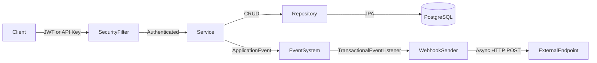

# Project Architecture

## Components

- **Base Data Layer** — Generic entity (`AbstractEntity` with UUID, timestamps), repository (`EntityRepository`), and service (`AbstractDbBackedDataService`) providing reusable CRUD with Spring event publishing
- **Security Layer** — Spring Security filter chain with JWT/OAuth2 bearer token auth and custom API key header authentication (`ApiKeyAuthenticationFilter`)
- **Domain Services** — API keys, tags, webhooks, settings — each following the entity/repository/service/DTO pattern
- **Event System** — `OnObjectCreate`, `OnObjectUpdate`, `OnObjectDelete` events published by data services, consumed by `WebhookEventListener`
- **Multi-Tenancy** — Tenant ID injected from JWT principal into entities via JPA lifecycle callbacks, enforced at service level

## Data Flow

## Release & CI/CD Flow

- **PR / Push** — `build.yml` runs `spotless:check` + `mvn clean verify`
- **Push to main** — `snapshot.yml` publishes SNAPSHOT to GitHub Packages
- **Release** — `release.sh` sets version, builds, commits, stages artifacts, runs JReleaser (GPG sign + Maven Central upload + GitHub Release), sets next SNAPSHOT
