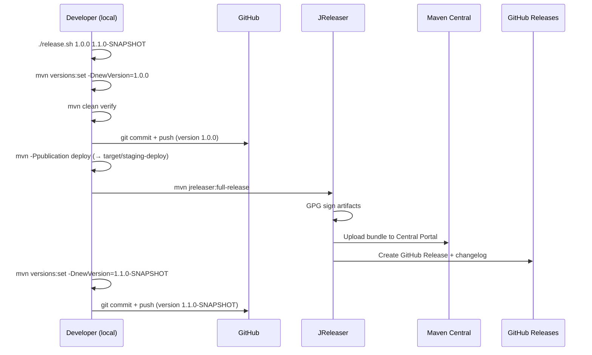
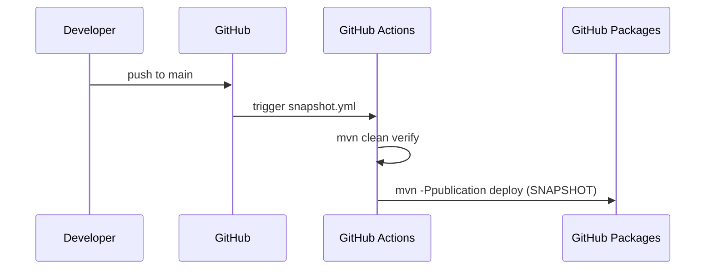

# Design: Release Pipeline

## GitHub Issue

— (no issue yet)

## Summary

The spring-services project needs a complete release pipeline covering three paths: CI build validation on pull requests, automatic SNAPSHOT publishing to GitHub Packages on pushes to `main`, and manual release publishing to Maven Central via JReleaser (including GPG signing and GitHub Release creation). The current `release.sh` exists but is incomplete — there is no `distributionManagement`, no GPG signing, no CI workflows, and JReleaser was removed after being copied untested from another repo.

## Goals

- Publish release artifacts (JAR, sources, Javadoc, SBOM) to Maven Central via the new Central Portal
- Publish SNAPSHOT artifacts to GitHub Packages automatically on every push to `main`
- Run build + test on every pull request and push (without publishing)
- Create GitHub Releases with changelogs automatically during a release
- Sign all release artifacts with GPG
- Keep the release process triggerable locally via `release.sh`

## Non-goals

- Multi-module Maven build (current project is single-module; design should not block future migration but does not implement it)
- Legacy OSSRH support — only the new Central Portal (`central.sonatype.com`)
- Unauthenticated SNAPSHOT consumption (GitHub Packages requires auth, this is accepted)
- CI-triggered releases (releases remain manual via `release.sh`)

## Technical Approach

### Release Path (local, manual)

The existing `release.sh` is the entry point. It will be updated to:

1. Validate version arguments (already implemented)
2. Load environment variables from `.env` (already implemented)
3. Set the release version via `versions-maven-plugin`
4. Run `mvn clean verify` to build and test
5. Commit and push the release version
6. Run `mvn -Ppublication deploy` to stage artifacts locally to `target/staging-deploy`
7. Run `mvn jreleaser:full-release` to:
   - Sign artifacts with GPG
   - Upload the bundle to Maven Central (new portal API)
   - Create a GitHub Release with auto-generated changelog
8. Set the next SNAPSHOT version
9. Commit and push

**Rationale:** JReleaser handles both Maven Central upload (new portal) and GitHub Release creation in a single tool, avoiding the need to wire together `central-publishing-maven-plugin` + GitHub CLI separately.

### SNAPSHOT Path (CI, automatic)

A GitHub Actions workflow (`snapshot.yml`) triggers on push to `main`:

1. Checkout code
2. Set up JDK 21
3. Cache Maven dependencies
4. Run `mvn clean verify` (build + test)
5. Run `mvn -Ppublication deploy` to publish SNAPSHOT to GitHub Packages

SNAPSHOTs do not require GPG signing or JReleaser — standard `mvn deploy` with `distributionManagement` pointing to GitHub Packages is sufficient.

### Build Path (CI, automatic)

A GitHub Actions workflow (`build.yml`) triggers on pull requests and pushes to all branches:

1. Checkout code
2. Set up JDK 21
3. Cache Maven dependencies
4. Run `mvn spotless:check` (formatting validation, fail fast)
5. Run `mvn clean verify` (build + test)

No publishing occurs in this workflow.

## POM Changes

### `distributionManagement`

```xml
<distributionManagement>
    <repository>
        <id>github</id>
        <name>GitHub Packages</name>
        <url>https://maven.pkg.github.com/OpenElementsLabs/spring-services</url>
    </repository>
    <snapshotRepository>
        <id>github</id>
        <name>GitHub Packages</name>
        <url>https://maven.pkg.github.com/OpenElementsLabs/spring-services</url>
    </snapshotRepository>
</distributionManagement>
```

**Rationale:** `distributionManagement` points to GitHub Packages for SNAPSHOT publishing. Release artifacts are NOT deployed via `mvn deploy` to Maven Central — JReleaser handles that separately by uploading from `target/staging-deploy`.

### Publication Profile Updates

Add to the existing `publication` profile:

1. **maven-deploy-plugin** — configure to stage locally to `target/staging-deploy` (for JReleaser to pick up):
   ```xml
   <plugin>
       <groupId>org.apache.maven.plugins</groupId>
       <artifactId>maven-deploy-plugin</artifactId>
       <configuration>
           <altDeploymentRepository>
               local::file:./target/staging-deploy
           </altDeploymentRepository>
       </configuration>
   </plugin>
   ```

2. **jreleaser-maven-plugin** — add execution configuration (actual config lives in `jreleaser.toml`)

3. **maven-gpg-plugin** — activate in publication profile for local release signing

### JReleaser Configuration (`jreleaser.toml`)

```toml
[signing]
active = "ALWAYS"
armored = true

[deploy.maven.mavenCentral.release-deploy]
active = "RELEASE"
url = "https://central.sonatype.com/api/v1/publisher"
stagingRepositories = ["target/staging-deploy"]
applyMavenCentralRules = true

[release.github]
owner = "OpenElementsLabs"
name = "spring-services"
changelog.formatted = "ALWAYS"
changelog.preset = "conventional-commits"
```

**Rationale:** This is close to the previously deleted config but adds changelog generation for GitHub Releases.

## Key Flows

### Release Flow



### SNAPSHOT Flow



## Credentials and Secrets

### Local Release (`.env`)

| Variable | Purpose |
|----------|---------|
| `JRELEASER_GITHUB_TOKEN` | GitHub token for creating releases |
| `JRELEASER_MAVENCENTRAL_USERNAME` | Maven Central portal username |
| `JRELEASER_MAVENCENTRAL_TOKEN` | Maven Central portal token |
| `JRELEASER_GPG_PASSPHRASE` | GPG key passphrase |
| `JRELEASER_GPG_SECRET_KEY` | GPG private key (armored) |

### CI (GitHub Secrets)

| Secret | Purpose |
|--------|---------|
| `GITHUB_TOKEN` | Automatically provided by GitHub Actions — used for GitHub Packages publish |
| `GPG_PRIVATE_KEY` | CI-specific GPG key (for SNAPSHOT signing if needed in future) |
| `GPG_PASSPHRASE` | CI GPG key passphrase |

**Note:** SNAPSHOT publishing to GitHub Packages does not require GPG signing or Maven Central credentials. The built-in `GITHUB_TOKEN` is sufficient.

## Security Considerations

- **`.env` must be in `.gitignore`** — currently missing, this is a security fix
- GPG private keys and passphrases must never be logged or echoed in scripts or CI
- `release.sh` already uses `set -e` to fail fast on errors
- CI workflows should use `permissions` to restrict `GITHUB_TOKEN` scope
- Maven Central tokens should have minimal required permissions

## Dependencies

- **JReleaser** >= 1.23.0 (already in `pluginManagement`)
- **Maven GPG Plugin** >= 3.2.8 (already in `pluginManagement`)
- **GitHub Actions** runners with JDK 21
- **New Central Portal account** with API token

## Open Questions

- Exact GitHub organization/repo name for `distributionManagement` URL — assumed `OpenElementsLabs/spring-services` based on deleted JReleaser config. Needs confirmation.
