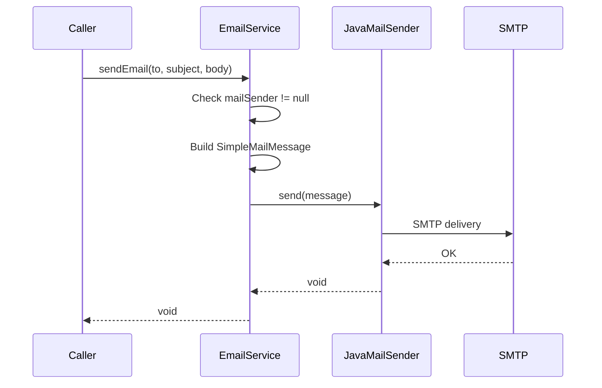
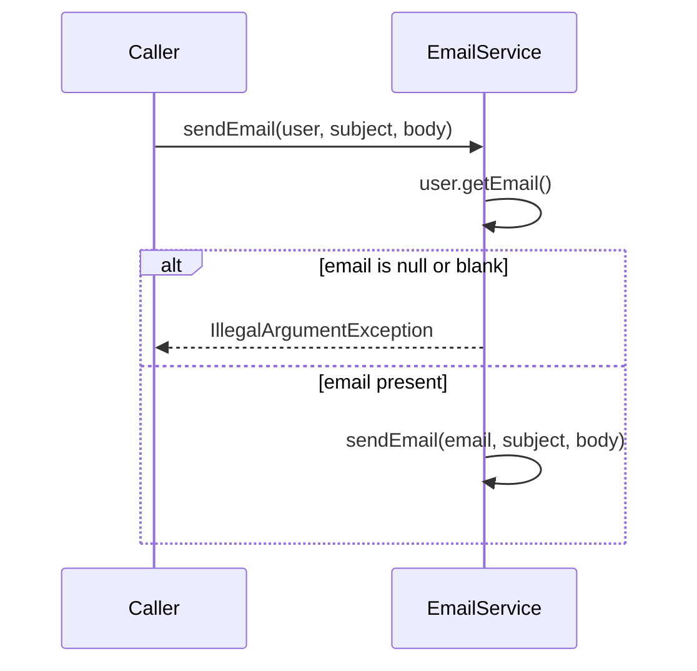

# Design: Email Sending Service

## GitHub Issue

[#5 — Add email sending service](https://github.com/OpenElementsLabs/spring-services/issues/5)

## Summary

Add a reusable Spring service for sending plain-text emails via SMTP. The service follows the same pattern as the existing Slack messaging service (spec 002): a thin convenience layer over an underlying client library — in this case Spring's `JavaMailSender`. It provides a simple `sendEmail` API that other components can use without dealing with `SimpleMailMessage` construction, sender address configuration, or exception translation.

## Goals

- Provide a simple, single-method API for sending plain-text emails
- Follow the established service pattern (Config, Properties, Service, Exception)
- Gracefully degrade when SMTP is not configured (warn at startup, fail at call time)
- Offer a convenience method that resolves the recipient address from a `UserEntity`

## Non-goals

- HTML email content or rich formatting
- Attachments
- Multiple recipients, CC, or BCC
- Email templating (callers use `String.format` or similar before calling the service)
- Retry logic or delivery queue
- Email delivery tracking or read receipts

## Technical Approach

The service builds on Spring Boot's auto-configured `JavaMailSender` from `spring-boot-starter-mail`. SMTP connection settings use the standard `spring.mail.*` properties. Only service-specific configuration (sender address and display name) lives under the `open-elements.email.*` namespace.

**Rationale:** Reusing `spring.mail.*` avoids duplicating SMTP configuration that Spring Boot already handles. Adding a custom namespace only for service-specific properties keeps the configuration clean and discoverable.

### Package Structure

```
com.openelements.spring.base.services.email/
├── EmailConfig.java        # Spring configuration, enables properties
├── EmailProperties.java    # Binds open-elements.email.* properties
├── EmailService.java       # Public API: sendEmail methods
├── EmailException.java     # Unchecked exception for mail failures
└── package-info.java       # Package-level Javadoc
```

### Components

#### `EmailProperties`

```java
@ConfigurationProperties(prefix = "open-elements.email")
public class EmailProperties {
    private String from;       // e.g. "noreply@example.com"
    private String fromName;   // e.g. "My Application"
}
```

#### `EmailConfig`

```java
@Configuration
@ComponentScan
@AutoConfiguration
@EnableAutoConfiguration
@EnableConfigurationProperties(EmailProperties.class)
public class EmailConfig {}
```

No additional `@Bean` methods needed — `JavaMailSender` is auto-configured by Spring Boot when `spring-boot-starter-mail` is on the classpath and `spring.mail.host` is set.

#### `EmailService`

```java
@Service
public class EmailService {
    private final @Nullable JavaMailSender mailSender;
    private final EmailProperties properties;
    
    // Injects JavaMailSender via ObjectProvider for graceful degradation
    public EmailService(ObjectProvider<JavaMailSender> mailSenderProvider,
                        EmailProperties properties) { ... }
    
    @PostConstruct
    void warnIfNotConfigured() { ... }
    
    public void sendEmail(@NonNull String to, @NonNull String subject, @NonNull String body) { ... }
    
    public void sendEmail(@NonNull UserEntity user, @NonNull String subject, @NonNull String body) { ... }
}
```

**Key design decisions:**

- **`ObjectProvider<JavaMailSender>`** instead of direct injection: Allows the service bean to be registered even when no SMTP host is configured. Mirrors the Slack service's `ObjectProvider<MethodsClient>` pattern.
- **`UserEntity` instead of `UserDto`** for the convenience method: The service is an internal building block, not a REST-facing component. Using the entity avoids unnecessary DTO conversion when the caller already has the entity.
- **`IllegalArgumentException`** when user has no email: This is a caller error (precondition violation), not a mail infrastructure failure. Using `IllegalArgumentException` distinguishes it from `EmailException` (which indicates SMTP/config problems).

#### Sender Address Formatting

The `from` field on `SimpleMailMessage` is set as `"Display Name <address>"` using `jakarta.mail.internet.InternetAddress.toString()` when `fromName` is configured, or just the plain address when only `from` is set.

#### `EmailException`

```java
public class EmailException extends RuntimeException {
    public EmailException(String message) { ... }
    public EmailException(String message, Throwable cause) { ... }
}
```

Wraps `MailException` (Spring's mail exception hierarchy) into an unchecked project-specific exception.

### Integration

1. **Dependency:** Add `spring-boot-starter-mail` to `pom.xml`
2. **Config registration:** Add `EmailConfig.class` to `FullSpringServiceConfig`'s `@Import` list

## Key Flows





## Dependencies

- `spring-boot-starter-mail` — provides `JavaMailSender` auto-configuration
- `UserEntity` from `com.openelements.spring.base.security.user` — for the convenience method
- `org.jspecify:jspecify` — for `@NonNull` / `@Nullable` annotations (already in project)

## Security Considerations

- No personal data is stored by this service — it only passes data through to SMTP
- Email addresses come from either the caller (explicit string) or the `UserEntity` (already persisted)
- SMTP credentials are configured via `spring.mail.username` / `spring.mail.password` — these should be managed via environment variables or secrets, not committed to source control

## Open Questions

None — all requirements were clarified during the grill session.
