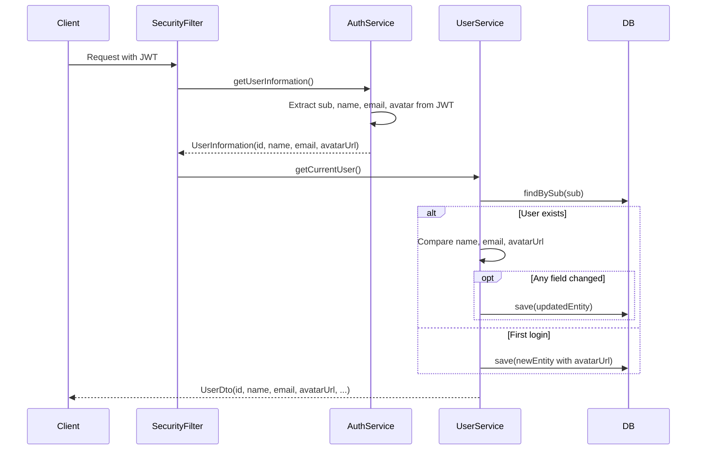

# Design: Avatar URL from authentik

## GitHub Issue

#7

## Summary

The library currently stores user avatars as binary blobs (`byte[]`) uploaded manually through `UserService`. This design replaces the manual upload mechanism with automatic synchronization of the avatar URL from the authentik identity provider's JWT `avatar` claim.

The avatar URL is synchronized on every request — the same pattern already used for `name` and `email`. The URL points directly to the authentik instance, which is publicly reachable by end users. Consuming applications render the avatar by using the URL in an `` tag — no proxy or binary storage is needed.

This change removes `EntityWithImage` from `UserEntity` (the interface itself remains in the library for other entities) and replaces the `avatar` (byte[]) and `avatar_content_type` columns with a single `avatar_url` (String) column.

## Goals

- Synchronize the avatar URL from the JWT `avatar` claim into the local user mirror, following the existing sync pattern for `name` and `email`
- Expose the avatar URL in `UserDto` so that consuming applications can display avatars for any user
- Remove the manual avatar upload/download/delete functionality from the library
- Keep the `EntityWithImage` interface and related image infrastructure (`ImageData`, `ImageType`) intact for use by other entities

## Non-goals

- Proxying or caching the avatar image server-side — the URL points directly to authentik
- Providing a fallback/default avatar in the library — this is the responsibility of consuming frontends
- Database migrations — consuming applications own their Flyway migrations and will add the migration when upgrading to this library version
- Validating the avatar URL format or reachability

## Technical approach

The change follows the existing pattern for JWT claim synchronization already established for `name` and `email`:

1. **`UserInformation`** gains an `avatarUrl` field (nullable String)
2. **`AuthService.getUserInformation()`** reads the `avatar` claim from the JWT and passes it to `UserInformation`. An absent, `null`, or blank claim results in `null`.
3. **`UserEntity`** drops `implements EntityWithImage` and the associated binary fields/methods. A new `avatarUrl` column (String, nullable, max length 2048) is added.
4. **`UserService.getCurrentUserEntity()`** synchronizes `avatarUrl` alongside `name` and `email` — if the JWT value differs from the stored value, the entity is updated and persisted.
5. **`UserDto`** replaces `boolean hasAvatar` with `String avatarUrl` (nullable). The `fromEntity()` factory method maps the new field.
6. **`UserService`** removes `updateAvatarForCurrentUser`, `getAvatarOfCurrentUser`, and `deleteAvatarOfCurrentUser`.

**Rationale:** Storing the URL as a String rather than downloading and storing the image avoids unnecessary storage, latency, and cache-invalidation complexity. The authentik instance is publicly reachable, so clients can fetch the image directly.

## Data model

### UserEntity — before

| Column | Type | Notes |
|--------|------|-------|
| avatar | byte[] (LAZY) | Binary image data |
| avatar_content_type | varchar(100) | MIME type |

### UserEntity — after

| Column | Type | Notes |
|--------|------|-------|
| avatar_url | varchar(2048) | Nullable. URL from authentik JWT `avatar` claim |

**Migration note:** Consuming applications must create a Flyway migration that:
1. Adds the `avatar_url` column (varchar 2048, nullable)
2. Drops the `avatar` column
3. Drops the `avatar_content_type` column

## Key flows

### Avatar synchronization on request



### Avatar display for other users

No new endpoint or service method is needed. When an application loads data that references a user (e.g., a list of items with their authors), the `UserDto.avatarUrl` field is already present. The frontend renders it directly:

```html

```

If `avatarUrl` is `null`, the frontend shows a default placeholder (application-specific).

## Dependencies

- **authentik** must include the `avatar` claim in the JWT. This is typically part of the default OIDC profile scope in authentik.
- **Spring Security OAuth2 Resource Server** — already configured, no changes needed.

## Security considerations

- The avatar URL originates from the identity provider's JWT, which is cryptographically signed. It cannot be tampered with by the client.
- The URL is stored as-is. No server-side fetching or processing of the URL content occurs in the library, eliminating SSRF risk.
- Consuming frontends should use CSP (`img-src`) to restrict image loading to the expected authentik domain.

## Open questions

None — all questions were resolved during the grill session.
