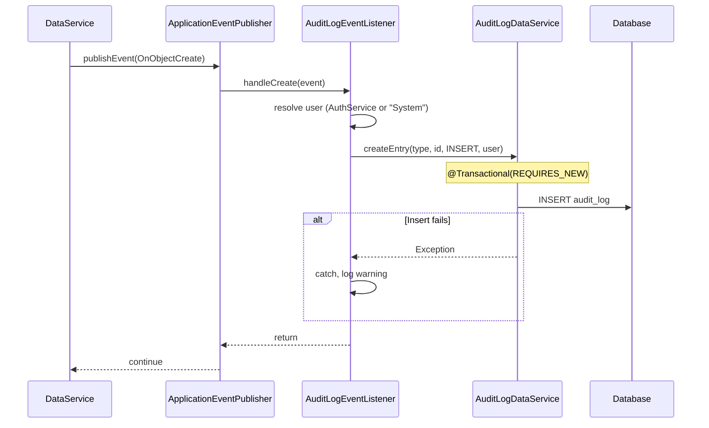

# Design: Audit Log for Data Lifecycle Events

## GitHub Issue

#8

## Summary

The library publishes `OnObjectCreate`, `OnObjectUpdate`, and `OnObjectDelete` events for every CRUD operation performed through `AbstractDbBackedDataService`. Currently, only the `WebhookEventListener` consumes these events. This feature adds an audit log that persists every data lifecycle event to a database table, capturing what changed, when, and by whom.

The audit log runs synchronously in the same thread (to access the `SecurityContextHolder`) but in its own transaction (`REQUIRES_NEW`), so a failed audit write never rolls back the main operation. The audit entity itself is excluded from event publishing to prevent recursion.

## Goals

- Automatically record every create, update, and delete operation performed through `AbstractDbBackedDataService`
- Capture: entity type, entity ID, action type, timestamp, and the authenticated user (or "System")
- Provide query methods for filtering audit entries by type, by user, and by type+user
- Include a configurable retention policy with a scheduled cleanup job

## Non-goals

- Storing the before/after data payload — only the entity reference and action are recorded
- Providing a REST API for audit log access — consuming apps build their own endpoints
- Supporting per-entity-type exclusion rules (beyond the audit entity itself)
- UI for viewing audit logs

## Technical approach

### Event publishing control in `AbstractDbBackedDataService`

Add a `boolean publishEvents` field to `AbstractDbBackedDataService`, defaulting to `true`. Add a second constructor:

```java
protected AbstractDbBackedDataService(ApplicationEventPublisher eventPublisher, boolean publishEvents)
```

The existing constructor delegates to the new one with `publishEvents = true`. The `postSave` and `postDelete` methods check the flag before publishing.

**Rationale:** This is a clean, infrastructure-level solution to the recursion problem. The audit service simply opts out of event publishing at construction time, rather than requiring the listener to filter its own events at runtime.

### Audit log data model

#### `AuditAction` (Enum)

```java
public enum AuditAction {
    INSERT, UPDATE, DELETE
}
```

#### `AuditLogEntity`

Extends `AbstractEntity`. Columns:

| Column | Type | Nullable | Notes |
|--------|------|----------|-------|
| `entity_type` | varchar(255) | no | `event.getType().getSimpleName()` |
| `entity_id` | UUID | no | `event.entityId()` |
| `action` | varchar(20) | no | Enum stored as string (`@Enumerated(STRING)`) |
| `user` | varchar(255) | no | Authenticated user name or `"System"` |

`createdAt` from `AbstractEntity` serves as the timestamp — no additional column needed.

#### `AuditLogDto`

Record implementing `WithId`:

```java
public record AuditLogDto(
    UUID id,
    String entityType,
    UUID entityId,
    AuditAction action,
    String user,
    Instant createdAt
) implements WithId {}
```

### Service layer

#### `AuditLogRepository`

Extends `EntityRepository<AuditLogEntity>` with custom finders:

- `List<AuditLogEntity> findByEntityType(String entityType)`
- `List<AuditLogEntity> findByUser(String user)`
- `List<AuditLogEntity> findByEntityTypeAndUser(String entityType, String user)`
- `void deleteByCreatedAtBefore(Instant cutoff)` — for retention cleanup

#### `AuditLogDataService`

Extends `AbstractDbBackedDataService<AuditLogEntity, AuditLogDto>` with `publishEvents = false`. Exposes:

- Inherited: `getAll()`, `findById()`, `findAll(Pageable)`
- Additional: `findByEntityType(String)`, `findByUser(String)`, `findByEntityTypeAndUser(String, String)`
- Internal: `createEntry(String entityType, UUID entityId, AuditAction action, String user)` — used by the listener

The `preSave` override must **not** throw (unlike `UserService`) since the audit service needs to write entries programmatically.

### Event listener

#### `AuditLogEventListener`

A `@Component` that listens to all three event types. Uses `@TransactionalEventListener(phase = AFTER_COMMIT)` would lose the SecurityContext, so instead uses `@EventListener` (synchronous, within the transaction) but wraps the write in a `REQUIRES_NEW` transaction via a self-injected proxy or a separate `@Transactional(propagation = REQUIRES_NEW)` method.



**User resolution:** The listener calls `AuthService.getAuthentication()`. If it returns a valid `Authentication` with a non-null principal, the user name is extracted. If it throws `IllegalStateException` (no authentication), the listener catches it and uses `"System"`.

### Retention

#### Configuration property

```properties
audit.retention-days=1460
```

Bound via `@Value("${audit.retention-days:1460}")` or a `@ConfigurationProperties` class.

#### Scheduled cleanup

A `@Scheduled` method (e.g., daily at 02:00) deletes all entries where `createdAt < now - retentionDays`. The cleanup runs in its own transaction.

```java
@Scheduled(cron = "0 0 2 * * *")
@Transactional
public void cleanupExpiredEntries() {
    Instant cutoff = Instant.now().minus(retentionDays, ChronoUnit.DAYS);
    auditLogRepository.deleteByCreatedAtBefore(cutoff);
}
```

## Dependencies

- `AbstractDbBackedDataService` — modified to support `publishEvents` flag
- `AuthService` — used to resolve the current user
- Spring's `@Scheduled` — requires `@EnableScheduling` in the consuming app (or in the library's auto-configuration)

## Security considerations

- The audit log records which user performed an operation. This is personal data under GDPR.
- **Data minimization:** Only the user name (from the JWT principal) is stored, not the full JWT or additional claims.
- **Retention:** The configurable cleanup ensures data is not stored indefinitely (default 4 years).
- **Access control:** The library does not expose audit log endpoints. Consuming apps must implement appropriate access controls (e.g., admin-only) when exposing audit data.

## Open questions

None — all questions were resolved during the grill session.
