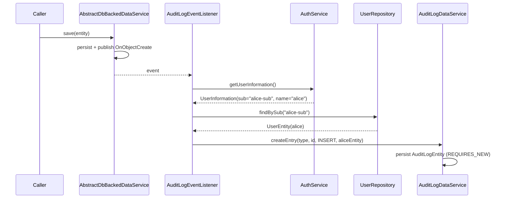
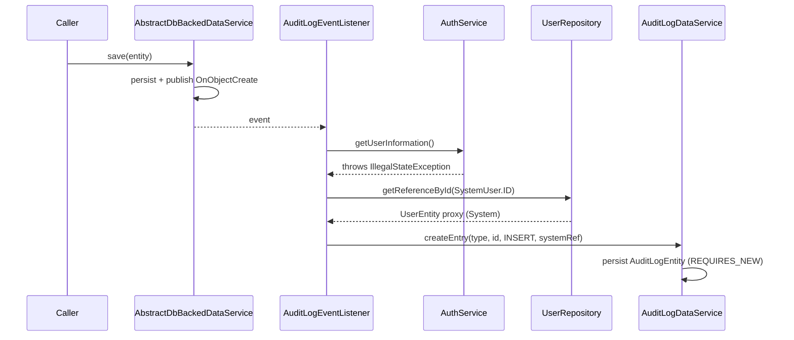
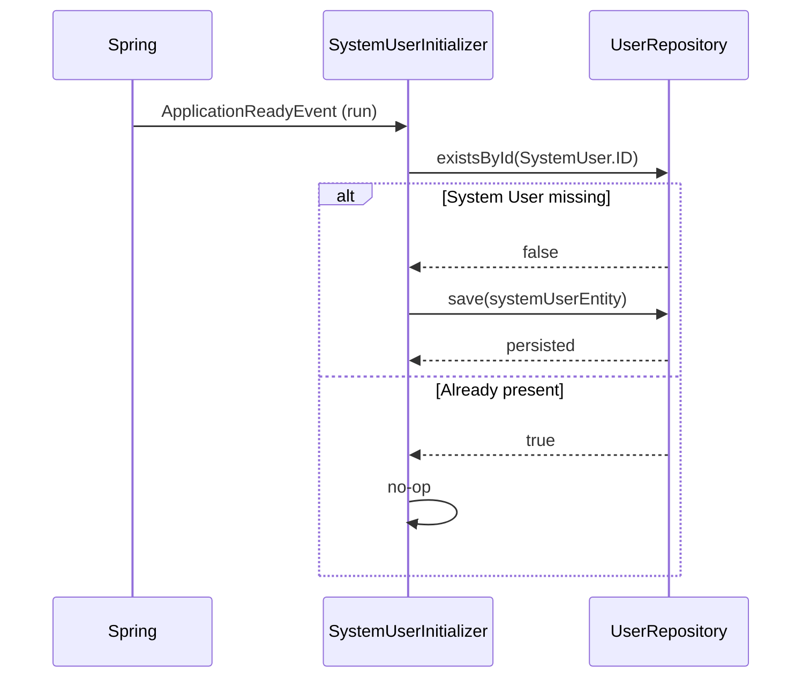
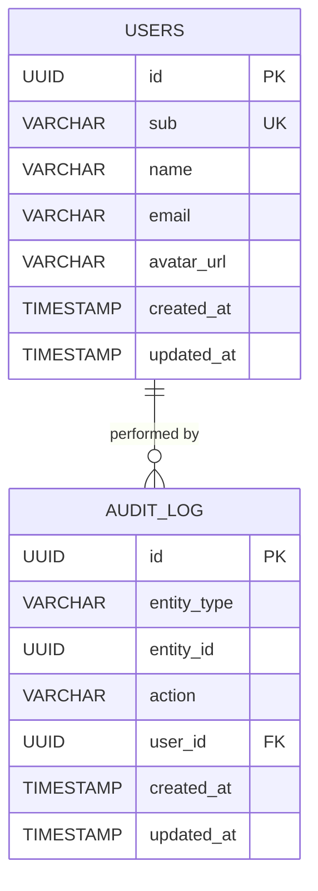

# Design: Audit Log User FK

## GitHub Issue

[#16 — Replace AuditLogEntity.userName String column with ManyToOne reference to UserEntity](https://github.com/OpenElementsLabs/spring-services/issues/16)

## Summary

Today, `AuditLogEntity` stores the acting user as a denormalized `user_name` String column. The value is derived in `AuditLogEventListener.resolveUser()` from the JWT `name` claim, falling back to the literal string `"System"` when no security context is available and to `"UNKNOWN"` for API-key principals.

This change replaces the String column with a `ManyToOne` reference to `UserEntity`. To keep the column non-nullable for entries without an authenticated user, a dedicated **System User** with the reserved nil UUID `00000000-0000-0000-0000-000000000000` is introduced and bootstrapped at application startup by a Spring-managed runner. API-key triggered events also reference this System User.

## Goals

- Make `audit_log` entries reference real `users` rows via a foreign key
- Preserve the audit log invariant that every entry has a non-null actor
- Provide a stable, well-known System User identity that consumers and the library can rely on
- Keep the audit-write path resilient (existing semantics: never break the originating transaction because the audit write fails)

## Non-goals

- Migrating existing `audit_log` data in consumer applications — each app owns its data migration
- Changing the audit event semantics (`INSERT` / `UPDATE` / `DELETE` remain unchanged)
- Adding new query methods beyond replacing the existing `userName`-based ones
- Adopting Flyway in this library

## Technical approach

### Data model change

`AuditLogEntity`:

- Remove field `private String userName;` and the `user_name` column
- Add `@ManyToOne(optional = false, fetch = FetchType.LAZY) @JoinColumn(name = "user_id", nullable = false) private UserEntity user;`

The schema column becomes `user_id UUID NOT NULL` with a foreign key to `users(id)`. Hibernate's default referential action is `NO ACTION` / `RESTRICT` — that is exactly the desired behavior (deleting a user must not silently break audit history). No explicit `@OnDelete` is needed.

**Rationale for `LAZY`:** the listener writes the FK reference only; it never needs to render user fields when persisting. The DTO mapping path will trigger the load.

### System User

A dedicated `UserEntity` row identified by the reserved nil UUID and a reserved `sub` value:

| Field | Value |
|---|---|
| `id` | `00000000-0000-0000-0000-000000000000` |
| `sub` | `"system"` |
| `name` | `"System"` |
| `email` | `null` |
| `avatarUrl` | `null` |

The values are exposed as constants (`SystemUser.ID`, `SystemUser.SUB`, `SystemUser.NAME`) so callers and tests don't repeat magic literals.

**Rationale for the nil UUID:** RFC 9562 reserves `00000000-0000-0000-0000-000000000000` as the Nil UUID. Hibernate's `GenerationType.UUID` produces v4 (random) UUIDs, so a real user can never collide with the nil UUID in practice.

**Rationale for `sub = "system"`:** the `sub` column is `NOT NULL UNIQUE`. We need a stable sentinel value that no real OAuth2 identity provider will issue. `"system"` is short and self-explanatory; if a consumer's IdP can issue this exact subject, they can override the constant via configuration in a follow-up.

### System User bootstrap

A Spring component `SystemUserInitializer implements ApplicationRunner` runs once on application startup:

```java
@Override
public void run(ApplicationArguments args) {
    if (userRepository.existsById(SystemUser.ID)) {
        return;
    }
    final UserEntity systemUser = new UserEntity();
    systemUser.setId(SystemUser.ID);
    systemUser.setSub(SystemUser.SUB);
    systemUser.setName(SystemUser.NAME);
    try {
        userRepository.save(systemUser);
    } catch (DataIntegrityViolationException e) {
        // Another instance bootstrapped concurrently — ignore.
    }
}
```

The runner uses `UserRepository` directly, bypassing `UserService.preSave()` (which forbids external CRUD). Idempotency is handled by the `existsById` check; the catch block guards the multi-instance startup race.

**Rationale for `ApplicationRunner` over `@PostConstruct`:** `ApplicationRunner` runs after the full context is up and after schema initialization (Hibernate DDL or any consumer-side migration tool) has completed. `@PostConstruct` would fire before the schema may exist.

**Rationale for `existsById` instead of relying solely on the catch:** the happy path (System User already present, the case on every restart after the first) avoids a wasted INSERT attempt and the associated rollback.

### AuditLogEventListener changes

The user resolution logic in `resolveUser()` changes signature and return type — from `String` to `UserEntity`. The fallback chain becomes:

1. Call `authService.getUserInformation()`.
2. If it returns a `UserInformation` whose `id` corresponds to a real user (resolvable by `sub`), look that user up via `userRepository.findBySub(sub)` and use it.
3. In all other cases (`IllegalStateException`, `null` userInfo, `null`/blank `name`, API-key principal returning `"UNKNOWN"`), use `userRepository.getReferenceById(SystemUser.ID)`.

`getReferenceById` returns a Hibernate proxy — no DB round-trip is needed for the reference itself.

`AuditLogDataService.createEntry` signature changes from `(entityType, entityId, action, String user)` to `(entityType, entityId, action, UserEntity user)`.

### DTO changes (breaking)

`AuditLogDto`:

- Old: `record AuditLogDto(UUID id, String entityType, UUID entityId, AuditAction action, String user, Instant createdAt)`
- New: `record AuditLogDto(UUID id, String entityType, UUID entityId, AuditAction action, UserDto user, Instant createdAt)`

The mapping `AuditLogDto.fromEntity()` calls `UserDto.fromEntity(entity.getUser())`. Because the `user` association is `LAZY`, this triggers the load when the DTO is constructed. Consumers must call `fromEntity` inside an open session (which is the normal pattern via `@Transactional` boundaries).

### Repository changes

`AuditLogRepository`:

- `findByUserNameOrderByCreatedAtDesc(String userName, Pageable)` → `findByUserIdOrderByCreatedAtDesc(UUID userId, Pageable)`
- `findByEntityTypeAndUserNameOrderByCreatedAtDesc(String entityType, String userName, Pageable)` → `findByEntityTypeAndUserIdOrderByCreatedAtDesc(String entityType, UUID userId, Pageable)`

`AuditLogDataService`:

- `findByUser(String user, Pageable)` → `findByUser(UUID userId, Pageable)`
- `findByEntityTypeAndUser(String entityType, String user, Pageable)` → `findByEntityTypeAndUser(String entityType, UUID userId, Pageable)`

### REST endpoint changes (breaking)

Any controller that filtered the audit log by `user` (String) now expects `userId` (UUID). The JSON response shape for `AuditLogDto` changes: `"user": "alice"` becomes `"user": { "id": "...", "name": "alice", ... }`.

## Key flows

### Audit write with authenticated JWT user



### Audit write without security context (System fallback)



### Startup bootstrap



## Data model



## Dependencies

- `UserRepository` — used by `SystemUserInitializer` and `AuditLogEventListener`
- `AuthService` — unchanged, still the source of `UserInformation`
- `AbstractDbBackedDataService` — unchanged

No new third-party libraries.

## Security considerations

- The System User has no real OAuth2 identity (`sub = "system"`) and cannot log in: `UserService.lookupOrProvision` is only invoked from a JWT-authenticated request, where the `sub` claim is asserted by the IdP. A user logging in with the literal sub `"system"` would be a misconfiguration of the IdP, not a security boundary issue (they would still be subject to all normal authorization checks).
- The schema-level FK with `RESTRICT` semantics prevents accidental loss of audit history if a user row is deleted. Since `UserService` does not expose a delete operation, this is a defense-in-depth check at the database level.
- No personal data exposure beyond what `AuditLogDto` already exposed: previously the user's display name was inlined; now the full `UserDto` is included. Consumers building public-facing audit views must continue to filter PII at the controller layer if needed.

## GDPR / personal data

The change does not introduce new personal data — `UserDto` (already exposed by other endpoints) replaces a String name. The right to erasure is not affected: the library does not expose user deletion, and the FK is `RESTRICT` rather than `CASCADE`, which means a future erasure feature will need to deliberately decide whether to anonymize the user row or detach the audit entries.

## Open questions

- Should the System User's `sub` value (`"system"`) be configurable, in case a consumer's IdP can issue that exact subject? Default to hard-coded for now; revisit if a consumer hits the conflict.
- Should `AuditLogDto.user` be the full `UserDto` or a smaller projection (id + name only) to limit payload size? Current proposal uses full `UserDto` for consistency with other endpoints; revisit if audit list endpoints become hot paths.
