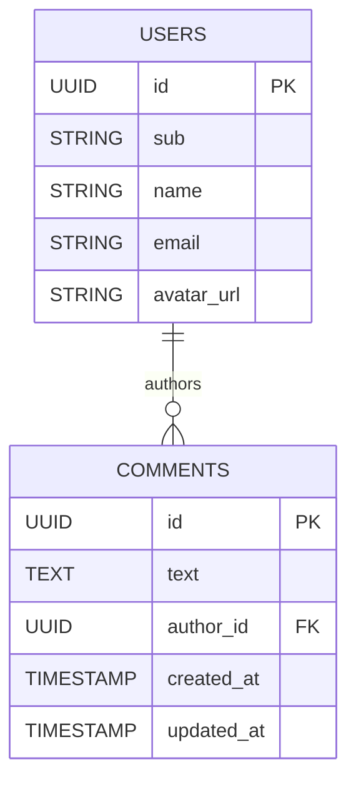

# Design: Comment author as `@ManyToOne UserEntity` association

## GitHub Issue

[#14 — CommentEntity: replace String authorId with @ManyToOne UserEntity](https://github.com/OpenElementsLabs/spring-services/issues/14)

## Summary

`CommentEntity` currently stores its author as `@Column(name = "author") String authorId` — a UUID-as-String reference to `UserEntity` with no foreign key constraint. `CommentService.toData()` resolves each comment's author through a per-comment `userService.findById(...)` call, which is a textbook N+1 when listing comments. The column name `author` is also misleading: downstream consumers writing migrations naturally assume `author` is a display name, not the FK.

This spec replaces the String reference with a `@ManyToOne` association to `UserEntity` mapped to a `author_id` column. The change introduces a real foreign key constraint at the database level, removes the N+1 by letting Hibernate batch-fetch authors, and aligns the schema with the convention every downstream consumer already expects.

This is a **breaking change** for downstream consumers — they must apply a schema migration (rename `author` → `author_id`, change type from `VARCHAR(255)` to `UUID`, add the FK).

## Goals

- Replace `String authorId` with a typed `@ManyToOne UserEntity` association
- Map the new association to a column named `author_id` (matching project-wide convention)
- Add a real foreign key constraint (`fk_comments_author`) from `comments.author_id` → `users.id`
- Eliminate the per-comment `userService.findById(...)` lookup in `CommentService.toData()`
- Reduce query count when listing comments via a `@BatchSize`-driven batch fetch
- Provide a documented SQL migration template for downstream consumers

## Non-goals

- Refactoring `ApiKeyEntity.createdBy` or `AuditLogEntity.userName` (different concerns; out of scope)
- Adding bidirectional navigation from `UserEntity` to its comments (no use case today)
- Backwards compatibility with the old `author` column — this is a hard break, called out in the release notes
- Introducing Flyway/Liquibase to this repo — schema management remains the consumer's responsibility
- Changing the `CommentDto` shape (the public API surface stays the same)

## Technical approach

### Entity change

In `CommentEntity`:

```java
@ManyToOne(fetch = FetchType.LAZY, optional = false)
@JoinColumn(name = "author_id", nullable = false,
            foreignKey = @ForeignKey(name = "fk_comments_author"))
private UserEntity author;
```

In `UserEntity` (to enable batched fetching for any `@ManyToOne UserEntity` reference, including the new one above):

```java
@Entity
@Table(name = "users")
@BatchSize(size = 50)
public class UserEntity extends AbstractEntity { ... }
```

Rationale for each choice:

- **`fetch = LAZY`** — avoids loading every author on each `findById`/`findAll`. Callers that need the author (e.g., `toData()`) trigger the load explicitly via `getAuthor()`.
- **`optional = false`** + **`nullable = false`** — every comment must have an author. Mirrors the existing `nullable = false` on the String column.
- **`@BatchSize(size = 50)` on `UserEntity`** — when references to `UserEntity` are dereferenced lazily (e.g., `comment.getAuthor()` inside `toData()`), Hibernate batches up to 50 proxy initializations into a single `SELECT ... WHERE id IN (?, ?, …)` query instead of one query per comment. Removes the N+1 without requiring custom `JOIN FETCH` queries. Hibernate 6 only supports `@BatchSize` on the target entity class or on collection-valued associations — it is rejected on `@ManyToOne` fields. Putting it on `UserEntity` is also forward-friendly: any future `@ManyToOne UserEntity` association in the codebase inherits the same batching behavior automatically.
- **Named `@ForeignKey`** — gives Hibernate's auto-DDL a stable constraint name (`fk_comments_author`) rather than a hash-based default, which makes the constraint diffable and referenceable in migrations.

### Service change

`CommentService.createDetachedEntity()` becomes:

```java
@Override
protected @NonNull CommentEntity createDetachedEntity() {
    final UserEntity user = userService.getCurrentUserEntity();
    final CommentEntity entity = new CommentEntity();
    entity.setAuthor(user);
    return entity;
}
```

`CommentService.toData()` becomes:

```java
@Override
protected @NonNull CommentDto toData(@NonNull final CommentEntity entity) {
    final UserDto author = UserDto.fromEntity(entity.getAuthor());
    return new CommentDto(entity.getId(), entity.getText(), author,
            entity.getCreatedAt(), entity.getUpdatedAt());
}
```

The `userService.findById(...)` call is gone. Authors come from the JPA-loaded relationship via `UserDto.fromEntity(...)`.

### `UserService.getCurrentUserEntity()` visibility change

`UserService.getCurrentUserEntity()` is currently `private synchronized`. It must become `public` so `CommentService` can pass a managed `UserEntity` (not just a UUID) into the new association.

Rationale: the alternative — looking up the entity via `userRepository.findById(getCurrentUser().id()).orElseThrow()` from `CommentService` — adds an unnecessary DB round-trip when `getCurrentUserEntity()` already produced exactly the entity we need. Exposing the existing method is the cleanest path.

The method's `synchronized` modifier and existing semantics (lazy provisioning, JWT-claim drift detection) are preserved unchanged.

## Data model

### Before

```
comments
  id           UUID    PK
  text         TEXT    NOT NULL
  author       VARCHAR(255) NOT NULL    -- UUID stored as String, no FK
  created_at   TIMESTAMP NOT NULL
  updated_at   TIMESTAMP NOT NULL
```

### After

```
comments
  id           UUID    PK
  text         TEXT    NOT NULL
  author_id    UUID    NOT NULL    FK → users(id)   (fk_comments_author)
  created_at   TIMESTAMP NOT NULL
  updated_at   TIMESTAMP NOT NULL
```



### Delete behavior

The FK uses Hibernate's default `ON DELETE` behavior, which combined with `optional = false` / `nullable = false` results in **`RESTRICT`** semantics: attempting to delete a `UserEntity` that still has comments will raise a `DataIntegrityViolationException`.

Rationale: comments are audit-relevant content. Silently cascading them away on user deletion would lose information; `SET NULL` is unavailable because the column is non-null. Surfacing the violation forces the caller to make an explicit decision (reassign or delete the comments first). If a future use case demands cascade, it can be added in a separate spec.

## Migration guide for downstream consumers

This repo does not ship database migrations — schema is managed by Hibernate `ddl-auto` in tests and by each consumer in production. Consumers using a real migration tool (Flyway, Liquibase, raw SQL) must apply the following migration when upgrading to the version that contains this change.

### PostgreSQL migration template

```sql
-- 1. Rename the column
ALTER TABLE comments RENAME COLUMN author TO author_id;

-- 2. Convert the column type from VARCHAR to UUID
ALTER TABLE comments
    ALTER COLUMN author_id TYPE UUID USING author_id::uuid;

-- 3. Add the foreign key constraint
ALTER TABLE comments
    ADD CONSTRAINT fk_comments_author
    FOREIGN KEY (author_id) REFERENCES users(id);
```

### Pre-migration check

Before running step 3, consumers must verify there are no orphan rows (comments referencing a non-existent user), or the `ADD CONSTRAINT` will fail:

```sql
SELECT c.id, c.author_id
FROM comments c
LEFT JOIN users u ON c.author_id = u.id
WHERE u.id IS NULL;
```

Any rows returned must be cleaned up (deleted or reassigned) before the FK is added.

This migration template is reproduced in the release notes and in this design doc as the canonical reference.

## Dependencies

- **Hibernate / JPA** (already in use) — provides `@ManyToOne`, `@JoinColumn`, `@ForeignKey`, `@BatchSize`
- **`UserEntity`** — already in the same module (`com.openelements.spring.base.security.user`); no new coupling
- No new external libraries

## Security considerations

- The author of a comment is set server-side from the authenticated subject in `createDetachedEntity()` (via `UserService.getCurrentUserEntity()`), never from client input. The new FK constraint adds defense-in-depth against tampering: even if a future code path tried to set a fabricated UUID, the database would reject the INSERT.
- Personal data: a `UserEntity` reference (UUID FK) is not new personal data — the comment was already linked to the user, just via String. No new GDPR considerations beyond what already applied.
- The existing audit-log mechanism (event-driven via `AbstractDbBackedDataService`) is unaffected — events are still published on create/update/delete.

## Regression risk

- **Existing data** — Any consumer with existing `comments` rows must run the migration above. This is the headline breaking change and is called out in the release notes.
- **Lazy-loading boundary** — `getAuthor()` must be called inside the active transaction. `CommentService.toData()` is `@Transactional` (inherited from the class-level annotation), so this is safe today. New callers that touch `getAuthor()` outside a transaction would hit a `LazyInitializationException`. Mitigated by keeping the entity internal — the public surface is `CommentDto`.
- **`UserService` API surface widening** — Exposing `getCurrentUserEntity()` as public means it joins the supported API. The class doc says it "deliberately does not expose generic CRUD by id"; this exposure is consistent because the method is still scoped to the current authenticated user, not arbitrary lookups.
- **N+1 regression on uncached batch sizes** — If a consumer loads more than 50 comments in one transaction and touches `getAuthor()` on all of them, Hibernate issues `ceil(N / 50)` author queries instead of one. Acceptable trade-off vs. forcing every consumer to write `JOIN FETCH` queries.

## Open questions

None.
