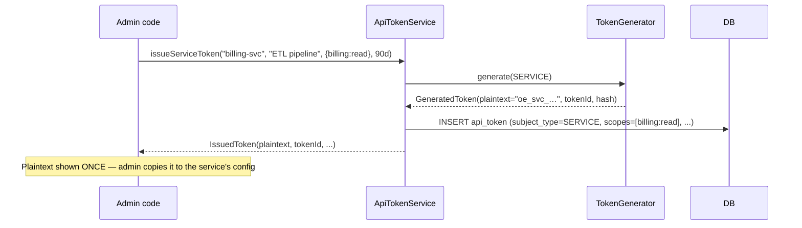
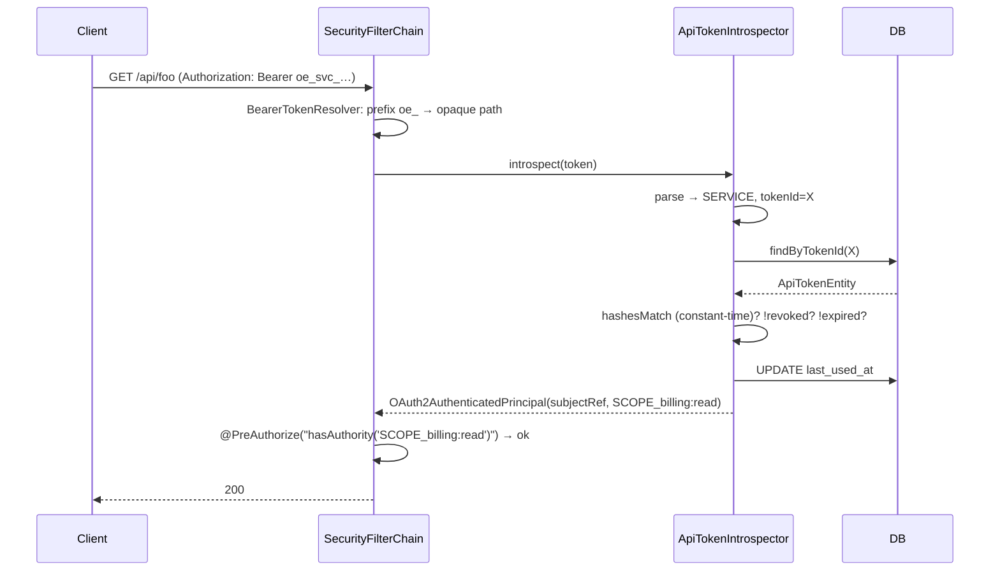
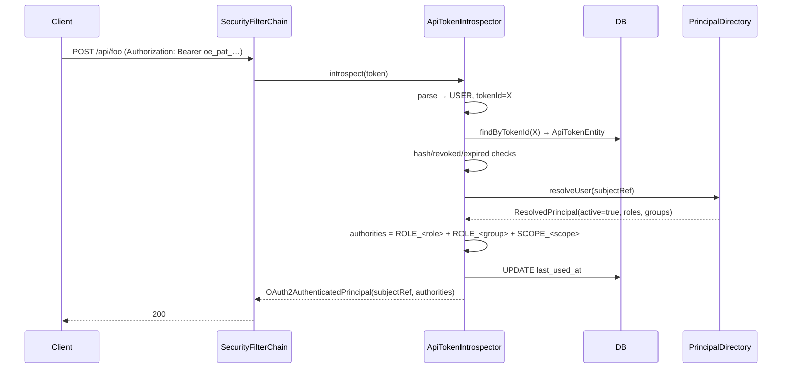
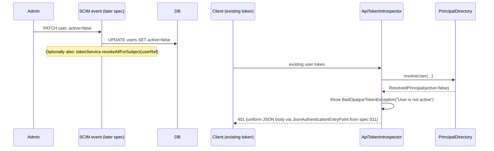

# Design: API Token Module

## GitHub Issue

—

## Summary

Replace the fragmented token surface of `spring-services` — the existing `ApiKey` infrastructure
on `/api/external/**` plus the previously-planned `PatEntity` module — with one unified,
opaque-token module that authenticates two scenarios through a single mechanism, one storage
table, and one validation path:

| Scenario | Subject type | What the token stores | Where permissions come from |
|---|---|---|---|
| **Machine-to-machine** (was: API key) | `SERVICE` | service ref + scopes | the token's scopes only |
| **User calls directly** (PAT) | `USER` | user ref only (+ optional scopes) | resolved **live** at every request via a `PrincipalDirectory` port |

Both token types are mechanically identical: an opaque string comes in → lookup by the non-secret
`tokenId` → constant-time hash comparison → resolution to a Spring Security principal. The only
difference is *what* the lookup returns as authorities. Validation rides on Spring Security 6's
standard `OpaqueTokenIntrospector` instead of a custom servlet filter.

The defining design rule:

> Anything that can change *without the user deciding it* is looked up (groups, roles, active
> status). Anything the user *deliberately chooses at creation time* may live in the token (scopes,
> expiry, purpose name).

That single rule eliminates the "stale permissions" failure mode by construction.

This spec **replaces** the existing `ApiKey` module (`/api/external/**`, `X-API-Key` header,
`crm_*` keys) — a breaking change for consumers, deliberately taken now while the library is at
`1.1.0-SNAPSHOT`. The supersession is described under *Migration from the existing ApiKey
module*.

## Goals

- One token table, one validation path, two subject-type discriminators (`SERVICE`, `USER`).
- No frozen authorization for user-bound tokens — roles and groups resolve live on every request
  via the `PrincipalDirectory` port; stale permissions are unreachable by construction.
- Spring Security 6 standard wiring (`OpaqueTokenIntrospector` on `oauth2ResourceServer`) — no
  custom servlet filter for token validation.
- Token format `oe_<typeCode>_<tokenId>_<secret>` so secret scanners can flag leaked tokens by the
  `oe_` vendor prefix (analogous to `ghp_`).
- Constant-time hash comparison and no plaintext at rest — only SHA-256 of the full printable
  token is stored.
- Library ships the port (`PrincipalDirectory`) but **no default implementation** in this spec —
  consumers wire their own (or wait for the implementation that lands alongside spec 012).
- SERVICE tokens are usable immediately on shipping this spec; USER tokens are only meaningful
  once a `PrincipalDirectory` implementation exists.

## Non-goals

- A default `PrincipalDirectory` implementation — landed alongside spec 012 (or sooner if a
  consumer needs it).
- `JwtAuthenticationConverter` changes — the JWT chain stays as-is; opaque tokens and JWT are
  dispatched by the `Authorization` header's token prefix (`oe_` → opaque, anything else → JWT).
- Distributed token revocation list / token-cache — the DB row plus per-request live-resolution
  is the revocation model. Revocation is durable across instances because it writes to the
  shared DB.
- Per-request signature verification — opaque tokens are not signed; integrity is enforced by
  the SHA-256 hash stored alongside the row.
- Token rotation policies (auto-rotate after N days, etc.) — TTL is set at creation time;
  rotation is an application-level concern.
- Replacing or refactoring `UserEntity` itself — that is spec 012's job. This spec only declares
  the port (`PrincipalDirectory`) that the `UserEntity` (post-012) will eventually back.
- Backwards-compatibility shims for the old `X-API-Key` header — consumers migrate per the
  *Migration* section below; no library code keeps `X-API-Key` alive.
- The previously-planned `UserEntity.roles` JIT-sync from the JWT `roles` claim — explicitly
  dropped. The new design treats live resolution as the only correct source of truth for
  role-like authorities; persisting them locally would resurrect the staleness failure mode.

## Technical Approach

Eight new types in a new package `com.openelements.spring.base.services.apitoken`. The existing
`services/apikey/*` and `security/apikey/*` packages are deleted (see *Migration*).

### Components

- **`TokenSubjectType`** — enum, two values (`SERVICE`, `USER`) with single-character segment
  codes (`svc`, `pat`). The segment code is embedded in the printable token so the resolution
  path can be chosen before any DB lookup.
- **`ApiTokenEntity`** — one JPA entity, table `api_token`, indexed by the non-secret
  `tokenId`. Discriminated by `subjectType`. Carries `scopes` (`@ElementCollection`),
  `subjectRef`, `tokenHash`, optional `expiresAt`, `revoked` flag, `lastUsedAt`.
- **`ApiTokenRepository`** — `JpaRepository`. Adds `findByTokenId(String)`,
  `findBySubjectRefAndRevokedFalse(String)`, and `revokeAllForSubject(String)` (`@Modifying`).
- **`IssuedToken`** — record, the once-shown result of issuance. Carries the **plaintext**
  exactly once at creation.
- **`TokenGenerator`** — `@Component`. Generates, parses, hashes (SHA-256 hex), compares
  (constant-time via `MessageDigest.isEqual`). Token format:
  `oe_<typeCode>_<tokenId_12B>_<secret_32B>` (Base64-URL-safe, no padding).
- **`ApiTokenService`** — `@Service`. Issues SERVICE / USER tokens, revokes single tokens, revokes
  all tokens for a subject (the SCIM-deprovisioning hook), lists active tokens for a subject.
- **`PrincipalDirectory`** — **port interface**. `Optional<ResolvedPrincipal> resolveUser(String
  subjectRef)`. Implementations are thread-safe. `ResolvedPrincipal` is a record carrying
  `(subjectRef, active, roles, groups, displayName)`.
- **`ApiTokenIntrospector`** — `@Component` implementing Spring Security's
  `OpaqueTokenIntrospector`. The single validation entry point. SERVICE → scope authorities only.
  USER → `principalDirectory.resolveUser(...)` (live), check `active`, map roles+groups to
  `ROLE_*`, add scopes as `SCOPE_*`.
- **`ApiTokenConfig`** — `@Configuration(proxyBeanMethods = false)` +
  `@ComponentScan(basePackageClasses = ApiTokenConfig.class)`. Imported by
  `FullSpringServiceConfig`.

### Token format

```
oe_<typeCode>_<tokenId>_<secret>
│  │          │          └─ ~32 bytes of randomness, URL-safe Base64 — this authenticates
│  │          └─ ~12 bytes of randomness, URL-safe Base64 — non-secret, indexed lookup id
│  └─ "pat" (USER) or "svc" (SERVICE) — chooses resolution path pre-DB
└─ "oe" — fixed vendor prefix for secret scanners
```

### Security wiring

After spec 011 the library runs two security filter chains:
- Default chain (`@Order(2)`): JWT bearer-token authentication via `oauth2ResourceServer.jwt(...)`.
- External-API chain (`@Order(1)`): `X-API-Key` authentication via `ApiKeyAuthenticationFilter`.

This spec collapses both into a new layout:

1. **External chain is deleted entirely.** `/api/external/**` no longer needs a separate chain —
   service-to-service callers use opaque bearer tokens like everyone else.
2. **Default chain is extended** to handle both JWT and opaque bearer tokens on the same chain:
   - A custom `BearerTokenResolver` inspects the raw token. If it starts with `oe_`, the resolver
     returns `null` for the JWT processor — so Spring Security's JWT path is bypassed.
   - A second `BearerTokenResolver` (or the inverse logic) routes `oe_*` tokens to the opaque
     introspection path.
   - If the token has no `oe_` prefix, the existing JWT path runs unchanged.
3. **Opaque-token authentication** wires the `ApiTokenIntrospector` via
   `oauth2ResourceServer.opaqueToken(...)`. The exact dispatch arrangement (a prefix-aware
   resolver, two `AuthenticationProvider`s on one chain, or two scoped chains with
   `securityMatcher`) is an implementation detail handled in `steps.md`; the constraint is that
   the JWT validation path and the opaque path coexist on the request lifecycle.

### Live resolution and the `PrincipalDirectory` port

The defining design choice: **USER tokens carry only the user reference**. Roles, groups, and
active-status are resolved fresh on every request via `PrincipalDirectory.resolveUser(...)`.
Implications:

- A user's permissions cannot go stale — when an admin removes a role, the *next* token-validated
  request reflects it.
- Deactivation propagates instantly — `ResolvedPrincipal.active() == false` causes the
  introspector to throw `BadOpaqueTokenException("User is not active")`, which Spring Security
  turns into `401` (via the spec-011 `JsonAuthenticationEntryPoint`).
- A request that hits the system N times during a 1-second burst pays N directory lookups. With
  the SCIM-fed table (post-012) those are local SELECTs; with a live Authentik backing those are
  network round-trips. Implementations that need to reduce I/O may add a short cache TTL —
  contract-compatible, library does not mandate.

The library ships the port interface only. Consumers (or spec 012) supply the implementation.

### Scopes — the one legitimate static permission

Scopes are explicitly chosen by the user at token creation time and narrow what the token can
do. They are persisted with the token and granted as `SCOPE_*` authorities at validation time.
For USER tokens, scopes compose with the live user authorities — effective rights are
**live user rights AND token scopes**. A token can never do more than its owner.

### Rationale for key decisions

- **Single table, single validation path** over separate PAT/ApiKey modules. Fewer surfaces to
  reason about, simpler to audit, and one revocation mechanism. The discriminator column is the
  only branch in the code.
- **Live resolution over JIT-sync.** The previous (now-superseded) 010 plan persisted JWT-claimed
  roles into `UserEntity.roles` and refreshed them on each interactive login. The new design
  rejects this: a user might never log in interactively again, leaving their token-carried
  authorities frozen indefinitely. Live resolution makes stale permissions structurally
  impossible.
- **Spring Security 6 `OpaqueTokenIntrospector` over a custom filter.** The OAuth2 resource
  server is the standard path for opaque bearer tokens. It composes with `@EnableMethodSecurity`,
  `@PreAuthorize`, `SecurityContextHolder` and all the other Spring Security machinery without
  extra glue.
- **`oe_` vendor prefix.** Secret scanners (GitHub Push Protection, GitGuardian, Gitleaks)
  recognise fixed prefixes. A leaked token in a commit message can be flagged automatically.
- **Separate non-secret `tokenId` indexed for lookup.** The hash is *only* used for constant-time
  comparison; indexing on a hashed value would couple lookup latency to hash collision avoidance
  and complicate audit (you cannot show a token's lookup id to a user without exposing
  hash-derived material).
- **`@ElementCollection` for scopes.** Short sets, eager-loaded, accepted JPA pattern.
  `@BatchSize` mitigates the N+1 concern when listing many tokens.
- **Constant-time hash comparison.** `MessageDigest.isEqual` is the documented constant-time
  string comparison; protects against timing side channels on the validation path.

## Data Model

### New table `api_token`

| Column | Type | Notes |
|---|---|---|
| `id` | VARCHAR(36) PK | UUID string |
| `token_id` | VARCHAR(32) UNIQUE NOT NULL | non-secret, primary authentication lookup index |
| `token_hash` | CHAR(64) NOT NULL | SHA-256 hex of the full token string |
| `subject_type` | VARCHAR(16) NOT NULL | `SERVICE` or `USER` |
| `subject_ref` | VARCHAR(255) NOT NULL, indexed | service id or user id |
| `name` | VARCHAR(255) NOT NULL | user-supplied label |
| `created_at` | TIMESTAMP NOT NULL | |
| `expires_at` | TIMESTAMP NULL | optional expiry |
| `last_used_at` | TIMESTAMP NULL | populated on every successful validation |
| `revoked` | BOOLEAN NOT NULL DEFAULT FALSE | irreversible |

### Side table `api_token_scope`

| Column | Type | Notes |
|---|---|---|
| `api_token_id` | VARCHAR(36) FK → `api_token(id)` | composite PK |
| `scope` | VARCHAR(255) NOT NULL | composite PK |

### ER diagram

```mermaid
erDiagram
    API_TOKEN ||--o{ API_TOKEN_SCOPE : has
    API_TOKEN {
        string id PK
        string token_id UK
        string token_hash
        string subject_type
        string subject_ref
        string name
        timestamp created_at
        timestamp expires_at
        timestamp last_used_at
        boolean revoked
    }
    API_TOKEN_SCOPE {
        string api_token_id PK_FK
        string scope PK
    }
```

## API Design (service layer)

The library exposes `ApiTokenService`. REST controllers are added by consuming apps, matching
the convention of all other library data services. A reference `TokenAdminController` is
documented as a copy-template, not shipped.

```java
public class ApiTokenService {
    IssuedToken issueServiceToken(String serviceRef, String name, Set<String> scopes, Duration ttl);
    IssuedToken issueUserToken(String userRef, String name, Set<String> scopes, Duration ttl);
    boolean revoke(String tokenId);
    int revokeAllForSubject(String subjectRef);
    List<ApiTokenEntity> listActiveTokens(String subjectRef);
}
```

The `IssuedToken` record carries the plaintext exactly once. All other DTOs expose only
`tokenId` + metadata; the secret is unreconstructable from anything the system keeps.

## Key Flows

### Flow 1 — Issuing a SERVICE token



### Flow 2 — Validating a SERVICE token



### Flow 3 — Validating a USER token



### Flow 4 — Deactivation propagates instantly



## Migration from the existing `ApiKey` module

This spec **deletes** the existing API-key infrastructure:

- Classes removed: `services/apikey/*` (`ApiKeyConfig`, `ApiKeyDataService`, `ApiKeyEntity`,
  `ApiKeyRepository`, `ApiKeyDto`, `ApiKeyCreateDto`, `ApiKeyCreatedDto`), `security/apikey/*`
  (`ApiKeyAuthenticationFilter`, `ApiKeyAuthentication`).
- `SecurityConfig.externalApiFilterChain` is removed; `apiKeyAuthenticationFilter` /
  `apiKeyAuthenticationEntryPoint` beans are removed.
- The `X-API-Key` header is no longer recognised by the library. Clients switch to
  `Authorization: Bearer oe_svc_<id>_<secret>`.
- The `api_key` table is dropped by the consuming application's Flyway migration; a template
  is shipped:

  ```sql
  -- Vx__migrate_apikey_to_api_token.sql
  -- 1. Issue replacement service tokens for each existing api_key row via
  --    ApiTokenService.issueServiceToken(...). The legacy api_key plaintexts cannot be migrated
  --    in-place — the old table only kept the SHA-256 hash. Operators must reissue and
  --    distribute new tokens out-of-band BEFORE this migration runs.
  -- 2. Drop the old tables once all consumers have switched.
  DROP TABLE api_key;
  ```

- The `/api/external/**` URL space is no longer special-cased — service-token-authenticated
  callers reach the same handlers as JWT-authenticated callers, scoped by `@PreAuthorize` /
  authority checks at the controller layer.

**Breaking change classification:** every consumer that uses `X-API-Key` must reissue tokens.
The migration cannot be automated by the library because plaintext keys are not stored.
Acceptable because the library is at `1.1.0-SNAPSHOT` and the spec lands in a major bump.

## Dependencies

- No new external libraries. Spring Security 6's `OpaqueTokenIntrospector` is already in scope
  via `spring-boot-starter-oauth2-resource-server`.
- Direct interaction with spec 011 (`JsonAuthenticationEntryPoint`) — `401` responses on token
  failure flow through the same uniform JSON body, with `WWW-Authenticate: Bearer`.
- Direct interaction with spec 012 (SCIM Foundation) — once 012 lands, a default
  `PrincipalDirectory` implementation backed by `UserEntity` can be added to the library (or to
  spec 012's deliverable).

## Security Considerations

- **No secret at rest.** Only SHA-256 hex digest of the full token string is stored. The
  plaintext leaves the library exactly once (`IssuedToken.plaintext()` at issuance).
- **Constant-time comparison.** Hash equality uses `MessageDigest.isEqual` to defeat timing
  side channels.
- **High-entropy tokens.** ~256 bits of entropy makes brute-force search infeasible; a fast
  cryptographic hash is correct (bcrypt-class slowness is for low-entropy passwords).
- **Tokens never in URLs.** Bearer-token transport via the `Authorization` header is the only
  supported channel; query parameters are intentionally not implemented.
- **Logging discipline.** `ApiTokenEntity.toString()` deliberately omits `tokenHash`. The
  `tokenId` is safe to log (non-secret, scoped to lookup). The `plaintext` field on `IssuedToken`
  must never reach a log — `IssuedToken.toString()` redacts it.
- **`WWW-Authenticate` header.** `401` responses set `WWW-Authenticate: Bearer` per RFC 7235,
  produced by `JsonAuthenticationEntryPoint` (spec 011).
- **Live deactivation.** A user deactivated at the IdP / SCIM is rejected by the very next token
  validation, with no extra integration plumbing required.
- **Scopes narrow, never widen.** USER token scopes are an additional `SCOPE_*` authority on top
  of the live user authorities. A token cannot grant more than its owner has.
- **Concurrent issuance.** Issuance writes a new row each call; the `token_id` is freshly
  generated (~96 bits of randomness) and the `UNIQUE` constraint plus `SecureRandom` collision
  probability make in-practice retries unnecessary. If a collision did ever occur,
  `DataIntegrityViolationException` propagates up and the caller retries.
- **GDPR.** No new categories of personal data. `name` (token label) is user-supplied free text,
  shown back only to the owner. `subject_ref` mirrors what was already stored in `UserEntity`.

## Open Questions

- **Default `PrincipalDirectory` implementation.** The library ships only the port. A default
  implementation backed by `UserEntity` is the natural follow-up — should it land here (then
  012 just refines it), with spec 012 (since 012 owns `UserEntity`), or in a third small spec
  between them? *Recommended:* with spec 012, because the implementation depends on 012's new
  fields (`active`, `externalId`).
- **USER tokens before a `PrincipalDirectory` exists.** Until a `PrincipalDirectory`
  implementation is wired, `issueUserToken(...)` produces a token that cannot be validated.
  Two options:
  - Reject `issueUserToken(...)` at runtime with `IllegalStateException("No PrincipalDirectory
    configured")` if no bean is in the context.
  - Permit issuance; the failure surfaces on the first validation attempt.
  *Recommended:* the first — fail at issuance, the call site is where the user can act.
- **Migration support tooling.** Should the library ship a one-shot migrator that issues
  replacement service tokens for existing `api_key` rows and logs the plaintexts to a single
  startup log line? Convenience vs. operational hazard (plaintexts in logs). *Deferred.*
- **Caching `PrincipalDirectory` lookups.** Per the *Non-goals*, the library does not add a
  cache. A consumer implementing `PrincipalDirectory` against Authentik live should consider
  Caffeine with a short TTL (e.g. 60 s). Documenting this as a recommendation in the README is
  a separate doc task.
