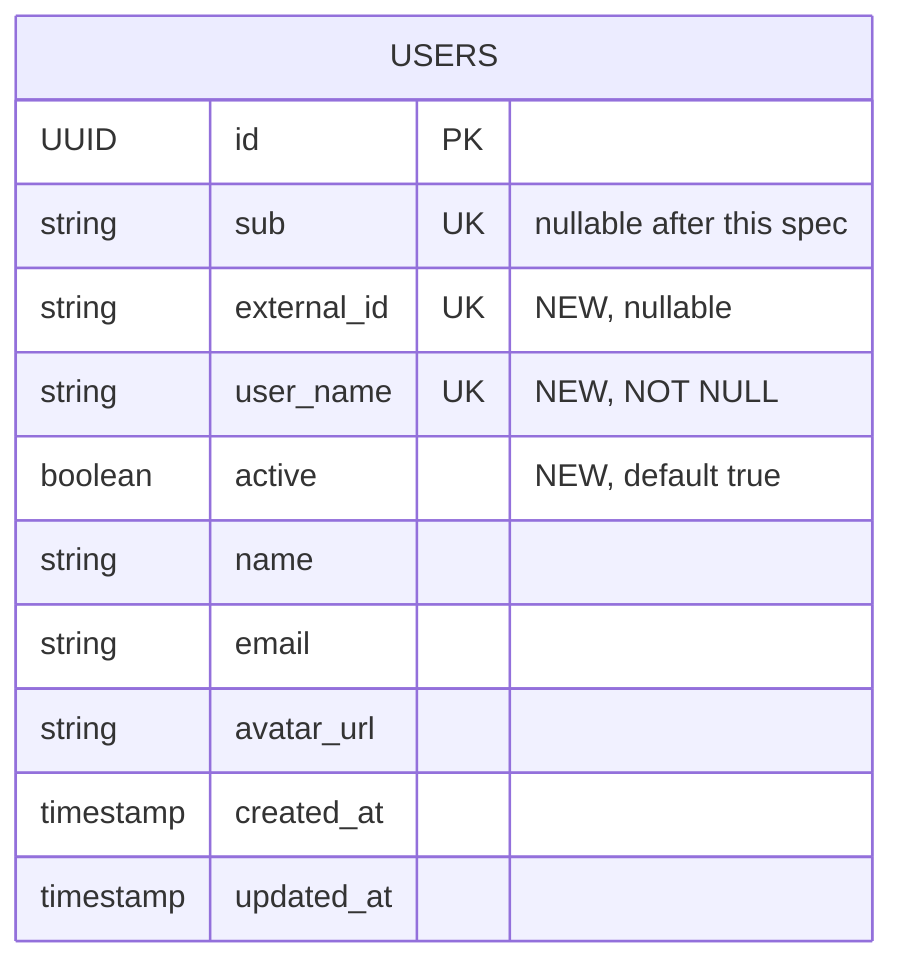
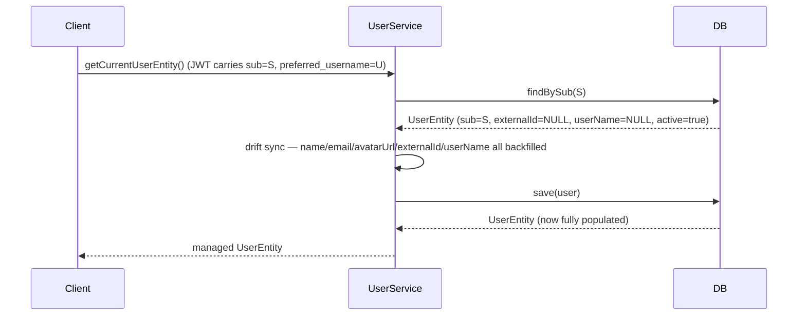
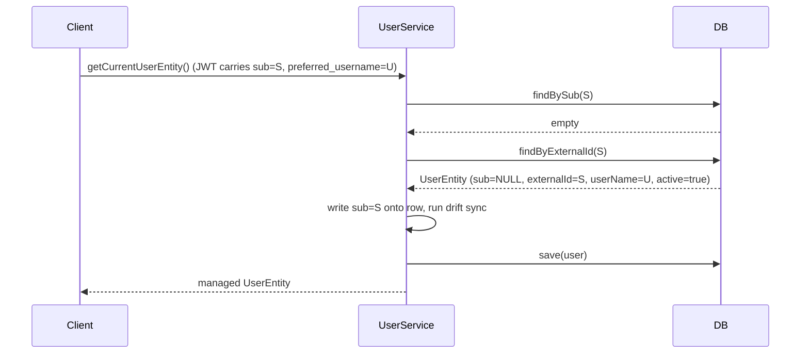
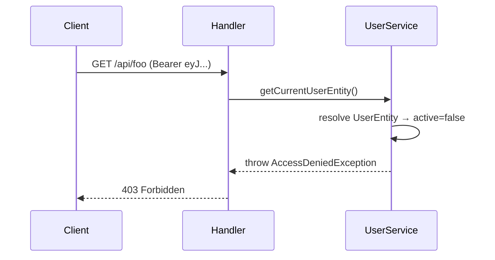
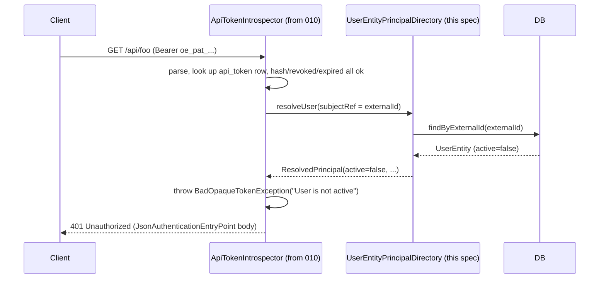

# Design: SCIM Foundation — User Model Refactor

## GitHub Issue

—

## Summary

Prepare `UserEntity` and the surrounding authentication flow for SCIM 2.0 provisioning, **without
introducing any SCIM endpoint yet**. SCIM clients (Authentik and other IdPs) provision users
*before* those users ever log in interactively — so the local user model must be addressable by
identifiers that are known to the IdP at provisioning time (`externalId`, `userName`), not by the
JWT `sub` claim which only exists after the first interactive login.

This spec relaxes `UserEntity.sub` from required-and-unique to optional-and-unique, adds three new
identifying fields (`externalId`, `userName`, `active`), wires the JIT-login flow to populate the
new fields from JWT claims and to correlate against a pre-existing row by `externalId` or
`userName`, and adds a soft-deactivation gate (`active = false`) that blocks JWT authentication
and JIT provisioning. Opaque-token authentication (spec 010) honours `active` through its own
`PrincipalDirectory.ResolvedPrincipal.active()` live check — the implementation of which is the
second deliverable of this spec.

No SCIM endpoints, no `GroupEntity`, no Group→Role mapping. Those land in a follow-up spec on top
of this foundation, once the data model can carry their semantics safely.

## Goals

- Allow `UserEntity` rows to exist without a `sub` claim, so a later SCIM-Provider spec can
  pre-provision users before their first interactive login.
- Introduce `externalId` and `userName` as stable IdP-side identifiers that survive across
  pre-provisioning and JIT login, so the same human always lands in the same row.
- Introduce `active` as the single, canonical deactivation flag — honored consistently by JWT
  auth (`UserService.getCurrentUserEntity()`), opaque-token auth (via the
  `PrincipalDirectory.ResolvedPrincipal.active()` live check defined in spec 010), and JIT
  provisioning.
- Backfill new fields incrementally via JIT login, without requiring a manual data migration step
  for existing installations.
- Ship the default `PrincipalDirectory` implementation that spec 010 deliberately omitted —
  backed by the now-extended `UserEntity`. Once 012 lands, USER tokens become validatable.

## Non-goals

- SCIM REST endpoints (`/scim/v2/Users`, `/scim/v2/Groups`, Discovery) — separate follow-up spec.
- `GroupEntity` and Group↔User relationships — separate follow-up spec.
- Group→Role mapping and role-derivation-from-groups — separate follow-up spec.
- A configurable JWT-claim-to-field mapping. This spec fixes `sub → externalId` and
  `preferred_username → userName` to keep the surface minimal. A property-based mapping can be
  added later without a breaking change.
- Flyway migration scripts shipped *by the library*. The library has no migration tooling of its
  own — consuming applications run Flyway against Postgres and own their schema timeline. This
  spec provides a migration *template* (see Schema Upgrade Path) that app maintainers adapt into
  their own Flyway versioned migration; the library does not ship `db/migration/V…__*.sql`.
- A REST API for user administration (e.g. listing all users, manually toggling `active`). The
  library exposes only the existing `UserService.getCurrentUser()` surface. Administrative writes
  come from SCIM (later) or directly from consuming apps.

## Technical Approach

The change has three coordinated parts.

### Part A — `UserEntity` schema additions

Three new columns and one relaxed constraint:

| Column        | Type          | Constraint                                      | Source on first write                                                   |
|---------------|---------------|-------------------------------------------------|-------------------------------------------------------------------------|
| `sub`         | VARCHAR(255)  | NULL allowed, UNIQUE                            | JWT `sub` claim on JIT login (unchanged)                                |
| `external_id` | VARCHAR(255)  | NULL allowed, UNIQUE                            | JWT `sub` claim on JIT login (mirrored)                                 |
| `user_name`   | VARCHAR(255)  | NOT NULL, UNIQUE                                | JWT `preferred_username` claim, with a fallback chain on JIT login      |
| `active`      | BOOLEAN       | NOT NULL, DEFAULT `true`                        | Always `true` on JIT-provisioned rows                                   |

The `sub` constraint is relaxed: the column stays unique but no longer requires a value, so a
SCIM-pre-provisioned row (added by the follow-up spec) can exist before the user ever logs in.

`externalId` is the stable IdP-side identifier. For Authentik, OIDC `sub` and SCIM `externalId`
are the same value (the Authentik user UUID). The foundation populates `externalId` from the JWT
`sub` on every JIT login; a future SCIM POST will set it from `externalId` in the SCIM payload.
The same value being available from both sources is what makes correlation possible later.

`userName` is the unique business key (RFC 7643 §4.1.1). Sourced from the OIDC
`preferred_username` claim on JIT login, with the fallback chain
`preferred_username → email → sub → "user-" + UUID` (only on missing claims; the last fallback
is a safety net to never write null).

`active = false` is the canonical deactivation flag. It is honored by all auth paths (see Part C).

### Part B — JIT-login correlation and backfill

`UserService.getCurrentUserEntity()` is extended with a tiered lookup and an opportunistic
backfill of new columns. Replacement for the current `userRepository.findBySub(sub)` call:

1. **Lookup by `sub`.** Same as today. If found, fall through to drift sync (Part C extras).
2. **Lookup by `externalId`.** Only if step 1 missed — addresses the SCIM-pre-provisioned case
   (a future spec writes the row without `sub`). When found, write `sub` onto the row.
3. **Lookup by `userName`.** Only if steps 1 and 2 missed — addresses installations where the
   IdP uses different identifiers for OIDC and SCIM. When found, write both `sub` and
   `externalId` onto the row.
4. **Create.** If all three lookups missed, insert a new row with all fields populated from the
   JWT.

For existing rows that were created before this spec (and therefore have `sub` set but
`externalId` and `userName` empty), the existing `findBySub` lookup wins at step 1, and the
drift-sync block then backfills `externalId` and `userName` opportunistically — no separate
migration job needed.

### Part C — Activation gate

`UserEntity.getActive()` is checked in three places, gating access on two security chains:

1. **`UserService.getCurrentUserEntity()`** (JWT chain) — after the resolve / create step. If
   the resolved entity has `active = false`, the method throws
   `AccessDeniedException("User account is disabled")`, which Spring Security renders as
   `403 Forbidden`. This affects every endpoint that calls `getCurrentUserEntity()`.

2. **`PrincipalDirectory.resolveUser(...)`** (opaque-token chain, from spec 010) — the default
   implementation introduced in this spec returns `ResolvedPrincipal(active = false, ...)`
   when the underlying `UserEntity.active` is false. `ApiTokenIntrospector` then throws
   `BadOpaqueTokenException("User is not active")`, which Spring Security renders as
   `401 Unauthorized` (semantically correct for a token-validation failure). The token row
   is **not** auto-revoked: deactivation is reversible and tokens should reactivate cleanly
   when `active = true` is restored.

3. **JIT provisioning** — when the very first JIT login arrives for a user that, in the future,
   has already been provisioned via SCIM as `active = false`, the lookup in Part B step 2 or 3
   finds the row, sees `active = false`, and throws. The user cannot bootstrap a session against
   a deactivated account.

`AccessDeniedException` on the JWT path is the right Spring Security exception: the JWT is
cryptographically valid and the principal is known, but they are not authorized to proceed.
This results in `403 Forbidden`. The opaque-token path uses `BadOpaqueTokenException` →
`401 Unauthorized` to match RFC 6750 §3 (an invalid-credentials response for a bearer token).
Both errors are rendered through the uniform JSON body introduced by spec 011.

### Part D — Default `PrincipalDirectory` implementation

Spec 010 ships the port `PrincipalDirectory.resolveUser(String subjectRef) →
Optional<ResolvedPrincipal>` but no default implementation. This spec adds one:

```java
@Component
public class UserEntityPrincipalDirectory implements PrincipalDirectory {

  private final UserRepository userRepository;

  @Override
  public Optional<ResolvedPrincipal> resolveUser(final String subjectRef) {
    // The opaque-token introspector calls this with the user's externalId,
    // which is what was written into the token's subject_ref at issuance.
    return userRepository.findByExternalId(subjectRef)
        .map(user -> new ResolvedPrincipal(
            user.getExternalId(),
            user.isActive(),
            // Roles and groups are currently not modelled on UserEntity in this spec —
            // the bridge returns empty sets and the SCIM-Provider follow-up extends this.
            Set.of(),
            Set.of(),
            user.getName()));
  }
}
```

The implementation is intentionally minimal in 012:

- **Active status** flows directly from the new column.
- **Roles and groups** return empty sets — the SCIM-Provider spec is what populates them once
  groups are part of the data model. Until then, USER tokens authenticate active users with
  zero role-based authorities; they can only act through scope-based `@PreAuthorize` checks.
- **`subjectRef` correlation** uses `externalId` because that is what `ApiTokenService`
  writes into the token at issuance (and what SCIM uses as the canonical IdP identifier).

This minimal implementation closes 010's "USER tokens are unusable without a directory" gap.
A consumer who needs role-based authorization on USER tokens before SCIM Groups land can
override the bean via `@Primary` or `@ConditionalOnMissingBean` (once that pattern is
introduced — TODO).

### Rationale for the key decisions

- **Three identifying fields, not one.** Each carries a different lifecycle promise:
  - `sub` = "this row has logged in interactively at least once via this IdP".
  - `externalId` = "this row is bound to a specific identity at the IdP" (works even pre-login).
  - `userName` = "this row has a stable human-readable handle, unique in our system".
  Collapsing them risks ambiguity once SCIM lands and starts pre-provisioning rows without a
  `sub`.
- **Fixed claim mapping, no config property.** The Authentik default (OIDC `sub` === SCIM
  `externalId`) holds for most enterprise IdPs (Okta, Entra ID, Keycloak in default config).
  Adding a property would expand the API surface for a flexibility we do not yet need; if a
  consumer of the library hits an IdP that disagrees, the property can be introduced without
  breaking anyone.
- **Opportunistic JIT backfill over a startup migration.** The library has no Flyway today.
  Startup-time JDBC backfill would have to run before Hibernate schema validation, which is
  brittle to order. JIT backfill is incremental, transactional, and degrades gracefully — every
  active user eventually has all three fields populated, dormant users stay as they are until
  they log in again.
- **`AccessDeniedException` over `AuthenticationException`.** A deactivated user is *known*, not
  *unknown*. Returning 401 would tell the client "your credentials are bad" and tempt a
  re-login, which would fail in the same place. 403 is honest: the credentials work, the account
  doesn't.
- **Token row stays active when user is deactivated.** Reversibility. If an admin toggles a user
  off and back on, their tokens continue to work — the live `PrincipalDirectory` check flips
  with the user's status, no row mutation needed. Auto-revoking on deactivation would force
  recreation on reactivation, which contradicts the "soft" in soft-deactivation. (Operators
  who *want* hard revocation on deactivation can still call
  `ApiTokenService.revokeAllForSubject(...)` from their SCIM handler — the library doesn't
  prescribe.)
- **`PrincipalDirectory` implementation belongs here.** Spec 010 declared the port; this spec
  owns the data model the port reads from (`UserEntity` + `active` + group membership in a
  later spec). Bundling the default implementation with the data-model change keeps a single
  source of truth and avoids a third spec between 010 and 012.
- **Spec 010 dependency direction.** This spec assumes 010 lands first (it declares the
  `PrincipalDirectory` port). The bridge code added here — a `UserEntityPrincipalDirectory`
  bean that adapts `UserEntity` to `ResolvedPrincipal` — is implementation detail that
  references but does not modify 010. If 010 has not landed when this spec is implemented,
  012 ships the port declaration too (a temporary library duplication) and 010 deletes the
  duplicate when it merges.

## Data Model

### Changes to `UserEntity`

```java
@Entity
@Table(name = "users")
public class UserEntity extends AbstractEntity {

  @Column(name = "sub", nullable = true, unique = true, length = 255)
  private String sub;                       // was nullable = false

  @Column(name = "external_id", nullable = true, unique = true, length = 255)
  private String externalId;                // NEW

  @Column(name = "user_name", nullable = false, unique = true, length = 255)
  private String userName;                  // NEW

  @Column(name = "active", nullable = false)
  private boolean active = true;            // NEW

  // existing columns: name, email, avatarUrl, updatedAt, plus AbstractEntity id/createdAt
}
```

### Entity-relationship diagram



### Repository additions

```java
public interface UserRepository extends EntityRepository<UserEntity> {
    Optional<UserEntity> findBySub(String sub);              // existing
    Optional<UserEntity> findByExternalId(String externalId); // NEW
    Optional<UserEntity> findByUserName(String userName);     // NEW
}
```

### `UserInformation` additions

The record carried from `AuthService` to `UserService` grows by two fields, so the JIT-login
flow has everything it needs in one pass:

```java
public record UserInformation(
    String id,            // = JWT sub (renaming would be a wider change; kept as is)
    String name,
    String email,
    String avatarUrl,
    String userName,      // NEW — from preferred_username claim, with fallback applied here
    String externalId     // NEW — = JWT sub (mirrored)
) {}
```

`AuthService.getUserInformation()` applies the `preferred_username → email → sub → "user-" + UUID`
fallback when building `userName`, so `UserService` always gets a non-null value.

## Key Flows

### Flow 1 — JIT login of an existing pre-foundation user



### Flow 2 — JIT login of a user previously provisioned by SCIM *(future-facing, no SCIM endpoints in this spec)*



This flow does not exercise any code path that this foundation alone can reach (no SCIM endpoint
to create the pre-provisioned row). It is documented here because the foundation's lookup
sequence is designed precisely to enable it. The follow-up SCIM spec inherits this flow without
further code changes in `UserService`.

### Flow 3 — JWT request for a deactivated user



### Flow 4 — Opaque-token request for a deactivated user



## Dependencies

- No new external libraries.
- **Spec 011 (Security Configuration Hygiene) is a hard prerequisite.** This spec extends
  `AuthService.getUserInformation()` (which after 011 returns `Optional<UserInformation>`) and
  the `UserInformation` record itself. Implementing 012 on the pre-011 codebase would either
  resurrect the `"UNKNOWN"` sentinel pattern for the two new fields or fork the API surface.
- **Spec 010 (API Token Module) is a soft prerequisite.** This spec ships a default
  `PrincipalDirectory` implementation that bridges 010's port to `UserEntity`. If 010 has not
  yet landed, the bridge code stays in place but is dormant (no `OpaqueTokenIntrospector`
  invokes it). If 010 lands second, it simply consumes the directory that 012 provided. The
  two specs are designed to be order-independent at implementation time, with 010 declaring the
  port and 012 declaring the implementation.

## Security Considerations

- **`active` is authoritative.** Once a row is `active = false`, every authentication path
  refuses to grant access. There is no "but the JWT is still valid" loophole, because the gate
  is downstream of token validation.
- **No new PII.** `userName` is an existing IdP-side identifier already exposed in JWTs today;
  storing it locally does not introduce a new category of personal data. GDPR posture is
  unchanged.
- **`externalId` is a stable identifier, not a secret.** It is the IdP's internal ID for the
  user and is intentionally never returned in API responses by this foundation; only
  `UserDto.id` (the local UUID) is exposed. The SCIM follow-up will expose `externalId` per
  RFC 7644, but only on `/scim/v2/Users` responses to authorized SCIM callers.
- **Re-activation does not require token reissue.** A user toggled back to `active = true`
  immediately succeeds on the next request — no logout/login dance.
- **Unique constraints are case-sensitive.** `userName` uniqueness follows the underlying RDBMS
  collation. Most IdPs already normalize. If a consumer needs case-insensitive uniqueness, they
  can add a functional index downstream; the foundation does not force a policy.

## Backwards Compatibility

- **`sub` relaxation from NOT NULL to NULL is non-breaking.** Existing rows already have values,
  no data is invalidated.
- **`UserInformation` gains two fields** (`userName`, `externalId`). For direct consumers of the
  record this is a minor breaking change at the source level. The project is `1.1.0-SNAPSHOT`
  and the previous spec (010) already noted similar tolerance for record extensions.
- **Existing `UserDto` is unchanged.** No new fields are exposed to API consumers — the
  identifiers added here are infrastructure, not part of the public DTO surface. This keeps the
  REST contract of consumer applications stable.
- **Schema upgrade path.** Consuming applications run Flyway against Postgres with Hibernate in
  `validate` mode. The library publishes a migration template that app maintainers paste into
  their own Flyway timeline:

  ```sql
  -- Vx__scim_foundation_user_model.sql
  ALTER TABLE users ALTER COLUMN sub DROP NOT NULL;

  ALTER TABLE users ADD COLUMN external_id VARCHAR(255);
  ALTER TABLE users ADD CONSTRAINT users_external_id_uk UNIQUE (external_id);

  ALTER TABLE users ADD COLUMN user_name VARCHAR(255);
  UPDATE users
     SET user_name = COALESCE(email, sub, 'user-' || id::text)
   WHERE user_name IS NULL;
  ALTER TABLE users ALTER COLUMN user_name SET NOT NULL;
  ALTER TABLE users ADD CONSTRAINT users_user_name_uk UNIQUE (user_name);

  ALTER TABLE users ADD COLUMN active BOOLEAN NOT NULL DEFAULT TRUE;
  ```

  Library integration tests use Hibernate DDL generation against Testcontainers, which creates
  the schema from scratch with the new constraints in place — so the library validates the JPA
  annotations independently of the app-side Flyway script.

## Open Questions

- **Property-based claim mapping.** Should we already expose
  `openelements.security.user.user-name-claim` and `external-id-claim` as configurable
  properties, even if the defaults match Authentik out of the box? Defer until a consumer
  reports they need it; the change is additive.

- **Audit-log integration for `active` flips.** Today `active` cannot be changed by any code
  path in this spec — it is set to `true` on JIT creation and never modified by the library.
  The SCIM follow-up will be the first writer that flips `active`. Audit-log integration is
  therefore added there, not here.

- **Reactivation of expired PATs.** A PAT's `expiresAt` is independent of `active`. A user
  toggled `active = false → true` after a PAT has expired does *not* un-expire the PAT. This is
  by design and worth calling out in the SCIM follow-up's behaviors as a non-obvious property.
