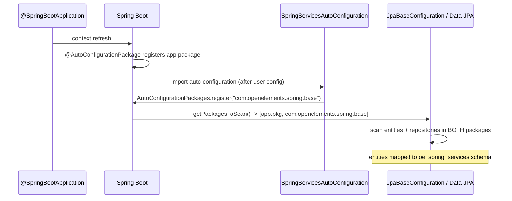

# Design: Dedicated DB schema + Spring Boot starter

## GitHub Issue

— (to be created; draft below in *GitHub issue draft*)

## Migration model (consumer-managed; library ships the SQL)

The library does **not** run migrations. Each release ships ready-to-apply PostgreSQL
forward-migration SQL for `oe_spring_services` in its upgrade doc (`docs/upgrade-to-X.Y.md`); the
consumer incorporates those scripts into **their own** Flyway/Liquibase timeline, in version order.
This keeps a single, consumer-controlled migration timeline and avoids a second Flyway instance.

A library-run Flyway instance was explored in spec **014** and **withdrawn** as too complex (two
Flyway instances, enforced ordering, fail-fast coupling, conditional V1) — the per-release-SQL model
here is the pragmatic replacement. The cross-entity reference contract that 014 raised is preserved
below (see *Cross-entity references*), since it is independent of who runs the migrations.

## Summary

`spring-services` ships JPA entities and Spring Data repositories, but today it relies on the
consuming application to wire them: the application must `@Import(FullSpringServiceConfig.class)`
and — because the library's tables live in the application's default schema — its entities and
repositories are only found if the application's component/entity scanning happens to cover
`com.openelements.spring.base`.

This spec makes two coupled changes:

1. **Dedicated schema (level 1 isolation).** All library tables move into a statically fixed
   database schema `oe_spring_services`, while remaining in a **single** JPA persistence unit (one
   `EntityManagerFactory`, one `TransactionManager`). The library owns a clearly delimited slice of
   the database without sacrificing cross-entity relationships or atomic transactions.

2. **Real Spring Boot starter.** The library becomes an auto-configured starter via
   `META-INF/spring/org.springframework.boot.autoconfigure.AutoConfiguration.imports`. The
   auto-configuration registers the library root package **additively** through
   `AutoConfigurationPackages.register(...)`, so Boot's existing entity *and* repository scanning
   finds both the application's and the library's packages. A consuming application needs **no**
   `@Import`, `@EntityScan`, or `@EnableJpaRepositories`.

## Goals

- Library tables live in schema `oe_spring_services`; application tables are untouched.
- One persistence context: library-internal foreign keys (e.g. `audit_log.user_id → users.id`) and
  `@ManyToOne` associations keep working; transactions spanning library entities stay atomic.
- Zero-config consumption: adding the dependency is enough — no `@Import`/`@EntityScan`/
  `@EnableJpaRepositories` in the application.
- A consuming application's own entities/repositories continue to be discovered automatically (the
  additive registration must not suppress Boot's default scan).
- Document how a dependent application migrates its database on the version bump using **its own**
  Flyway (the library ships no migrations).

## Non-goals

- **Two `EntityManagerFactory` / two `DataSource`** — explicitly rejected (level 2/3 isolation).
  One persistence unit only.
- **Library-owned/library-run Flyway** — the library does not run or version the schema at runtime.
  It *does* ship ready-to-apply per-release SQL in the upgrade doc, but the consumer applies it via
  their own migration tool (see *Migration model*). A library-run Flyway was the subject of the
  withdrawn spec 014.
- **Configurable schema name** — `oe_spring_services` is fixed. Externalising it would require a
  Hibernate `PhysicalNamingStrategy` that distinguishes library entities from application entities,
  which is deliberately out of scope.
- No change to the public Java API of the services (method signatures, DTOs).

## Technical approach

### Schema name constant

Introduce a single source of truth for the schema name so the value never drifts between
annotations and native SQL:

```java
package com.openelements.spring.base.data;

public final class DbSchema {
  /** The dedicated database schema that owns every spring-services table. */
  public static final String NAME = "oe_spring_services";
  private DbSchema() {}
}
```

`static final String` is a compile-time constant, so it is usable in `@Table(schema = ...)`
annotation attributes and in native SQL string concatenation.

### Entity schema mapping

The seven concrete entities gain `schema = DbSchema.NAME` on their existing `@Table`:

| Entity | Table | Package |
|---|---|---|
| `UserEntity` | `users` | `services.user` |
| `ApiKeyEntity` | `api_keys` | `services.apikey` |
| `AuditLogEntity` | `audit_log` | `services.audit` |
| `CommentEntity` | `comments` | `services.comment` |
| `SettingsEntity` | `settings` | `services.settings` |
| `TagEntity` | `tags` | `services.tag` |
| `WebhookEntity` | `webhooks` | `services.webhook.data` |

`AbstractEntity` is a `@MappedSuperclass` and carries no `@Table`, so it needs no change. `DbEntity`
in `data` is documentation-only (its `@Entity`/`@Table` appear in a Javadoc example), not a managed
entity — no change.

Example:

```java
@Entity
@Table(name = "users", schema = DbSchema.NAME)
public class UserEntity extends AbstractEntity { ... }
```

Hibernate handles entities across schemas within one persistence unit, and PostgreSQL allows foreign
keys across schemas — but here all library tables share the same schema, so library-internal FKs
(`audit_log.user_id → users.id`, `comments.author_id → users.id`) stay intra-schema and unaffected.

### Native SQL — schema qualification (ripple effect)

JPQL/derived queries reference entity names, not tables, so they are schema-transparent. **Native
SQL must be schema-qualified.** Affected sites:

- **Main:** `SystemUserInitializer.INSERT_SQL` → `INSERT INTO " + DbSchema.NAME + ".users ...`.
- **Tests** (5 classes) — the `@BeforeEach` cleanups and one seed insert:
  - `UserServiceConcurrencyTest`, `UserServiceActiveGateIntegrationTest`,
    `UserRepositorySchemaTest`, `UserEntityPrincipalDirectoryTest`:
    `delete from oe_spring_services.audit_log` / `delete from oe_spring_services.users where id <> ?`.
  - `AuditLogIntegrationTest`: schema-qualified `INSERT INTO oe_spring_services.users ...`.

JPA-based cleanups (`commentRepository.deleteAll()`, `auditLogRepository.deleteAll()`) need no change.

### Spring Boot starter (auto-configuration)

Add `src/main/resources/META-INF/spring/org.springframework.boot.autoconfigure.AutoConfiguration.imports`
containing one line:

```
com.openelements.spring.base.SpringServicesAutoConfiguration
```

```java
@AutoConfiguration
@ConditionalOnClass(EntityManagerFactory.class)
@AutoConfigureBefore({
  org.springframework.boot.autoconfigure.orm.jpa.HibernateJpaAutoConfiguration.class,
  org.springframework.boot.autoconfigure.data.jpa.JpaRepositoriesAutoConfiguration.class
})
@Import({FullSpringServiceConfig.class, SpringServicesAutoConfiguration.PackageRegistrar.class})
public class SpringServicesAutoConfiguration {

  static class PackageRegistrar implements ImportBeanDefinitionRegistrar {
    @Override
    public void registerBeanDefinitions(AnnotationMetadata meta, BeanDefinitionRegistry registry) {
      // Additive: appends the library root to whatever @SpringBootApplication already registered,
      // so Boot's entity AND repository scan (both default to AutoConfigurationPackages) cover the
      // app's package(s) AND the library's. Does NOT use @EntityScan, which would suppress the
      // app's default scan.
      AutoConfigurationPackages.register(registry, "com.openelements.spring.base");
    }
  }
}
```

**Ordering is not left to chance (binding).** The additive-scan mechanism only works if this
registrar appends the library package *before* Hibernate's entity scan and Spring Data's repository
registrar read `AutoConfigurationPackages`. Both readers are themselves auto-configuration-driven
registrars, and auto-configuration ordering is otherwise unspecified. Therefore
`SpringServicesAutoConfiguration` **must** declare
`@AutoConfigureBefore(HibernateJpaAutoConfiguration.class, JpaRepositoriesAutoConfiguration.class)`,
and the claim **must** be proven by the integration test below — it is not assumed to work.

**Why `AutoConfigurationPackages.register` and not `@EntityScan`:** Boot's
`JpaBaseConfiguration#getPackagesToScan()` uses `EntityScanPackages` only when non-empty, otherwise
falls back to `AutoConfigurationPackages` (the application's main package). Spring Data JPA's
repository auto-configuration uses the same `AutoConfigurationPackages` fallback. Adding an
`@EntityScan` would make `EntityScanPackages` non-empty and thereby *suppress* the application's
default entity scan — breaking the application's own entities. Appending to
`AutoConfigurationPackages` instead keeps `EntityScanPackages` empty, so the union of the
application package and the library package is scanned for both entities and repositories.

**Ordering:** `@SpringBootApplication` registers the application package via
`@AutoConfigurationPackage` during user-config processing; auto-configurations (and thus this
registrar) run afterwards, so the application package is already present when the registrar appends
the library package. The result is the union.

**Consistency with spec 011:** Spec 011 removed the *inert* `@AutoConfiguration`/
`@EnableAutoConfiguration` annotations from the feature configs because there was no
`AutoConfiguration.imports` file — they did nothing. This spec introduces the real `.imports` file
and a single dedicated auto-configuration class, completing the starter properly rather than
restoring the old half-state. The feature configs stay plain `@Configuration`; only the new
`SpringServicesAutoConfiguration` is auto-configured, and it `@Import`s `FullSpringServiceConfig`.

`@Import(FullSpringServiceConfig.class)` remains valid for consumers who prefer explicit wiring or
who exclude the auto-configuration; it becomes optional rather than required.

### Test schema creation

Tests run with `spring.jpa.hibernate.ddl-auto=create-drop` against PostgreSQL (Testcontainers).
Hibernate does not create a schema for an entity unless told to. Enable namespace creation in the
test profile so `create-drop` provisions `oe_spring_services`:

```
spring.jpa.properties.hibernate.hbm2ddl.create_namespaces=true
```

This must be added to `src/test/resources/application-testcontainers.properties` (and any other
test profile that relies on `ddl-auto` to build the schema, e.g. an H2-backed profile, if present).

### Binding acceptance gates (from the design grill)

These are **mandatory** parts of this spec, not optional polish. The whole design rests on two
claims that must be proven, plus one convention that must be enforced going forward.

1. **Starter resolves both app and library persistence — integration test.** A test application
   declaring its **own** `@Entity` + Spring Data repository in a *separate* package (e.g.
   `com.example.app`), with **no** `@Import`, `@EntityScan`, or `@EnableJpaRepositories`, must start
   with only the library on the classpath and resolve **both** its own entity/repository **and** a
   library entity/repository (e.g. `UserRepository`). This is the proof that
   `AutoConfigurationPackages.register` + `@AutoConfigureBefore` actually win the ordering. The test
   must fail if either side is missing.

2. **Schema convention is enforced — dependency-free guard test.** A test scans the classpath for
   every `@Entity` under `com.openelements.spring.base` (via reflection / classpath scanning, **no
   new dependency** such as ArchUnit) and asserts each one carries `@Table(schema = DbSchema.NAME)`.
   This makes the convention self-enforcing: any future entity (including those from the
   not-yet-implemented specs 010 / 012) that forgets the schema fails the build instead of silently
   landing in `public`.

### Versioning and release gating (from the design grill)

- This is a **DB-breaking change** for existing consumers (the new code will not start against the
  old `public`-schema tables without the migration). It is **not** a Java-API break.
- **Decision:** ship it as a normal version bump, **not** a forced major. Accepted tension: a
  DB-breaking change in a non-major release relaxes the semver expectation of third-party
  consumers; the mitigation is the mandatory upgrade doc (below) plus its explicit warnings.
- **The `docs/upgrade-to-X.Y.md` for the releasing version is a hard release gate** — this version
  must not be released without it. Per the existing `release.sh`/`release-doc` flow, the doc is
  generated/committed before the tag; for this version the doc is a *required* artifact.

## Data model

No columns, types, or relationships change. Only the **schema namespace** of the seven tables
changes from the default (`public`) to `oe_spring_services`. All existing constraints (PKs, unique
indexes, FKs) are preserved and move with their tables.

## Consumer migration (Flyway) — documentation deliverable

The library ships no runtime migrations; consumers migrate with their own Flyway/Liquibase. The
library's responsibility is to **ship the exact forward-migration SQL in each release's upgrade doc**
(`docs/upgrade-to-X.Y.md`), ready to paste into the consumer's own migration timeline. The version
that introduces the dedicated schema ships the **move** SQL below; subsequent releases ship the
forward DDL delta for any entity change. Consumers apply the scripts **in version order** (a skipped
release means applying each delta in sequence).

**Existing application (tables currently in `public`):**

```sql
CREATE SCHEMA IF NOT EXISTS oe_spring_services;

-- PostgreSQL moves the table together with its constraints and indexes; FKs between these
-- tables keep pointing at the moved tables, so order does not matter for referential integrity.
ALTER TABLE users      SET SCHEMA oe_spring_services;
ALTER TABLE api_keys   SET SCHEMA oe_spring_services;
ALTER TABLE audit_log  SET SCHEMA oe_spring_services;
ALTER TABLE comments   SET SCHEMA oe_spring_services;
ALTER TABLE settings   SET SCHEMA oe_spring_services;
ALTER TABLE tags       SET SCHEMA oe_spring_services;
ALTER TABLE webhooks   SET SCHEMA oe_spring_services;
```

**New application (no existing spring-services tables):**

```sql
CREATE SCHEMA IF NOT EXISTS oe_spring_services;
-- Then create the seven tables in oe_spring_services (DDL generated from the entities, or
-- hand-written), or let hibernate ddl-auto create them with hbm2ddl.create_namespaces=true in dev.
```

Guard rails for the upgrade doc: do not rename columns, do not change the single-DataSource setup,
and do not point application entities at `oe_spring_services` — that schema is library-owned.

**Mandatory warnings the upgrade doc must contain** (from the design grill — `spring-services` is a
*public* Maven Central artifact, so it cannot assume the Open Elements Flyway/deploy conventions):

- **`ddl-auto=update` causes silent data loss.** A consumer running `spring.jpa.hibernate.ddl-auto`
  in `update`/`create` mode gets **no** controlled `ALTER`: Hibernate sees the schema-qualified
  tables missing and creates fresh empty tables in `oe_spring_services`, orphaning the old data in
  `public`. The upgrade doc must state plainly: apply the shipped migration scripts with a real
  migration tool (Flyway/Liquibase) and set `ddl-auto` to `validate` or `none` for this upgrade.
- **Downtime required — not rolling-safe.** `ALTER TABLE … SET SCHEMA` is a hard cut: the instant it
  runs, `public.<table>` is gone, and any still-running old application instance (which expects
  `public`) breaks. The upgrade is **stop-the-world**: stop the app, migrate, start the new version.
  The doc must say it is not safe for rolling/HA deploys against a shared database.
- **Required database privileges.** The migration needs DDL rights and table ownership
  (`CREATE SCHEMA`, `ALTER TABLE … SET SCHEMA`). The application's *runtime* role then needs
  `USAGE` on `oe_spring_services` (and the schema on its `search_path` for any consumer-side native
  SQL). The doc must not assume "app role = full-privilege DB owner"; it must list the privileges
  for the migration role and the runtime role separately.

## Cross-entity references (app ↔ lib)

Preserved from the withdrawn spec 014 because it is independent of who runs the migrations. With one
persistence unit (this spec), an application entity may map a JPA association to a library entity;
the contract:

- **App → lib only.** An application entity may declare `@ManyToOne UserEntity`, yielding a
  cross-schema FK `app_schema.<table>.<col> → oe_spring_services.<lib_table>.id` (PostgreSQL
  supports this). **Lib → app is forbidden** — the library must never reference an application table.
  The convention guard test (see *Binding acceptance gates*) is extended to assert no library entity
  associates to a non-library type.
- **Reference stable PKs only.** Applications reference the library `id` primary key (immutable
  `UUID`), never volatile columns (`sub`, `user_name`, `email`). The library treats `id` as an
  immutable contract.
- **Referential actions owned by the app.** The `ON DELETE`/`ON UPDATE` behavior of an app→lib FK is
  defined by the application's migration; library deletion code must tolerate a constraint violation
  surfacing from an unknown downstream FK.
- **Deprecation cycle for destructive library schema changes.** A referenced library table/column to
  be removed is announced as deprecated in release N and removed no earlier than N+1, so the consumer
  can drop its FK first. Because the consumer owns a single Flyway timeline, it sequences the library
  scripts and its own FK changes itself — no cross-instance two-deploy dance is forced by the library
  (that complication only existed in the withdrawn library-run-Flyway design).

## Key flows



## Dependencies

- No new runtime dependency. `AutoConfigurationPackages`, `@AutoConfiguration`,
  `ImportBeanDefinitionRegistrar` are all Spring Boot / Spring core.
- `@ConditionalOnClass(EntityManagerFactory.class)` guards the auto-config so it only activates when
  JPA is on the classpath.

## Security considerations

- No change to authentication/authorization. The active-gate, API-key, and JWT flows are unaffected.
- The dedicated schema slightly improves blast-radius isolation (library tables are namespaced and
  can be granted/revoked as a unit), but this is not a security feature and is not relied upon as one.

## Open questions

- Is there an H2-backed test profile besides `testcontainers` that also needs
  `hbm2ddl.create_namespaces=true`? To be confirmed during implementation; if found, apply the same
  property there.
- The exact release version for the upgrade doc (`docs/upgrade-to-X.Y.md`) is decided at release
  time, not in this spec.

## GitHub issue draft

> **Title:** Move spring-services persistence into a dedicated `oe_spring_services` schema and ship a proper Spring Boot starter
>
> **Description:**
> Today consumers must wire the library (`@Import(FullSpringServiceConfig)`) and ensure their
> entity/repository scanning covers `com.openelements.spring.base`, and the library's tables share
> the application's default schema. This change (1) maps all seven library tables to a fixed schema
> `oe_spring_services` within a single persistence unit, and (2) turns the library into an
> auto-configured Spring Boot starter that registers its package additively via
> `AutoConfigurationPackages`, so a consuming app needs no `@Import`/`@EntityScan`/
> `@EnableJpaRepositories` and its own entities keep being discovered.
>
> **Acceptance criteria:**
> - All seven entities map to `oe_spring_services`; one `EntityManagerFactory`/`TransactionManager`.
> - Adding the dependency wires everything; an app with its own entity (no `@EntityScan`) resolves
>   both its own and the library's entities/repositories.
> - Native SQL (SystemUserInitializer + test cleanups/seeds) is schema-qualified.
> - Library-internal FKs and atomic transactions still work.
> - Upgrade doc explains the consumer Flyway migration (`ALTER TABLE ... SET SCHEMA`).
> - No library-owned Flyway; schema name is fixed (not configurable).
