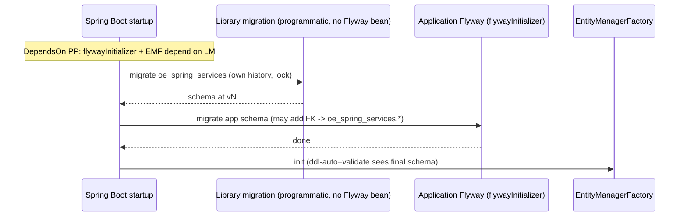

# Design: Library-owned Flyway migrations

## GitHub Issue

— (to be created)

## Status: WITHDRAWN

This spec is **withdrawn**. A library-run Flyway instance proved too complex once grilled — it
required running migrations without a `Flyway` bean (to avoid disabling the app's Flyway), an
enforced ordering PostProcessor, fail-fast Flyway coupling, a conditional V1, and a deprecation
two-deploy dance — for marginal benefit over the consumer simply owning their migration timeline.

**Replacement (pragmatic):** the library stays consumer-managed (spec 013) and **ships ready-to-apply
per-release forward-migration SQL in each release's upgrade doc** (`docs/upgrade-to-X.Y.md`); the
consumer pastes it into their own Flyway/Liquibase in version order. This is anchored in spec 013's
*Migration model* and *Consumer migration* sections, and in the `release-doc` process.

The decided **cross-entity reference contract** (app→lib only, reference stable PK `id`, referential
actions owned by the app, deprecation cycle for destructive library schema changes) was preserved by
folding it into spec 013's *Cross-entity references* section.

The content below is retained only as a record of the explored design — **do not implement it.**

---

## (Withdrawn) original design note

**Combined release with spec 013.** This spec is *grilled and decided*. Per the grill, 013 and 014
ship in **one release** (Pfad 2): the library owns its `oe_spring_services` schema via Flyway from
**V1**, which supersedes 013's original "consumer-managed, no library Flyway, manual `ALTER … SET
SCHEMA`" approach. 013's design has been amended accordingly. 013 + 014 are one logical unit.

## Summary

The library **owns and runs its own schema migrations** via a Flyway runner that is fully isolated
from the application's own Flyway. When the library's entities change in a future version, the
consuming application picks up the matching schema change automatically on startup — the consumer
writes no migration SQL for `oe_spring_services`.

Isolation is achieved without disturbing the application's Flyway by **running the library migration
programmatically — without registering a `Flyway`-typed Spring bean** (see *Coexistence*). The
library migration uses its own location, its own schema history table inside `oe_spring_services`,
and its own default schema, against the shared `DataSource`.

A central concern is **how references between application entities and library entities are handled**
(see *Cross-entity references*).

## Goals

- The library ships versioned Flyway migrations for its 7 tables and runs them on startup.
- The library migration is **isolated** from the application's Flyway (own history table, own
  location, own default schema; shared `DataSource`) and must **not** disable the application's own
  Flyway auto-configuration.
- **Deterministic, enforced ordering:** library migration runs before the application's Flyway, and
  both before the `EntityManagerFactory` initializes.
- Application entities may safely reference library entities, with a clear lifecycle contract for the
  cross-schema foreign key.
- Flyway is a **hard, fail-fast requirement** when the library is active; a consumer can explicitly
  opt out to self-manage the schema.
- From V1 the library handles both greenfield databases and existing `public`-schema databases
  (move), under a documented upgrade precondition.

## Non-goals

- Two `EntityManagerFactory` / two `DataSource` (one persistence unit, per 013).
- Configurable schema name (fixed `oe_spring_services`, per 013).
- Managing the application's own schema — the library only migrates `oe_spring_services`.
- Library → application references (forbidden — see *Cross-entity references*).
- **Rolling / zero-downtime deploys** — explicitly unsupported (see *Concurrency*).
- Reconciling column drift from older 1.x versions in V1 (see *Upgrade precondition*).

## Technical approach

### Coexistence — run migration WITHOUT a `Flyway` bean (binding)

Spring Boot's `FlywayAutoConfiguration` creates the application's `Flyway` bean only under
`@ConditionalOnMissingBean(Flyway.class)` (matched by **type**). If the library registered its own
`Flyway` bean, Boot would back off and the **application's** Flyway would never be created — its
migrations would silently stop. Therefore:

- The library **must not** expose a `Flyway`-typed bean. It runs its migration **programmatically**
  inside a dedicated initializer bean (a custom type, not `Flyway`/`FlywayMigrationInitializer`),
  building a **local** instance:
  ```java
  Flyway.configure()
      .dataSource(dataSource)
      .schemas(DbSchema.NAME)            // oe_spring_services
      .defaultSchema(DbSchema.NAME)      // history table lives in oe_spring_services
      .locations("classpath:db/migration/oe_spring_services")
      .createSchemas(true)
      .baselineOnMigrate(false)          // not needed under Pfad 2 — V1 owns greenfield + move
      .load()
      .migrate();
  ```
- Because no `Flyway` bean is present, Boot's application Flyway auto-configuration is preserved.
- **Binding test:** an integration test with a consumer test-app that has its **own** application
  Flyway (separate location + history table) must prove **both** the application's and the library's
  migrations run.

### Ordering — enforced, not assumed (binding)

Two requirements:
1. Library migration runs **before** the application's Flyway (so an app migration may add a
   cross-schema FK into an already-existing `oe_spring_services` table).
2. Both run **before** the `EntityManagerFactory` initializes (so `ddl-auto=validate` sees the final
   schema).

Boot already orders the application's `flywayInitializer` before the `EntityManagerFactory`. To put
the library migration first, the library ships a `BeanFactoryPostProcessor` extending Boot's
`AbstractDependsOnBeanFactoryPostProcessor` that declares a `@DependsOn` from **`flywayInitializer`**
and **`entityManagerFactory`** onto the library migration bean. Spring then instantiates the library
migration first, deterministically — independent of auto-configuration order. This is the mechanism
Boot itself uses for "X must run before JPA"; it is **not** `@Order`/bean-order guessing. Ordering is
covered by an integration test.

### Concurrency (binding)

- Each Flyway migration takes a **database lock on its history table** (PostgreSQL session lock), so
  concurrently starting instances serialize: one applies, the others see "already applied" and skip.
- Library and application histories are **different tables** → different locks → no cross-deadlock.
- Each instance runs library-before-application internally, so the referenced library tables exist
  before that instance creates an application FK.
- The only residual hazard — **mixed library versions running concurrently** — is excluded by the
  **stop-the-world** deploy constraint. **Rolling/HA deploys against a shared database are
  unsupported** and must be stated as such in the docs.

### Flyway requirement — fail-fast (binding)

- `flyway-core` (+ `flyway-database-postgresql`) is declared at **optional scope** — not forced
  transitively onto every consumer.
- Flyway is nonetheless a **hard requirement** when the library is active, and it is **enforced
  fail-fast**: if the library is active (JPA present) but Flyway is **not** on the classpath and the
  opt-out is **not** set, context startup **fails** with a clear message
  (`"spring-services requires Flyway on the classpath; add org.flywaydb:flyway-core, or set
  <opt-out> to self-manage the oe_spring_services schema"`). This closes the silent-fallback gap
  where a missing Flyway would otherwise drop the consumer back to `ddl-auto` and risk data loss.

### Opt-out

A consumer that wants to self-manage the schema sets an opt-out property (exact name TBD — Open
question). When set: the library runs no migration, performs no schema management, and the fail-fast
Flyway check is skipped. The consumer is then fully responsible (as in the pre-014 model).

### V1 — conditional move-or-create (binding)

`spring-services` already has 1.x releases with the 7 tables in `public`. The combined 013+014
release is the first version with the dedicated schema, so V1 must serve **both** populations in one
script via a PL/pgSQL `DO` block:

```sql
-- V1__oe_spring_services_baseline.sql  (illustrative)
CREATE SCHEMA IF NOT EXISTS oe_spring_services;
DO $$
BEGIN
  IF to_regclass('public.users') IS NOT NULL THEN
    ALTER TABLE public.users SET SCHEMA oe_spring_services;   -- existing 1.x consumer: move
  ELSE
    CREATE TABLE oe_spring_services.users (...);              -- greenfield: create
  END IF;
  -- ... repeat per table (api_keys, audit_log, comments, settings, tags, webhooks)
END $$;
```

`ALTER … SET SCHEMA` moves the table with its constraints, indexes, and FKs; greenfield `CREATE`
must exactly match the entity mapping so `ddl-auto=validate` passes.

### Upgrade precondition (binding, documented)

V1 moves tables by **location only** — it does **not** reconcile column drift. A consumer on an
*older* 1.x (e.g. before the SCIM columns) would have a moved table missing columns, failing
`ddl-auto=validate`. Therefore the supported upgrade path is a **hard, documented precondition**:

> Upgrade to the **latest 1.x** (all columns present) **first**, then upgrade to the schema release.

## Cross-entity references (app ↔ lib)

### Allowed direction: application → library only

- **App → lib allowed.** An application entity may map `@ManyToOne UserEntity`; Hibernate emits a
  cross-schema FK `app_schema.<table>.<col> → oe_spring_services.<lib_table>.id` (PostgreSQL
  supports this).
- **Lib → app forbidden.** The library must never reference an application table; the convention
  guard test (from 013) is extended to assert no library entity has an association/FK to a
  non-library type.

### Reference only stable library primary keys

Applications reference only the library's `id` PK (immutable `UUID` from `AbstractEntity`), never
volatile columns (`sub`, `user_name`, `email`). The library treats `id` as an immutable contract.

### Migration ordering for the cross-schema FK

An application migration adding a FK into `oe_spring_services` runs after the library migration that
created the table — guaranteed by the enforced ordering above.

### Lifecycle: destructive library changes require a deprecation cycle (binding policy)

Because library-Flyway runs **before** application-Flyway, a library migration that drops/renames a
referenced table/column cannot be made safe within the *same* boot (the app's FK-removal migration
runs afterwards). Therefore a **two-release, two-deploy** policy is mandatory:

- A referenced library table/column that is to be removed is **deprecated and announced in release
  N** (changelog/upgrade doc).
- It is removed **no earlier than release N+1**.
- The consumer removes its FK in a **separate, earlier deploy** (while still on library version N),
  then upgrades to N+1.
- The library never hard-drops a referenced table/column unannounced, and never uses `DROP … CASCADE`
  that would silently take an application's FK/data with it.

### Referential actions owned by the application

The `ON DELETE`/`ON UPDATE` behavior of an app→lib FK is defined by the application's migration. A
library operation deleting a referenced row is governed by the app's FK definition; the library's
deletion code must tolerate a constraint violation surfacing from an unknown downstream FK.

## Data model

No change to the 7 tables' columns. 014 adds: a library-owned Flyway history table in
`oe_spring_services`, and versioned scripts under `db/migration/oe_spring_services/`.

## Key flows



## Dependencies

- **Spec 013** ships in the same release (combined unit).
- `flyway-core` (+ `flyway-database-postgresql`) at **optional** scope; required at runtime when
  active (fail-fast enforced).
- No second DataSource.

## Security considerations

- The migration needs DDL privileges on `oe_spring_services`; the runtime role needs DML + `USAGE`.
  Same privilege split documented in the upgrade doc.

## Open questions

- **Opt-out property name** (and confirmation it also skips the fail-fast Flyway check + schema
  creation).
- **Multi-module / multiple OE libraries** each owning a schema with their own programmatic runner:
  ordering among several such runners. Deferred — `spring-services` is the first schema-owning
  library; revisit when a second one appears.
- `ddl-auto=update` consumers *with* Flyway present but misconfigured: covered by the upgrade doc's
  `validate`/`none` guidance (carried from 013); confirm wording.
