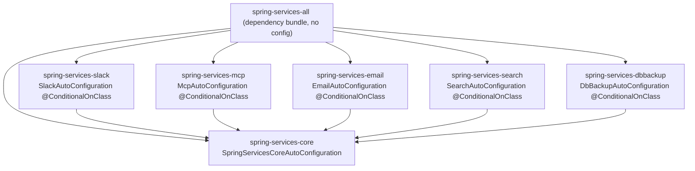

# Design: Multi-module restructuring (core + optional feature modules)

## GitHub Issue

— (to be created; draft below in *GitHub issue draft*)

## Summary

`spring-services` ships today as a single Maven artifact (`com.open-elements:spring-services`).
Every consumer therefore pulls the **full** dependency footprint, including heavy/rare libraries
that only some applications need: `slack-api-client` (Slack), the MCP SDK
(`io.modelcontextprotocol.*`, two artifacts), and `spring-boot-starter-mail` (email). An application
that uses none of these still drags them onto its classpath.

This spec restructures the library into a **Maven reactor (multi-module) project** so that a consumer
depends only on the features it uses, while a single `spring-services-all` artifact preserves the
current one-step "everything" experience. The split is **pragmatic, not maximal**: packages that are
cyclically entangled stay together in one module, and only the genuinely separable features become
their own modules.

This spec **builds on spec 013** (dedicated `oe_spring_services` schema + Spring Boot starter, single
persistence unit). Spec 013 is implemented and **released first**; this restructuring follows and
refactors 013's single auto-configuration into per-module auto-configurations.

## Goals

- A consumer can depend on `spring-services-core` plus only the feature modules it needs, without
  pulling the heavy/rare dependencies of the other features.
- `spring-services-all` reproduces today's full-feature behavior for consumers who want everything.
- A `spring-services-bom` lets à-la-carte consumers manage all module versions from one import.
- Each optional feature module **self-activates** when present on the classpath and is inert when
  absent (no `NoClassDefFoundError` from a missing module).
- The single persistence unit from spec 013 is preserved: all seven entities resolve, library-internal
  foreign keys and atomic transactions keep working.
- One shared (lockstep) version across all modules, bumped from a single place.

## Non-goals

- **Maximal per-feature split.** Every feature does *not* become its own module. `data`/`events` and
  `security`/`apikey`/`user` are cyclically entangled and stay together; the remaining light features
  stay in `core`. (Granularity decision; see *Module layout*.)
- **JPMS / `module-info.java`.** Modules are plain Maven/classpath modules. Real Spring module
  boundary enforcement (Spring Modulith) is deferred to the backlog (`docs/TODO.md`).
- **Independent per-module versioning.** Lockstep only.
- **Changing the public Java API of the services** (method signatures, DTOs) beyond the visibility
  widening forced by the module split (see *Inter-module API surface*).
- **Backwards-compatible Maven coordinates.** The `spring-services` coordinate is intentionally
  repurposed as the reactor parent; this is a breaking change for consumers (see *Breaking change &
  consumer migration*).
- **Re-opening spec 013's design.** 013 ships its monolithic starter as-is and is released before this
  work begins.

## Background: dependency analysis

Code-level (non-Javadoc) import analysis of the current single module established which packages can
be separated and which cannot.

**Cyclically entangled clusters — each must stay in one module:**

- `data ↔ events` — `AbstractDbBackedDataService` publishes `OnObject{Create,Update,Delete}`; those
  event types import `WithId` from `data`.
- `security ↔ apikey ↔ user` — mutually recursive (`security` → `apikey`, `user`; `apikey` →
  `security`, `user`; `user` → `security`).

**External dependency footprint of the candidate modules:**

| Feature | Extra external dependency vs. core | Internal deps |
|---|---|---|
| `slack` | `com.slack.api:slack-api-client` | none — standalone |
| `mcp` | `io.modelcontextprotocol.sdk:mcp-spring-webmvc` + `mcp-json-jackson2` | `security`, `apikey` |
| `email` | `spring-boot-starter-mail` (`jakarta.mail`) | `user` |
| `search` | **none** (Spring `RestClient` against Meilisearch HTTP API) | none (real) |
| `dbbackup` | **none** (Spring `RestClient` against the sidecar) | none (real) |

`search` and `dbbackup` carry **no** extra third-party library; they are split out for logical
optionality and clean boundaries, not for dependency weight (decision owned in the grill session).

All seven `@Entity` classes (`UserEntity`, `ApiKeyEntity`, `AuditLogEntity`, `CommentEntity`,
`SettingsEntity`, `TagEntity`, `WebhookEntity`) live in `core` packages. No optional module owns an
entity — so the single persistence unit from spec 013 is preserved trivially.

## Technical approach

### Module layout

```
spring-services                      (reactor parent, packaging=pom; parent = com.open-elements:java-parent)
├── spring-services-core             data, events, security, user, apikey, audit, comment,
│                                    tag, settings, system, webhook, tenant, translation, apitoken
│                                    → all 7 @Entity, the core @AutoConfiguration, the schema/
│                                      persistence wiring from spec 013, FullSpringServiceConfig (core-only)
├── spring-services-slack            → slack-api-client
├── spring-services-mcp              → mcp-spring-webmvc + mcp-json-jackson2 (depends on core)
├── spring-services-email            → spring-boot-starter-mail (depends on core)
├── spring-services-search           → Spring RestClient (depends on core)
├── spring-services-dbbackup         → Spring RestClient (depends on core)
├── spring-services-all              → depends on every module above; the "everything" jar;
│                                      hosts the aggregate/zero-config integration tests
└── spring-services-bom              → import-scope BOM listing all modules at the lockstep version
```

Java packages are **not** renamed: all classes stay under `com.openelements.spring.base.*`. Only the
Maven artifact that contains them changes. This keeps the spec-013 root-package scan
(`AutoConfigurationPackages.register("com.openelements.spring.base")`) valid regardless of which jars
are present.

**Rationale:** the entangled clusters cannot be split without breaking compilation; the light features
add no dependency weight; the genuinely heavy/optional features (slack, mcp, email) are exactly the
stated pain. `search`/`dbbackup` join them for boundary consistency. This minimizes POM/release churn
while solving the actual problem.

### Reactor parent and the org parent

The reactor parent `spring-services` keeps `com.open-elements:java-parent` as **its** parent, so all
modules inherit the Open Elements build conventions (plugins, reproducible-build settings, Java
version). The reactor parent owns `<dependencyManagement>` and `<pluginManagement>` shared by the
modules; third-party library versions (`slack-api-client.version`, `mcp-sdk.version`, …) stay as
properties in the reactor parent (module-internal concern), not pushed into the org parent.

### Versioning (lockstep)

All modules share one version. Each module's POM references the parent version **explicitly** (fixed,
not `${revision}`); a global version change is performed with the `versions-maven-plugin`
(`mvn versions:set -DnewVersion=… -DprocessAllModules`). This keeps the reactor reproducible and is
compatible with the existing JReleaser flow (spec 001), which now stages and deploys N module
artifacts (each with its `-sources`/`-javadoc`/signatures) instead of one.

### Dependency redistribution

The current single `pom.xml` declares all dependencies. They are redistributed:

- **`core`:** `spring-boot-starter-web`, `-security`, `-data-jpa`, `-validation`,
  `-oauth2-resource-server`, `swagger-annotations-jakarta`, `jspecify`. Test deps for the JPA/security
  integration tests (Testcontainers PostgreSQL, spring-security-test, h2, postgresql driver).
- **`slack`:** `slack-api-client`.
- **`mcp`:** `mcp-spring-webmvc`, `mcp-json-jackson2` (+ `wiremock` in test scope where used).
- **`email`:** `spring-boot-starter-mail`.
- **`search`, `dbbackup`:** no new third-party dependency (`spring-web`'s `RestClient`, transitively
  via core); `wiremock` in test scope where used.
- Each feature module declares `spring-services-core` as a `compile` dependency.

Version management for third-party libs stays in the reactor parent's `<dependencyManagement>`; module
POMs declare the dependency without a version.

### Auto-configuration distribution (refactor of spec 013)

Spec 013 establishes **one** `SpringServicesAutoConfiguration` that `@Import`s `FullSpringServiceConfig`,
which statically references every feature config. After the split that single class cannot stay — it
would reference `SlackConfig`, `McpServerConfig`, etc. from artifacts that may be **absent**, causing
`NoClassDefFoundError`.

New model — **one auto-configuration per module**, each registered through that module's own
`META-INF/spring/org.springframework.boot.autoconfigure.AutoConfiguration.imports`:

- **`core`:** `SpringServicesCoreAutoConfiguration`
  - Keeps spec 013's responsibilities: `AutoConfigurationPackages.register("com.openelements.spring.base")`
    (additive root-package registration), `@AutoConfigureBefore(HibernateJpaAutoConfiguration,
    JpaRepositoriesAutoConfiguration)`, `@ConditionalOnClass(EntityManagerFactory.class)`.
  - `@Import`s a **core-only** `FullSpringServiceConfig` (the optional feature configs are removed from
    it).
- **Each optional module:** e.g. `SlackAutoConfiguration`, `McpAutoConfiguration`,
  `EmailAutoConfiguration`, `SearchAutoConfiguration`, `DbBackupAutoConfiguration`.
  - Guarded by `@ConditionalOnClass(<the module's marker / heavy-dep class>)` so it only activates when
    the module (and its dependency) is on the classpath.
  - Retains the existing per-feature `@ConditionalOnProperty` toggles (e.g.
    `openelements.mcp.enabled`, search/db-backup enable flags) for runtime opt-out.
  - `@Import`s the module's existing feature `@Configuration` (`SlackConfig`, `McpServerConfig`, …).

`spring-services-all` ships **no** auto-configuration and **no** aggregate config: it is a pure
dependency bundle. With every module on the classpath, all per-module auto-configs activate, yielding
today's full behavior.

`@Import(FullSpringServiceConfig.class)` remains valid for `core` consumers who prefer explicit
wiring, but now wires only the core features. Optional features are wired by adding their module
(auto-config) or importing their feature config explicitly.



### Inter-module API surface

With plain classpath modules (no JPMS), every `public` type in `core` becomes reachable across the
module boundary and is therefore the **inter-module contract**. Optional modules already depend on
specific core types — these must be (and largely already are) `public`:

- `mcp` → `ApiKeyDataService`, `ApiKeyAuthenticationFilter` (from `security.apikey` / `services.apikey`).
- `email` → `services.user` types.
- all feature services → `AbstractDbBackedDataService` and `data` contracts; `events` types.
- `user` → `apitoken.PrincipalDirectory` (SPI) — stays in `core`.

The split only **widens visibility where required to compile across modules**; no deliberate API
redesign. Hardening these boundaries (hiding internals) is the deferred Spring Modulith follow-up.

### BOM

`spring-services-bom` (`packaging=pom`) provides `<dependencyManagement>` entries for every
spring-services module at the lockstep `${project.version}`. À-la-carte consumers `import` it once and
then declare individual modules without versions. The BOM inherits org conventions from `java-parent`
but does not need third-party lib versions (those are managed inside the modules).

### Build / CI

- The reactor builds top-down (`mvn -pl … -am` honored). CI builds the whole reactor.
- JReleaser/`release.sh` (spec 001) now publishes multiple artifacts; the release config is updated to
  stage all module jars + the BOM. SNAPSHOT publishing to GitHub Packages likewise covers all modules.
- Reproducible-build settings inherited from `java-parent` apply to every module.

## Data model

No change. All seven tables, columns, constraints, FKs, and the `oe_spring_services` schema (from spec
013) are untouched. Entities remain in `core`; one `EntityManagerFactory` / one `TransactionManager`.

## Testing strategy

- **Per-module tests** move with their code into each module's `src/test`. Unit tests (Slack/email
  `ObjectProvider`, MCP tool logic, WireMock-backed HTTP clients for search/dbbackup) live in their
  module.
- **JPA / Testcontainers-PostgreSQL integration tests** live in `core` (that is where the entities and
  repositories are). The test dependencies move to `core`'s test scope.
- **`@Entity` schema-convention guard test** (spec 013, gate 2) moves to `core` and scans the classpath
  for `@Entity` under `com.openelements.spring.base`, asserting `@Table(schema = DbSchema.NAME)`. It
  now only sees core entities (optional modules have none) — which is correct and complete.
- **Aggregate / zero-config starter integration test** (spec 013, gate 1) lives in
  **`spring-services-all`**, where the full classpath is present. It declares a test app with its own
  `@Entity` + repository in a separate package, with no `@Import`/`@EntityScan`/
  `@EnableJpaRepositories`, and asserts both the app's and the library's entities/repositories resolve,
  and that representative optional-feature beans (e.g. a Slack/MCP bean) are present.
- **New module-isolation test (this spec):** a test (in `spring-services-all` or per feature module)
  proving that an optional module's auto-config does **not** fail when sibling optional modules are
  absent — at minimum a dependency/classpath assertion that `core` does not transitively pull
  `slack-api-client`/MCP/mail.

## Breaking change & consumer migration

This is a **breaking change** for existing consumers:

- The `com.open-elements:spring-services` coordinate becomes the reactor parent (`packaging=pom`) — it
  no longer resolves to a jar with classes. A consumer declaring it as a dependency will fail to
  compile.
- **Migration:** depend on `com.open-elements:spring-services-all` (drop-in for the old "everything"
  behavior), or pick `spring-services-core` + the desired feature modules (optionally via
  `spring-services-bom`).
- `@Import(FullSpringServiceConfig.class)` keeps working but now wires only core features; full-feature
  consumers should rely on classpath-based auto-config (just having the modules present) or import
  individual feature configs.

The releasing version ships a `docs/upgrade-to-X.Y.md` (hard release gate, per spec 001/013 flow)
documenting the coordinate change and the auto-config model. Because spec 013 already introduced a
DB-breaking change in the prior release, this is the **second consecutive breaking release**; the
upgrade doc states the ordering explicitly (013's schema migration first, then this coordinate swap).

## Dependencies

- No new runtime dependency is introduced by the restructuring itself. `@AutoConfiguration`,
  `AutoConfigurationPackages`, `@ConditionalOnClass`, `ImportBeanDefinitionRegistrar` are Spring
  Boot/core.
- Build-time: `versions-maven-plugin` for the global version bump (likely already available via
  `java-parent`); `flatten`/`${revision}` explicitly **not** used (fixed parent versions chosen).

## Security considerations

- No change to authentication/authorization behavior. The JWT chain, API-key chain, MCP API-key
  profile, and active-gate are unchanged; they simply live in `core` (security/apikey/user) and `mcp`.
- Splitting `mcp` out means the MCP endpoint and its security filter chain are only present when the
  `spring-services-mcp` module is on the classpath — a small blast-radius improvement (the personal-data
  MCP surface cannot be accidentally active in an app that never added the module).

## Open questions

- Exact `@ConditionalOnClass` marker per optional module (the heavy-dep class vs. a dedicated marker
  type) — resolved during implementation per module.
- Whether `wiremock` and other test-only deps are best declared per module or managed centrally in the
  reactor parent's `<dependencyManagement>` test scope — resolved during implementation.
- The concrete release version and the order of operations in `release.sh`/JReleaser for multi-artifact
  staging — confirmed at release time.

## GitHub issue draft

> **Title:** Restructure `spring-services` into a Maven multi-module project (core + optional feature modules)
>
> **Description:**
> Today `spring-services` is a single Maven artifact, so every consumer pulls the full dependency
> footprint — including heavy/rare libraries only some apps need: `slack-api-client`, the MCP SDK, and
> `spring-boot-starter-mail`. This restructures the library into a Maven reactor so consumers depend
> only on what they use, while `spring-services-all` keeps a one-step "everything" path.
>
> **Proposed modules:** reactor parent `spring-services` (pom) + `spring-services-core` (all 7
> entities, single persistence unit) + `-slack` + `-mcp` + `-email` + `-search` + `-dbbackup` +
> `-all` (aggregator jar) + `-bom`.
>
> **Key decisions:** lockstep versioning (global bump via `versions:set`); per-module
> `@AutoConfiguration` guarded by `@ConditionalOnClass` (activation via classpath presence, `-all` only
> bundles deps); builds on spec 013 (dedicated schema + starter, single persistence unit), which is
> released first; plain classpath modules (no JPMS; Spring Modulith deferred).
>
> **Acceptance criteria:**
> - Reactor builds all modules; `spring-services-all` reproduces today's full-feature behavior.
> - A consumer can take `core` + one feature module and not pull the other features' heavy deps
>   (verified by a dependency/classpath assertion).
> - Each optional module auto-configures only when present; absence causes no `NoClassDefFoundError`.
> - Single persistence unit preserved (all 7 entities, library-internal FKs, atomic transactions);
>   `@Entity` schema-guard test lives in `core`.
> - Aggregate/zero-config starter integration test lives in `spring-services-all`.
> - `spring-services-bom` resolves all module versions in one import.
> - Upgrade doc documents the breaking coordinate change (`spring-services` → `spring-services-all`).
>
> **Note:** breaking change — the `spring-services` coordinate becomes the reactor parent; consumers
> migrate to `spring-services-all`. Requires an upgrade guide.
