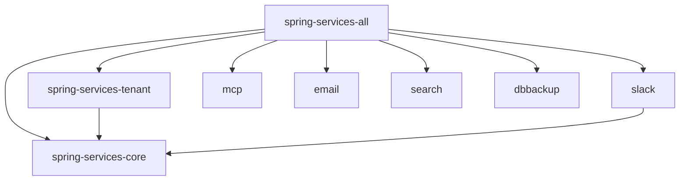

# Design: Tenant feature module

## GitHub Issue

— (to be created; draft prepared in the spec-create session)

## Summary

The multi-tenancy primitives in `com.openelements.spring.base.tenant` currently live inside
`spring-services-core`. They form a self-contained, leaf feature: the package depends on core
(`data`, `events`, `security`) but **nothing in core depends on it** except a wiring `@Import` in
`FullSpringServiceConfig` and a Javadoc `{@link}` in `data/package-info.java`. No other reactor
module references it, and it pulls **no third-party dependencies** (only Spring + JPA, which arrive
transitively via core).

This spec extracts the package into its own optional feature module `spring-services-tenant`,
consistent with the module pattern established in spec 014 (`slack`, `mcp`, `email`, `search`,
`dbbackup`). Consumers that do not use multi-tenancy no longer carry its abstractions; the feature
self-activates when the module is on the classpath. This is a build-coordinate change only — no
Java-API, data-model, or runtime-behavior change to the tenancy logic itself.

## Goals

- Move the entire `com.openelements.spring.base.tenant` package (7 classes + `package-info.java`)
  and its test out of `spring-services-core` into a new `spring-services-tenant` module.
- Make the feature **self-activate** on classpath presence via a `TenantAutoConfiguration`
  registered in `META-INF/spring/org.springframework.boot.autoconfigure.AutoConfiguration.imports`,
  matching the other feature modules.
- Keep `@EnableTenant` / `TenantConfig` working for explicit opt-in.
- Remove all core→tenant coupling so `spring-services-core` compiles and its Javadoc build stays
  green with `failOnWarnings`.
- Wire the new module into the reactor, `spring-services-all`, and the BOM, with a
  Maven-Central/PomChecker-compliant POM (explicit `<url>`).
- Preserve tenant isolation behavior exactly (the moved test passes unchanged).

## Non-goals

- No change to the tenancy model (still row-level isolation via a `tenant_id` column, tenant id
  derived from the principal name). No schema, entity, or API changes.
- No new conditional/property gate for the feature (it has no optional third-party dependency to
  guard, unlike slack/mcp/email — see rationale below).
- Not touched: any other feature module.

## Technical approach

### New module `spring-services-tenant`

- `spring-services-tenant/pom.xml`: `<parent>` = `spring-services`, single dependency on
  `spring-services-core` (`${project.version}`), plus `spring-boot-starter-test` (test scope).
  Declares `<name>`, `<description>`, and an explicit `<url>`
  (`https://github.com/OpenElementsLabs/spring-services`) so PomChecker passes.
- Move, unchanged, from `spring-services-core`:
  - `TenantService`, `AbstractMultitenantEntity`, `EntityWithMultitenantSupport`,
    `RepositoryWithTenantSupport`, `AbstractMultitenantDbBackedDataService`, `EnableTenant`,
    `TenantConfig`, `package-info.java` (main)
  - `TenantServiceTest` (test)
- All classes keep their package `com.openelements.spring.base.tenant` (a split-package is avoided
  because the whole package leaves core — no tenant types remain in core).

### Self-activation

Add `TenantAutoConfiguration` (`@AutoConfiguration`, `@Import(TenantConfig.class)`), registered in
the module's `AutoConfiguration.imports`. Because the module ships no optional third-party library,
**no `@ConditionalOnClass` guard is needed** — unlike `SlackAutoConfiguration` (guards
`slack-api-client`) etc. On the classpath ⇒ active.

**Drop the `@ComponentScan` in `TenantConfig`; register `TenantService` as an explicit `@Bean`.**
Rationale: `SlackAutoConfiguration` documents that an `@AutoConfiguration` co-located inside a
`@ComponentScan`-ed package gets swept up and registered twice. `TenantConfig` today does
`@ComponentScan(basePackageClasses = TenantConfig.class)` and `TenantService` is a `@Service`.
Converting to an explicit `@Bean TenantService(AuthService)` (and removing `@Service` from
`TenantService`) eliminates the scan entirely, so the auto-config can live in the same package with
no double-registration, and the wiring becomes explicit and obvious. `@EnableTenant` continues to
`@Import(TenantConfig.class)`; explicit importers are unaffected.

The tenant abstractions are `@MappedSuperclass`/abstract types, not `@Entity` beans, so **no
entity-scan registration is required** — a consumer's concrete `@Entity` subclass (in the
consumer's own package) drags in the mapped superclass as usual.

### Core cleanup

- `FullSpringServiceConfig`: remove the `import` and the `TenantConfig.class` entry from its
  `@Import(...)` list, and drop the corresponding Javadoc `<li>`.
- `data/package-info.java`: change the `{@link com.openelements.spring.base.tenant}` reference to
  plain text (e.g. "the `spring-services-tenant` module") so the core Javadoc build does not fail
  on an unresolvable cross-module link under `failOnWarnings`.

### Reactor / bundle / BOM

- Add `<module>spring-services-tenant</module>` to the reactor `pom.xml` (before `spring-services-all`).
- Add a dependency on `spring-services-tenant` to `spring-services-all` (keeps the everything-bundle
  transparent for existing consumers).
- Add `spring-services-tenant` to the BOM's `<dependencyManagement>`.

## Dependencies

- Internal: `spring-services-tenant` → `spring-services-core` (only). No new third-party deps.
- The BOM and `spring-services-all` gain one managed/aggregated coordinate.

## Migration / backward compatibility

Breaking for **à-la-carte** consumers who used tenant types via `spring-services-core` directly
(they must now add `spring-services-tenant`). Transparent for `spring-services-all` consumers.
Tenant shipped inside core in 1.3.0, so this move lands in **1.4.0** and is documented in a
`docs/releases/upgrade-to-1.4.md` (1.3.0 → 1.4.0): "if you use the multi-tenancy abstractions, add
the `spring-services-tenant` dependency (or switch to `spring-services-all`)."

## Security considerations

Tenant isolation semantics are unchanged — the code moves verbatim. Tenant id is still derived from
`AuthService.getPrincipal().getName()`; the `@PrePersist`/`@PreUpdate` guard and tenant-filtered
repository finders are preserved. No new personal-data processing (the principal name / `sub` is
already processed by core), so no additional GDPR handling is required by this change.

## Open questions

- Should `spring-services-tenant` also be listed in the README's à-la-carte example? (Minor doc
  polish; default: yes, add it to the module list.)
- Confirm no downstream Open Elements consumer currently pulls tenant types via bare
  `spring-services-core` without also using `spring-services-all` (affects how prominently the
  upgrade note is framed).
