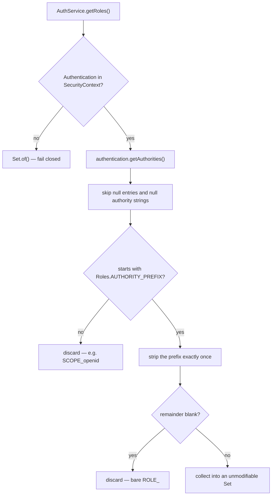

# Design: Caller role lookup

## GitHub Issue

— (not yet created; a ready-to-paste draft is provided at the end of this document)

## Summary

`spring-services-core` ships role name constants (`Roles`) and declarative endpoint guards
(`@RequiresItAdmin` and friends), but offers no way to ask **which roles the current caller has**
from inside business logic. Applications therefore re-implement Spring Security's `ROLE_` prefix
convention themselves, once per role, and carry the result around as a `boolean` per role.

This spec adds a single method — `AuthService.getRoles()` returning an immutable `Set<String>` of
prefix-free role names — plus the supporting `AuthService.findAuthentication()`, three new `Roles`
constants, and the removal of the duplicated `"ROLE_"` literal from the library's two authority
producers. Purely additive: no existing type, signature, or runtime behaviour changes.

## Goals

- Answer *"which roles does the current caller have?"* from application code without the caller
  knowing anything about Spring Security's authority prefix.
- Make the prefix convention live in **exactly one place** in the library.
- Give the `ANONYMOUS` and `API_KEY` role names — both already produced at runtime today — declared
  constants, so applications never write them as string literals.
- Degrade **closed**: a missing or unauthenticated security context yields an empty role set, never
  an exception and never more rights.
- Prove the chain-level claims (an anonymous request really does arrive as `ANONYMOUS`, a JWT
  `roles` claim really does arrive prefix-mapped) with tests through the **real filter chain**, not
  only with hand-built `Authentication` objects.

## Non-goals

- **No replacement for `@RequiresItAdmin` & co.** Declarative endpoint protection stays the way to
  guard an endpoint. This is for cases where the role is part of a *business* decision that cannot
  be made at the endpoint (e.g. "an IT-ADMIN also sees private boards").
- **No authorization logic.** No role ranking, no hierarchy, no "role X implies Y". That is the
  application's business.
- **No groups.** Group membership from token claims is a separate concern — see *Open questions*
  and the `docs/TODO.md` entry.
- **No new bean.** No provider component, no new configuration surface.
- **No change to `SecurityConfig`'s chain structure.** Specifically, anonymous authentication stays
  enabled — see [D1](#d1-anonymous-authentication-stays-enabled).
- **No dedicated `CallerRoles` value type.** See [D8](#d8-setstring-not-a-dedicated-value-type).

## Background: what exists today

| Element | Location | Relevance |
|---|---|---|
| `Roles` — 7 business role constants, values without prefix (`"IT-ADMIN"`) | `security/roles/Roles.java` | The names applications compare against. Locked utility class; `RolesTest` asserts every literal value is stable. |
| `@RequiresItAdmin` etc. → `@PreAuthorize("hasRole('IT-ADMIN')")` | `security/roles/Requires*.java` | Declarative guards. Spring compares authority strings **exactly**. |
| `JwtAuthenticationConverter` maps every `roles` claim entry to `ROLE_<x>` | `SecurityConfig.java:142` | First producer of the `"ROLE_"` literal. Also emits `SCOPE_*` authorities from the standard scope converter. |
| `ApiKeyAuthentication` carries exactly one authority, `ROLE_API_KEY` | `security/apikey/ApiKeyAuthenticationFilter.java:125` | Second producer of the `"ROLE_"` literal. |
| `AuthService.getAuthentication()` **throws** `IllegalStateException` when the context is empty | `security/AuthService.java:62-70` | Deliberate fail-fast design; documented as "programming error". It is the foundation of `getPrincipalObject()`, `getPrincipalJwt()`, `getUserInformation()` and `getPrincipal()`. |
| Anonymous authentication is **never disabled** | `SecurityConfig.java` (no `.anonymous(...)` call) | Spring's `AnonymousAuthenticationFilter` runs on the default chain. Unauthenticated requests to the `permitAll` paths (`/api/health/**`, Swagger) carry an `AnonymousAuthenticationToken` whose single authority is `ROLE_ANONYMOUS`. |

The motivating application code this replaces:

```java
// before — in the consuming application
private static final String IT_ADMIN_AUTHORITY = "ROLE_" + Roles.ROLE_IT_ADMIN;

public boolean isItAdmin() {
  final Authentication authentication = authService.getAuthentication();
  return authentication.getAuthorities().stream()
      .map(GrantedAuthority::getAuthority)
      .anyMatch(IT_ADMIN_AUTHORITY::equals);
}

// after
authService.getRoles().contains(Roles.ROLE_IT_ADMIN);
```

## Technical approach

Four changes, all in `spring-services-core`.

### 1. `Roles` — three new constants

```java
/**
 * Prefix that Spring Security prepends to a role name when the role is exposed as a
 * {@code GrantedAuthority}. The constants in this class hold the role name <em>without</em> this
 * prefix, so they can be compared directly against the values returned by
 * {@code AuthService.getRoles()}.
 */
public static final String AUTHORITY_PREFIX = "ROLE_";

/** Role of a caller authenticated with an API key ... issued by ApiKeyAuthenticationFilter. */
public static final String ROLE_API_KEY = "API_KEY";

/** Role of an unauthenticated caller ... issued by Spring's AnonymousAuthenticationFilter. */
public static final String ROLE_ANONYMOUS = "ANONYMOUS";
```

`Roles` now holds three categories of constant — business roles issued by the identity provider,
mechanism markers issued by a filter, and the prefix itself. Each constant's Javadoc must state
**who issues the value**, and the class-level Javadoc (today just `"Predefined roles."`) must be
widened accordingly.

`ROLE_ANONYMOUS` carries an extra Javadoc caveat: unlike `ROLE_API_KEY`, its value cannot be wired
to its producer. `"ROLE_ANONYMOUS"` is Spring Security's *default*, overridable by any consumer via
`http.anonymous(a -> a.authorities(...))`. If a consumer reconfigures it, the constant no longer
describes that application.

### 2. `AuthService.findAuthentication()`

```java
/**
 * Returns the {@link Authentication} of the current request, if any.
 *
 * <p>Companion to {@link #getAuthentication()}: use this variant from code that may legitimately
 * run without an authenticated caller ...
 */
@NonNull
public Optional<Authentication> findAuthentication() {
  return Optional.ofNullable(securityContextHolderStrategy.getContext().getAuthentication());
}
```

`getAuthentication()` is refactored to `findAuthentication().orElseThrow(() -> new
IllegalStateException("No authentication found"))` — same message (asserted by `AuthServiceTest`),
same behaviour. It is **not** deprecated; the two are equal peers with cross-referencing Javadoc.

### 3. `AuthService.getRoles()`

```java
/**
 * Returns the role names of the current caller, without Spring Security's
 * {@link Roles#AUTHORITY_PREFIX} ...
 *
 * <p><b>Unlike every other accessor on this class, this method never throws</b> because of missing
 * authentication state: an absent security context yields an empty set ...
 */
@NonNull
public Set<String> getRoles() {
  return findAuthentication()
      .map(Authentication::getAuthorities)
      .map(AuthService::toRoleNames)
      .orElseGet(Set::of);
}

private static Set<String> toRoleNames(final Collection<? extends GrantedAuthority> authorities) {
  if (authorities == null) {
    return Set.of();
  }
  return authorities.stream()
      .filter(Objects::nonNull)
      .map(GrantedAuthority::getAuthority)
      .filter(Objects::nonNull)
      .filter(authority -> authority.startsWith(Roles.AUTHORITY_PREFIX))
      .map(authority -> authority.substring(Roles.AUTHORITY_PREFIX.length()))
      .filter(name -> !name.isBlank())
      .collect(Collectors.toUnmodifiableSet());
}
```

Properties that follow from this shape, all of them intentional:

- **Prefix stripped exactly once.** See [D5](#d5-strip-the-prefix-exactly-once).
- **`SCOPE_*` authorities are discarded** — they do not carry the prefix.
- **A bare `ROLE_` authority is discarded.** The `isBlank()` filter deliberately goes one step
  beyond "empty remainder" and also drops whitespace-only names: such a name can never match a
  `Roles` constant, so keeping it would only add noise. This is a small widening of the rule agreed
  during design and is covered by its own behavior scenario.
- **`null` entries and `null` authority strings are skipped** — no `NullPointerException` from a
  malformed authority collection.
- **The returned set is unmodifiable** (`Collectors.toUnmodifiableSet()`). Mutation attempts throw
  `UnsupportedOperationException`; `contains(null)` throws `NullPointerException`, which matches the
  fail-fast rule in [D6](#d6-fail-closed-vs-fail-fast).
- **Comparison is case-sensitive**, matching Spring — see [D4](#d4-case-sensitive-comparison).

### 4. Rewire the two authority producers

Both existing producers of the `"ROLE_"` literal switch to the constant, so the prefix has exactly
one home:

| File | Before | After |
|---|---|---|
| `SecurityConfig.java:142` | `new SimpleGrantedAuthority("ROLE_" + role)` | `new SimpleGrantedAuthority(Roles.AUTHORITY_PREFIX + role)` |
| `ApiKeyAuthenticationFilter.java:125` | `new SimpleGrantedAuthority("ROLE_API_KEY")` | `new SimpleGrantedAuthority(Roles.AUTHORITY_PREFIX + Roles.ROLE_API_KEY)` |

No behaviour change — the produced strings are byte-identical. The point is that the constant and
its producer can no longer drift apart.

## Key flow



## Design decisions and rationale

### D1: Anonymous authentication stays enabled

`SecurityConfig` never disables anonymous authentication, so an unauthenticated request to a
`permitAll` path carries an `AnonymousAuthenticationToken` with the authority `ROLE_ANONYMOUS`, and
`getRoles()` therefore returns `{ANONYMOUS}` — not an empty set.

Disabling anonymous was evaluated and **rejected**. Verified against the Spring Security 6.5.10
bytecode this project resolves: `ExceptionTranslationFilter.handleAccessDeniedException` branches on
`AuthenticationTrustResolver.isAnonymous(...)` and `isRememberMe(...)` — not on `isAuthenticated(...)`
— and `AuthenticationTrustResolverImpl.isAnonymous(null)` returns `false`. With anonymous disabled
the `Authentication` is `null`, both checks are `false`, and an unauthenticated request would be
routed to the `accessDeniedHandler` instead of `sendStartAuthentication`. The result: **`403` instead
of `401`**, with the library's `JsonAuthenticationEntryPoint` (and its `WWW-Authenticate` header) no
longer firing — undoing what specs 006 and 011 built. Disabling anonymous would also make
`AuthService.getAuthentication()` start throwing on `/api/health/**` and the Swagger paths.

*Rationale:* treating `ROLE_ANONYMOUS` like any other role costs nothing, keeps the mapping free of
special cases, and preserves the chain's error semantics. It also happens to make "no caller"
(`{ANONYMOUS}`) distinguishable from "authenticated caller with no roles" (`{}` — e.g. the SCIM
service principal, which `ScimTokenAuthenticationFilter:62` creates with `List.of()` authorities).

### D2: No whitelist against `Roles`

All `ROLE_*` authorities pass through, including application-defined names the library has never
heard of. A whitelist restricted to the declared `Roles` constants was considered and rejected: it
would strip `ANONYMOUS`, hide application-owned roles, and force the library to invent an extension
mechanism. It also guards the wrong direction — every check runs explicitly against a constant
anyway, so an unknown extra name cannot make a check pass that would otherwise fail.

### D3: The role set says *which names*, not *how the caller authenticated*

`SecurityConfig:142` maps **every** entry of the JWT `roles` claim to an authority, unfiltered. An
identity-provider group literally named `API_KEY` would therefore arrive as `ROLE_API_KEY` and be
indistinguishable from what `ApiKeyAuthenticationFilter` produces. The same applies to `ANONYMOUS`.

*Consequence — a contract statement, not code:* the set returned by `getRoles()` answers **which
role names the caller carries**. It must never be used to determine **how** the caller
authenticated. That question is answered by the type of the `Authentication` (or by the filter chain
the request was routed to), and this must be stated in the `getRoles()` Javadoc. A whitelist would
not have helped here — it protects against a different, less likely direction.

### D4: Case-sensitive comparison

Role names compare exactly, as Spring does. `@RequiresItAdmin` expands to `hasRole('IT-ADMIN')`, and
Spring compares authority strings byte-for-byte. A case-insensitive lookup here would let a caller
holding `ROLE_it-admin` pass an application-level check while being rejected at a
`@RequiresItAdmin` endpoint — two different answers for the same caller, which is precisely the
class of bug this spec exists to prevent.

Nothing in OIDC normalises claim *values*; identity providers pass through whatever name an
administrator configured. Matching role names between the IdP and the `Roles` constants is therefore
an operational discipline, and `design.md` states it: **IdP-side role names must match the `Roles`
constants character for character.**

### D5: Strip the prefix exactly once

Prefix removal happens only when reading authorities — never anywhere else. An identity provider is
allowed to name a group `ROLE_FOO`; that arrives in the `roles` claim as `ROLE_FOO`, is mapped by
`SecurityConfig:142` to the authority `ROLE_ROLE_FOO`, and one strip yields the correct role name
`ROLE_FOO`. A second, "defensive" strip anywhere in the pipeline would silently mangle it to `FOO`
and make the role disappear.

### D6: Fail closed vs. fail fast

Two different failure categories, deliberately handled differently:

| Category | Example | Behaviour |
|---|---|---|
| **Security-context state** | no `Authentication` bound; `null` entries in the authority collection | **Fail closed** — empty set, never an exception, never more rights |
| **Programming error at the call site** | asking whether the caller has the `null` role | **Fail fast** — throws |

The second row is why `getRoles()` returns an unmodifiable set produced by
`Collectors.toUnmodifiableSet()`: `contains(null)` throws `NullPointerException` there, rather than
silently answering `false` and swallowing a bug at the call site.

### D7: `AuthService.getRoles()`, not a separate provider bean

The original proposal had a `CallerRolesProvider` `@Component` wrapping `AuthService`. Dropped:

- Once `AuthService` has `findAuthentication()`, the provider is a two-line delegation.
- Applications inject **one** bean instead of two.
- `AuthService` remains the single place in the library that touches the `SecurityContextHolder`,
  which is exactly what the `security` package documentation already claims.
- No new bean means no new `@Component` and therefore no decision about
  `@ConditionalOnMissingBean` / consumer overridability — an item `docs/TODO.md` already tracks as
  needing a coherent library-wide plan first. This spec deliberately does not enlarge it.

The method is named `getRoles()` rather than `getCurrentRoles()` to match the rest of the class
(`getAuthentication()`, `getPrincipal()`, `getUserInformation()` — none carry a "current" prefix,
though all describe the current request).

**No `hasRole(String)` shortcut is added.** `authService.getRoles().contains(Roles.ROLE_IT_ADMIN)` is
already one line, and a shortcut would encourage re-reading the security context once per check
instead of taking a single snapshot per request — the snapshot being the original motivation for
this work.

**Documentation obligation:** the `AuthService` class Javadoc currently states that *every* accessor
fails fast with `IllegalStateException` because a missing state indicates a programming error.
`getRoles()` is the first method that deliberately does not. Unless the class Javadoc names this
exception explicitly, a later reader will "fix" the discrepancy and silently break the fail-closed
guarantee.

### D8: `Set<String>`, not a dedicated value type

A dedicated `CallerRoles` type (originally proposed as a record, then as a `sealed interface` with a
hidden record implementation) was designed in full and then dropped. What it would have added over
`Set<String>`:

| Candidate benefit | Verdict |
|---|---|
| `has(role)` / `hasAny(...)` | `contains(...)` and a stream `anyMatch` — no new capability |
| Set operations (`hasAll`, intersection, difference) | `Set<String>` does these **better**, for free, via the collections and stream APIs |
| Null-safe `has(null)` returning `false` | Void — [D6](#d6-fail-closed-vs-fail-fast) decided that asking for the `null` role should throw, which an immutable `Set` already does |
| Per-role provenance ("came from the JWT" vs. "from the API-key filter") | Excluded by [D3](#d3-the-role-set-says-which-names-not-how-the-caller-authenticated): the mechanism belongs to the `Authentication` type, not to a role name |
| Role hierarchy / ranking | Explicit non-goal |
| Type-safety against swapping roles and groups in a constructor | Real, but it is resolved from the **groups** side: groups plausibly carry more than a name (id, display name, nesting) and will therefore become their own type, at which point the two are no longer interchangeable |
| Future extensibility | No concrete extension survived scrutiny. A role name is a name. |

What remains for the type is a name that documents the prefix-free contract — and that can be
carried by the `getRoles()` Javadoc and by the `Roles` constants themselves. A published library type
is imported by every consumer and appears in their signatures forever; this one did not earn that
cost.

## Security considerations

- **Fail closed.** No authentication, a `null` authority collection, or malformed entries all yield
  an empty set. No path returns more roles than the caller actually holds, and no path throws out of
  the security-context read.
- **Never a mechanism check.** See [D3](#d3-the-role-set-says-which-names-not-how-the-caller-authenticated).
  A JWT whose `roles` claim contains `API_KEY` or `ANONYMOUS` produces exactly that role name.
  Applications must not infer the authentication mechanism from a role name.
- **Anonymous callers hold a role.** `{ANONYMOUS}` is non-empty. Any guard of the shape
  "caller has at least one role ⇒ allow" would admit unauthenticated callers. This is why no
  `isEmpty()`-style convenience is offered: the only safe question is whether a **specific** role is
  present.
- **Not a replacement for endpoint protection.** `@RequiresItAdmin` and the filter chains remain the
  enforcement mechanism. `getRoles()` informs business decisions behind an already-guarded endpoint.
- **GDPR:** not applicable. Role names are neither personal data nor derived from personal data; no
  new data is stored, logged, or transmitted.

## Testing strategy

Two layers, both required.

### Unit tests — `AuthServiceTest` (extended)

Pure JUnit 5, no Spring context, `Authentication` objects bound to the `SecurityContextHolder` by
hand — the pattern the existing class already uses. Covers the mapping rules: prefix stripping,
`SCOPE_*` rejection, bare `ROLE_`, `null` entries, empty and `null` authority collections, the
missing-context case, case sensitivity, immutability, and `findAuthentication()` in both states.

### Filter-chain tests — new integration test

The two claims that no unit test can prove, because they assert what actually reaches the security
context, must be exercised through the **real filter chains**:

1. **Anonymous** — an unauthenticated request to a `permitAll` path arrives with
   `getRoles() == {ANONYMOUS}`, proving `AnonymousAuthenticationFilter` runs on the default chain.
2. **`ROLE_` handling end to end** — a JWT carrying a `roles` claim arrives with the prefix mapped
   and stripped, and its `SCOPE_*` authorities absent.
3. **API key** — a request to `/api/external/**` authenticated with `X-API-Key` arrives with
   `getRoles() == {API_KEY}`.

Existing infrastructure this builds on:

- `StarterTestApp` (`com.example.app`) plus `PostgresTestConfiguration` already boot the full
  library with Testcontainers Postgres and the production filter chains.
- `PostgresTestConfiguration` already supplies a stub `JwtDecoder` (required for
  `defaultFilterChain` to build) that throws on use. The new test needs a `JwtDecoder` that
  **returns** a hand-built `Jwt`, contributed by a test configuration scoped to this test;
  `spring.main.allow-bean-definition-overriding=true` is already set for the `testcontainers`
  profile.
- A small test controller is needed: one endpoint under `/api/health/**` (permitAll, for the
  anonymous case), one under a protected path (for the JWT case), and one under `/api/external/**`
  (for the API-key case), each returning `authService.getRoles()`.
- For the API-key case, prefer creating a **real** key via `ApiKeyDataService.create(...)` — which
  returns the raw key exactly once — over mocking the service, so the test exercises the real
  hash-and-lookup path.

This test also closes the `docs/TODO.md` item *"MockMvc integration test for the JWT chain"* in
part, by establishing the JWT-issuing test fixture that entry says is missing. Whether that TODO
entry can be removed entirely should be assessed during `/spec-review`.

### Constant stability

`RolesTest` asserts the literal value of every `Roles` constant. The three new constants
(`AUTHORITY_PREFIX`, `ROLE_API_KEY`, `ROLE_ANONYMOUS`) must be added there — a silent rename would
break consumer checks and, for `ROLE_API_KEY`, the authority the library itself issues.

## Dependencies

None added. Everything used (`java.util`, Spring Security core, SLF4J) is already on the compile
classpath of `spring-services-core`.

## Migration / impact on existing applications

Purely additive. No existing type, method signature, produced authority string, or runtime behaviour
changes; the two rewired producers emit byte-identical strings. No database or configuration change.

Consuming applications can replace their hand-rolled prefix checks:

```java
// before
authentication.getAuthorities().stream()
    .map(GrantedAuthority::getAuthority)
    .anyMatch(("ROLE_" + Roles.ROLE_IT_ADMIN)::equals);

// after
authService.getRoles().contains(Roles.ROLE_IT_ADMIN);
```

Applications currently carrying `boolean itAdmin` through a request-context record can carry
`Set<String> roles` instead, so adding a second role check no longer changes a signature.

This lands in the `1.4.0` line and should get an entry in the corresponding upgrade document under
`docs/releases/`.

## Open questions

1. **Groups.** A `CallerGroups` counterpart (configurable token claim, trimming, de-duplication,
   fail closed) is the natural next step and is deliberately out of scope here. Unlike roles, groups
   plausibly carry more than a name — id, display name, nesting — and therefore likely warrant a
   real type rather than a `Set<String>`. Parked in `docs/TODO.md`.
2. **IdP case semantics.** Whether a given identity provider permits two roles differing only in
   case (e.g. Keycloak's `admin` vs. `Admin`) was not verified. It does not affect this design —
   comparison is exact either way — but it is worth confirming operationally against the IdP in use.
3. **`docs/TODO.md` JWT-chain entry.** Assess at `/spec-review` whether the new filter-chain test
   fully supersedes it or only partially.

---

## Appendix: GitHub issue draft

> **Title:** Expose the current caller's roles programmatically via `AuthService`
>
> **Description**
>
> `spring-services-core` provides role name constants (`Roles`) and declarative endpoint guards
> (`@RequiresItAdmin` & co.), but no way to ask which roles the current caller has from inside
> business logic. Applications re-implement Spring Security's `ROLE_` prefix convention themselves —
> once per role — and carry the result around as a `boolean` per role, so every additional role check
> changes a method or record signature.
>
> Add `AuthService.getRoles()` returning an immutable `Set<String>` of prefix-free role names,
> directly comparable against the `Roles` constants. Supporting changes: an
> `Optional`-returning `AuthService.findAuthentication()` (the existing `getAuthentication()` throws,
> which cannot serve a code path that may legitimately run unauthenticated), the constants
> `Roles.AUTHORITY_PREFIX`, `Roles.ROLE_API_KEY` and `Roles.ROLE_ANONYMOUS` for names the library
> already produces at runtime, and rewiring the library's two authority producers onto the prefix
> constant so it lives in exactly one place.
>
> **Acceptance criteria**
>
> - [ ] `AuthService.getRoles()` returns prefix-free role names as an immutable `Set<String>`
> - [ ] `AuthService.findAuthentication()` returns `Optional<Authentication>`; `getAuthentication()`
>       keeps its throwing contract and is **not** deprecated
> - [ ] Missing authentication yields an empty set — never an exception
> - [ ] `SCOPE_*` authorities, a bare `ROLE_` authority, and `null` entries are ignored
> - [ ] `Roles` gains `AUTHORITY_PREFIX`, `ROLE_API_KEY`, `ROLE_ANONYMOUS`, each with Javadoc naming
>       the issuer; `RolesTest` covers their literal values
> - [ ] `SecurityConfig` and `ApiKeyAuthenticationFilter` no longer contain the `"ROLE_"` literal
> - [ ] Tests through the **real filter chain** prove the anonymous case and end-to-end `ROLE_`
>       handling
> - [ ] No new bean, no breaking change
>
> **Spec:** `docs/specs/017-caller-role-lookup`
