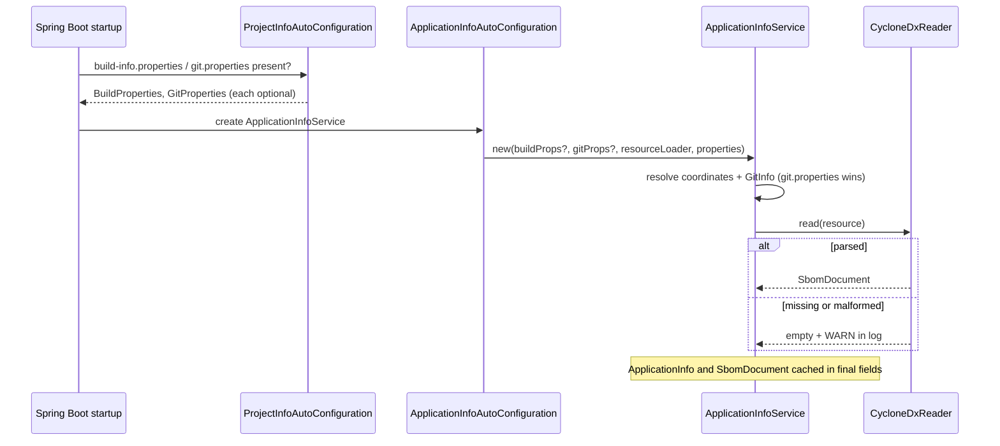

# Design: Application build and SBOM info

## GitHub Issue

— (not yet created; a ready-to-paste draft is provided at the end of this document)

## Summary

Applications built on `spring-services` cannot tell an operator *which* build is running: there is
no standardised way to read the application's version, its Git commit, or the contents of the
CycloneDX SBOM the build already produces. This spec adds a read-only `ApplicationInfoService` plus
an immutable record model to `spring-services-core`, sourced from Spring Boot's existing
`BuildProperties` / `GitProperties` beans and from a Jackson-parsed CycloneDX SBOM on the
classpath. No new dependency, no REST endpoint, no build-time metadata that would break
reproducible builds — applications define their own controller on top of the model.

## Goals

- Give every application one standardised way to answer *"which build is running, and what is it
  made of?"* — artifact coordinates, Git commit, and the parsed SBOM component list.
- Keep the library **reproducible-build neutral**: nothing this feature adds may put a build
  timestamp, hostname, or build-user into an artifact.
- Add **zero new dependencies** to `spring-services-core`, preserving the module's
  "no optional heavy dependencies" enforcer contract.
- Work in every deployment shape the Open Elements apps actually use — in particular the Docker
  build that has no `.git` directory (see [Background](#background-where-the-data-comes-from)).
- Degrade to an empty model, never to an exception and never to a failed startup.

## Non-goals

- **No REST endpoint.** The application owns the controller: its path, its media type, and above
  all its authorization. See [D7](#d7-no-controller-in-the-library).
- **No raw SBOM serving.** The compliance scanner consumes the *unmodified* CycloneDX file; that is
  a separate transport concern deferred to the planned `spring-services-actuator` module
  (see [Deferred work](#deferred-work)).
- **No Spring Boot Actuator dependency.** `BuildProperties` and `GitProperties` live in the
  `spring-boot` core jar, not in Actuator — see [D1](#d1-no-actuator-dependency).
- **No build time in the model.** See [D3](#d3-no-build-timestamp-in-the-model).
- **No dependency graph.** Only CycloneDX's flat `components` array is parsed, not its
  `dependencies` graph — so direct and transitive dependencies are not distinguished.
- **No license normalisation.** Licenses are surfaced as declared; SPDX ids and free-text names are
  not reconciled. See [D6](#d6-licenses-as-a-flat-liststring).
- **No changes to this reactor's own build.** The build wiring that produces the input files belongs
  in `java-parent` and in the application repositories — see
  [Required build wiring](#required-build-wiring), which is a *contract*, not work delivered here.
- **No JVM / OS / process runtime info.** Spring Boot already ships `org.springframework.boot.info
  .JavaInfo`, `OsInfo` and `ProcessInfo`; applications can use them directly.

## Background: where the data comes from

Three inputs feed the model. All three are produced by the build, none by the library.

| Input | File | Produced by | Spring type |
|---|---|---|---|
| Artifact coordinates | `META-INF/build-info.properties` | `spring-boot-maven-plugin:build-info` | `BuildProperties` |
| Git metadata | `META-INF/git.properties` | `git-commit-id-maven-plugin` | `GitProperties` |
| SBOM | `META-INF/sbom/application.cdx.json` | `cyclonedx-maven-plugin` | — (none; Actuator only serves the bytes) |

Spring Boot 3.5 auto-configures `BuildProperties` and `GitProperties` in
`ProjectInfoAutoConfiguration` whenever the corresponding file exists, stripping the `build.` /
`git.` key prefix as it loads. Both classes live in the `spring-boot` core jar. For the SBOM,
Spring Boot 3.3+ ships an Actuator `SbomEndpoint` that serves the **raw file**; it does not parse
it, so there is no Spring type for the SBOM's contents.

### The `.git` problem

The Open Elements application Dockerfiles build the jar *inside* the container:

```dockerfile
COPY .mvn/ .mvn/
COPY mvnw pom.xml ./
COPY src/ src/
RUN ./mvnw clean package -DskipTests -B
```

and `.dockerignore` excludes `.git`. `git-commit-id-maven-plugin` runs with
`failOnNoGitDirectory=false` (correctly — a source-archive build must not fail), so it silently
produces nothing. **The deployed image therefore carries no Git metadata at all**, which is exactly
the artifact an operator needs to identify.

The agreed remedy is to pass the commit into the container as a build argument and write it into
`build-info.properties` via `spring-boot-maven-plugin`'s `additionalProperties` — a mechanism that
needs no file in the application repository and is therefore fully inheritable from `java-parent`.
The consequence for this design is [D4](#d4-two-git-sources-gitproperties-wins).

## Technical approach

A new package `com.openelements.spring.base.info` in `spring-services-core`:

```
base/info/
├── ApplicationInfoService.java         @Service — the only entry point for applications
├── ApplicationInfo.java                record — coordinates + git + sbom summary
├── GitInfo.java                        record — commit, branch, tag, dirty, commit time
├── SbomSummary.java                    record — format, spec version, serial, counts, licenses
├── SbomDocument.java                   record — summary + full component list
├── SbomComponent.java                  record — one dependency
├── CycloneDxReader.java                package-private Jackson tree parser
├── ApplicationInfoProperties.java      @ConfigurationProperties("openelements.info")
├── ApplicationInfoAutoConfiguration.java
└── package-info.java
```

It is registered as a **second entry** in
`META-INF/spring/org.springframework.boot.autoconfigure.AutoConfiguration.imports`, alongside
`SpringServicesCoreAutoConfiguration`. It must not be attached to `FullSpringServiceConfig`:
that configuration is reached only through `SpringServicesCoreAutoConfiguration`, which is guarded
by `@ConditionalOnClass(EntityManagerFactory.class)`. Application info has nothing to do with JPA
and must work in an application that has none.

### Model

All types are immutable Java records with JSpecify `@Nullable` components. Every collection
component is normalised in a compact constructor (`null` → empty, then `List.copyOf`), so no
accessor ever returns `null` for a list and no returned list is mutable.

```java
public record ApplicationInfo(
    @Nullable String group,
    @Nullable String artifact,
    @Nullable String version,
    @Nullable String name,
    @Nullable GitInfo git,
    @Nullable SbomSummary sbom) {

  public static ApplicationInfo empty() { ... }
}

public record GitInfo(
    String commitId,                  // full hash — a GitInfo exists only if a hash is known
    String shortCommitId,             // git.commit.id.abbrev, else the first 7 chars of commitId
    @Nullable String branch,
    @Nullable String tag,
    @Nullable Boolean dirty,          // null = unknown, see D5
    @Nullable Instant commitTime) {}

public record SbomSummary(
    @Nullable String bomFormat,       // "CycloneDX"
    @Nullable String specVersion,     // "1.6"
    @Nullable String serialNumber,    // deterministic for a given content, see D3
    @Nullable SbomComponent application,   // CycloneDX metadata.component
    int componentCount,
    List<String> licenses) {}         // distinct, sorted union over all components

public record SbomDocument(SbomSummary summary, List<SbomComponent> components) {}

public record SbomComponent(
    @Nullable String group,
    String name,
    @Nullable String version,
    @Nullable String type,            // "library", "application", "framework", ...
    @Nullable String purl,
    List<String> licenses) {}
```

### Service

```java
@Service
public class ApplicationInfoService {

  /** Never null. Fields that the build did not provide are null. */
  public ApplicationInfo getApplicationInfo();

  /** The full component list; empty when no SBOM was found or it could not be parsed. */
  public Optional<SbomDocument> findSbom();
}
```

`getApplicationInfo()` deliberately carries only the SBOM **summary**, not the component list, so an
application can expose a small `/api/info` payload without shipping 400 components on every call.
`findSbom()` is the separate, explicit call for the admin view that wants the full list.

Both values are computed **once in the constructor** and cached in final fields: the service is
immutable and trivially thread-safe, and a broken SBOM produces its warning during startup, where
operations sees it — not on the first admin-view request weeks later.

### Configuration

```properties
openelements.info.sbom.enabled=true      # false disables SBOM reading entirely
openelements.info.sbom.location=         # explicit Spring Resource location; empty = autodetect
```

Autodetection uses the same locations, in the same order, as Spring Boot's `SbomEndpoint`:

1. `classpath:META-INF/sbom/bom.json`
2. `classpath:META-INF/sbom/application.cdx.json`
3. `classpath:META-INF/native-image/sbom.json`

Matching Spring's order matters: when the planned `spring-services-actuator` module later serves the
raw file through `SbomEndpoint`, the parsed view and the raw download must describe the same file.
Because the location is resolved through `ResourceLoader`, `file:` locations work too — an SBOM
mounted into the container is supported without extra code.

The property prefix is `openelements.` (as used by `scim`, `mcp`, `db-backup` and `meilisearch`),
not `open-elements.` (`slack`, `email`). That inconsistency predates this spec and is not resolved
here.

### Key flow



## Design decisions

### D1: No Actuator dependency

`BuildProperties` and `GitProperties` are in the `spring-boot` core jar
(`org.springframework.boot.info`), auto-configured by `ProjectInfoAutoConfiguration` in
`spring-boot-autoconfigure` — both already on `spring-services-core`'s compile classpath. Depending
on `spring-boot-starter-actuator` would pull Micrometer and the whole endpoint infrastructure into
*every* consuming application to gain nothing this feature needs.

Actuator is planned separately for health and Prometheus. When it arrives, it becomes a
`spring-services-actuator` module that *depends on* this one; the parsing and the model do not move.

**Rejected alternative — build the whole feature on Actuator.** It would have inverted the
dependency: applications that only want a version string in their footer would have had to adopt a
management endpoint infrastructure and secure `/actuator/**`. It also conflicts with the requirement
that the REST endpoint be defined by the application: Actuator endpoints live at framework-owned
paths.

### D2: Jackson tree parsing, not `cyclonedx-core-java`

The reader walks a Jackson `JsonNode` tree and pulls out the handful of fields the model needs. The
official `cyclonedx-core-java` library would be the "ready-made" choice, but it brings
`packageurl-java`, `jackson-dataformat-xml` and a JSON-schema validator into a module whose explicit
contract (enforced by `maven-enforcer-plugin` in `spring-services-core/pom.xml`) is to stay free of
heavy optional dependencies. Jackson is already present via `spring-boot-starter-web`.

Tree parsing also degrades better across spec versions than data binding: unknown fields are
inherently ignored, so a CycloneDX 1.7 document still yields its components.

**Cost accepted:** the reader must be maintained by hand if CycloneDX renames a field this design
reads. The real-SBOM fixture test ([D8](#d8-a-real-generated-sbom-as-test-fixture)) is what
surfaces such a break.

### D3: No build timestamp in the model

Reproducible builds require `project.build.outputTimestamp` to be a fixed, deterministic value.
It is being set as a **constant in `java-parent`**, which means `build.time` in
`build-info.properties` describes the last `java-parent` release, not this build of this
application. Exposing it as `ApplicationInfo.buildTime` would present a value that looks like an
answer to "when was this deployed?" and is not one.

The same reasoning removes `metadata.timestamp` from `SbomSummary`. `serialNumber` is **kept**: with
`outputTimestamp` set, `cyclonedx-maven-plugin` derives it deterministically from the SBOM's
content, so it identifies the SBOM without asserting a time.

A build is identified by **version + commit hash**, both of which are true statements about the
code. `GitInfo.commitTime` is kept for the same reason — the commit time is a property of the
commit, not of the build machine.

### D4: Two Git sources, `git.properties` wins

Where `.git` exists (developer machine, CI), `git-commit-id-maven-plugin` writes the full
`META-INF/git.properties` and Spring exposes it as `GitProperties`. Where it does not (the Docker
build), the commit arrives as a build argument and lands in `build-info.properties` as
`build.commit`, readable via `buildProperties.get("commit")`.

The service reads **both** and prefers `GitProperties` when both are present and disagree: it is the
richer and the machine-derived source, whereas `build.commit` is an unverified value passed in from
outside the build. A library used by many applications should not force one build shape on all of
them.

Optional keys read from `GitProperties`: `tags` (→ `tag`), `dirty`, `commit.id.abbrev`. From
`BuildProperties`: `commit` and, if present, `commit.time`.

When only a full hash is known, `shortCommitId` is derived as its first 7 characters — mirroring
what `GitProperties.getShortCommitId()` does — or the whole hash when it is shorter than 7.

### D5: `dirty` is a nullable `Boolean`

As a primitive `boolean`, `false` would mean both "built from a clean worktree" and "nobody told us"
— and the container build, which is precisely the one that cannot know, would report every image as
clean. `null` keeps "unknown" distinguishable from "clean".

### D6: Licenses as a flat `List<String>`

CycloneDX encodes a license three ways: `licenses[].license.id` (an SPDX identifier),
`licenses[].license.name` (free text such as *"The Apache Software License, Version 2.0"*), and
`licenses[].expression` (`"MIT OR Apache-2.0"`). A real Maven SBOM contains all three, mixed.

Each entry collapses to one string using `id`, else `name`, else `expression`. **Accepted
consequence:** `Apache-2.0` and its free-text twin are two distinct strings and will not group in
the admin view. A dedicated `SbomLicense` record preserving all three forms was considered and
rejected as more model than the view needs; compliance-grade license analysis happens on the raw
SBOM in the scanner, not here.

### D7: No controller in the library

The application defines the endpoint. Two reasons: the path and payload belong to the application's
own API surface, and — more importantly — the SBOM discloses the exact version of every dependency
the application runs, which is a precise map of its attack surface. That authorization decision is
the application's, and hard-coding an endpoint in the library would silently make it for them. See
[Security considerations](#security-considerations).

### D8: A real generated SBOM as test fixture

A hand-written fixture only proves the parser handles what its author imagined. The test suite
therefore checks in a real `cyclonedx-maven-plugin` output — the SBOM of this reactor, generated
with `-Pfull-build` — under `src/test/resources/`, alongside small hand-written fixtures for the
edge cases a real SBOM does not contain (malformed JSON, empty `components`, expression-only
licenses).

**Cost accepted:** ~100 KB in the repository, and it must be regenerated deliberately when the
CycloneDX format or the plugin version changes. That deliberate regeneration is the point: it is
the moment someone notices a format change.

### D9: Eager parsing in the constructor

Parsing at construction makes the service immutable, removes all caching and thread-safety
questions, and puts the warning about an unreadable SBOM in the startup log. The cost is a one-time
parse of a file the application already ships — on the order of tens of milliseconds.

## Required build wiring

None of this is delivered by this spec — it is the contract an application build must satisfy for
the model to be populated. It belongs in `java-parent` and in the application repositories.

| Requirement | Where |
|---|---|
| `project.build.outputTimestamp` set to a fixed value | `java-parent` (in progress, separately) |
| `spring-boot-maven-plugin:build-info` in `pluginManagement`, with `additionalProperties` carrying `commit` | `java-parent`, activated per application |
| `cyclonedx-maven-plugin` output to `${project.build.outputDirectory}/META-INF/sbom/application.cdx.json` | `java-parent`, activated per application |
| `ARG GIT_COMMIT` in the Dockerfile, passed to Maven | each application repository |

> **Classpath collision rule.** `META-INF/build-info.properties`, `META-INF/git.properties` and
> `META-INF/sbom/*` are *single-slot* classpath resources: if two jars on one classpath each ship
> one, only the first is ever read. Their generation must therefore live in an **application-level
> activation**, never in a profile shared with library modules. This is the same trap that already
> forced `generateGitPropertiesFile=false` in `java-parent`'s `full-build` profile — and the reason
> `spring-services` itself must never produce any of these three files into its own jars.

## Dependencies

None added. The feature uses `spring-boot` (`org.springframework.boot.info`),
`spring-boot-autoconfigure`, `spring-core` (`ResourceLoader`), Jackson and JSpecify — all already on
`spring-services-core`'s compile classpath. The module's `ban-optional-feature-dependencies`
enforcer rule is unaffected.

## Security considerations

- **The SBOM is an attack-surface map.** It lists the exact version of every dependency the
  application runs. An unauthenticated info endpoint hands an attacker a precise CVE checklist. The
  library exposes no endpoint ([D7](#d7-no-controller-in-the-library)); the README must state that
  an application-defined SBOM endpoint belongs behind an admin-level guard such as
  `@RequiresItAdmin`.
- **No secrets are read.** The three input files contain build coordinates only. The library never
  reads environment variables or system properties.
- **No user input reaches the parser.** The parsed resource is a classpath (or explicitly
  configured) location fixed at startup, never a request parameter.
- **No personal data**, therefore no GDPR relevance. `git.properties` can carry
  `git.build.user.name`/`.email`; the model does not expose them, and `java-parent` already excludes
  them from generation for reproducibility.

## Testing

- **Unit** — `CycloneDxReader` against the real reactor SBOM and against hand-written fixtures for
  the edge cases (malformed, empty `components`, each of the three license forms, missing
  `metadata`).
- **Unit** — `ApplicationInfoService` with hand-built `BuildProperties`/`GitProperties`, covering
  every combination of present/absent sources and the precedence rule.
- **Integration** — an `ApplicationContextRunner` test proving the bean exists **without JPA on the
  classpath**, which is the property that motivated the separate auto-configuration.
- **Integration** — a context test proving a malformed SBOM does not prevent startup.

## Open questions

- Should `ApplicationInfoService` be registered with `@ConditionalOnMissingBean` so an application
  can substitute its own? No bean in the reactor currently does this, and `docs/TODO.md` tracks
  overridability as its own unresolved topic. This design adds it for the new bean only, as the
  cheap and correct default, without retrofitting the rest.

## Deferred work

- **`spring-services-actuator` module** — raw SBOM endpoint, Git/Build `InfoContributor`, later
  health and Prometheus. Needs its own spec.
- **`java-parent` build wiring** — see [Required build wiring](#required-build-wiring).
- **Application Dockerfile changes** — `ARG GIT_COMMIT` in `open-crm`, `open-tasks`,
  `open-expenses`, `KnowledgeForge`, `Octobird`.

---

## Draft GitHub issue

**Title:** Standardised application build and SBOM information

**Body:**

Applications built on `spring-services` have no standardised way to report which build is running.
Version, Git commit and the CycloneDX SBOM the build already produces are all unavailable to
application code today, so every app would solve it differently — or not at all.

Add a read-only `ApplicationInfoService` and an immutable record model to `spring-services-core`,
sourced from Spring Boot's existing `BuildProperties`/`GitProperties` beans and from a
Jackson-parsed CycloneDX SBOM on the classpath.

**Acceptance criteria**

- [ ] `ApplicationInfoService.getApplicationInfo()` returns artifact coordinates, Git info and an
      SBOM summary; it never returns `null` and never throws when the build produced no metadata.
- [ ] `ApplicationInfoService.findSbom()` returns the full parsed component list.
- [ ] The Git commit is read from `git.properties` when available and from `build-info.properties`
      (`build.commit`) otherwise; `git.properties` wins on conflict.
- [ ] A missing or malformed SBOM logs a warning and yields no SBOM — the application still starts.
- [ ] The bean is available in an application without JPA on the classpath.
- [ ] No new dependency is added to `spring-services-core`; nothing added puts a build timestamp,
      hostname or build user into an artifact.
- [ ] A real `cyclonedx-maven-plugin`-generated SBOM is checked in as a test fixture and parses.
