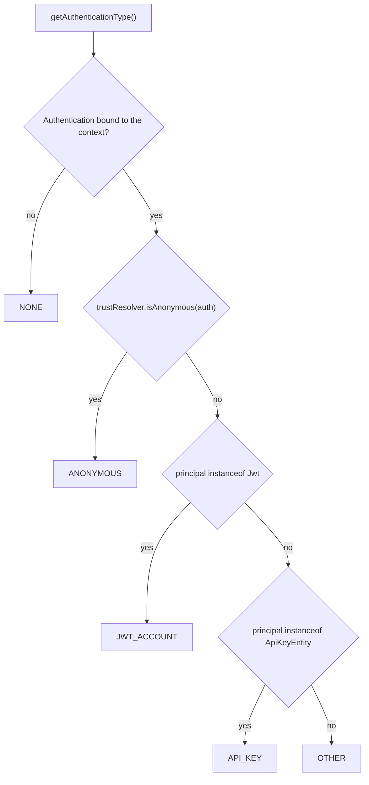

# Design: Authentication type probe

## GitHub Issue

— (not yet created; a ready-to-paste draft is provided at the end of this document)

## Summary

`AuthService` can only *return* authentication state or throw — there is no way to ask whether the
current request even has a real caller, and the closest existing call,
`findAuthentication().isPresent()`, answers `true` on `permitAll` paths because Spring's anonymous
filter has put a token there. This spec adds an enum `AuthenticationType` with
`AuthService.getAuthenticationType()` (`JWT_ACCOUNT`, `API_KEY`, `ANONYMOUS`, `OTHER`, `NONE`) plus
`AuthService.isAuthenticated()`, whose semantics mirror Spring Security's
`AuthenticationTrustResolver` exactly so that the word "authenticated" cannot mean two different
things in the same codebase. Purely additive; fail-closed; no new bean and no new configuration.

## Goals

- Answer *"what kind of caller is on this request?"* from application code, so an application can
  allow a decision for a JWT-authenticated user and withhold it from an API-key caller.
- Answer *"is there an authenticated caller at all?"* with **exactly** the meaning that
  `@PreAuthorize("isAuthenticated()")` has in the same application.
- Make the trap explicit and impossible to fall into by accident: a present `Authentication` does not
  mean an authenticated caller.
- Degrade **closed**: no security context yields `NONE` / `false`, never an exception and never more
  rights.
- Prove the classification through the **real filter chains** — JWT, API key, anonymous and SCIM —
  not only with hand-built `Authentication` objects.

## Non-goals

- **No boolean `isAnonymous()`.** Expressible as `getAuthenticationType() == ANONYMOUS`, and the
  enum carries the same class-based check.
- **No `isFullyAuthenticated()` / remember-me support.** Nothing in the reactor produces a
  `RememberMeAuthenticationToken`; adding the probe would ship an untestable branch.
- **No dedicated constant for the SCIM caller**, and therefore no change to
  `ScimTokenAuthenticationFilter` and no marker interface in `core`. SCIM is `OTHER` — see
  [D6](#d6-scim-stays-other).
- **No injectable `AuthenticationTrustResolver`.** See [D3](#d3-a-fixed-trust-resolver-instance-not-an-injected-one).
- **No change to `SecurityConfig`**, no chain restructuring, anonymous authentication stays enabled
  (as decided in Spec 017, D1).
- **No new information about the caller.** The enum says *what kind*, not *who*: `getUserInformation()`
  and `getPrincipalObject()` remain the way to obtain the principal.
- **No authorization logic.** The library makes no decision on behalf of the application.

## Background: what exists today

### The four callers this library can produce

| Chain | `Authentication` | Principal | `Authentication.getName()` | Classified as |
|---|---|---|---|---|
| Default `/**`, JWT (`SecurityConfig.defaultFilterChain`) | `JwtAuthenticationToken` | `Jwt` | the `sub` claim | `JWT_ACCOUNT` |
| `/api/external/**` (`SecurityConfig.externalApiFilterChain`) and `/mcp/**` (`McpSecurityConfig`) | `ApiKeyAuthenticationFilter.ApiKeyAuthentication` | `ApiKeyEntity` | `"ApiKeyEntity[id=…, name=…, keyPrefix=…]"` | `API_KEY` |
| `permitAll` paths (`/api/health/**`, Swagger) | `AnonymousAuthenticationToken` | `"anonymousUser"` | `"anonymousUser"` | `ANONYMOUS` |
| `/scim/v2/**` (`ScimSecurityConfig`) | `UsernamePasswordAuthenticationToken` | `String` (`ScimServicePrincipal.USER_NAME` = `"scim"`), **no** authorities | `"scim"` | `OTHER` |
| No request thread (`@Async`, `@Scheduled`, startup runners) | — | — | — | `NONE` |

`ApiKeyAuthenticationFilter` and `ScimTokenAuthenticationFilter` are the only two producers of
authentication state inside the reactor; everything else comes from Spring Security itself.

### Why there is no mechanism-independent "user" to ask for

| Type | Declaration (Spring Security 6.5.10) | Consequence |
|---|---|---|
| `AuthenticatedPrincipal` | `interface { String getName(); }` | A name only, no user data |
| `Jwt` | `extends AbstractOAuth2Token implements JwtClaimAccessor` | Does **not** implement `AuthenticatedPrincipal` — which is why `AuthService.getPrincipal()` already has an `instanceof Jwt` branch that wraps it |
| `UserDetails` (Basic / form login) | `extends Serializable` | Shares no interface with the OAuth2 principal types |
| `OAuth2AuthenticatedPrincipal` | `extends AuthenticatedPrincipal`, `getAttributes()` | Exists only in the OAuth2 world |

`Authentication.getName()` is mechanism-independent in its *signature* only: it is never empty, even
when no user exists (`"anonymousUser"`, an entity `toString()`), so it cannot carry the statement
"there is an account". The only reliable discriminator for a user is `principal instanceof Jwt` —
hence the constant name `JWT_ACCOUNT`.

### What "authenticated" already means in this codebase

`SecurityConfig` carries `@EnableMethodSecurity`, and every `@Requires*` annotation is SpEL
(`@RequiresItAdmin` → `@PreAuthorize("hasRole('IT-ADMIN')")`). The definitions, verified in the
6.5.10 sources:

| Element | Definition |
|---|---|
| `SecurityExpressionRoot.isAuthenticated()` | `trustResolver.isAuthenticated(getAuthentication())` |
| `AuthenticationTrustResolver.isAuthenticated(auth)` (default method, since 6.1.7) | `auth != null && auth.isAuthenticated() && !isAnonymous(auth)` |
| `AuthenticationTrustResolverImpl.isAnonymous(auth)` | class check: `AnonymousAuthenticationToken.class.isAssignableFrom(auth.getClass())` — **not** an authority check; the class is replaceable via `setAnonymousClass` |
| `isFullyAuthenticated(auth)` | `isAuthenticated(auth) && !isRememberMe(auth)` |

> Note for readers of `docs/TODO.md`: the entry that produced this spec states that
> `isAuthenticated()` is defined as `!trustResolver.isAnonymous(authentication)`. That was true
> before 6.1.7; today it is the three-part conjunction above, which also covers `null` and
> `auth.isAuthenticated()`.

`@PreAuthorize` resolves its trust resolver from a `DefaultMethodSecurityExpressionHandler` that
holds a hard-coded `new AuthenticationTrustResolverImpl()`; it is replaceable only by declaring a
`MethodSecurityExpressionHandler` bean. **No `AuthenticationTrustResolver` bean exists in a default
Spring Boot application**, and none exists anywhere in this reactor today.

### The state of `AuthService`

Every accessor fails fast with `IllegalStateException`, with one documented exception: `getRoles()`
(Spec 017) degrades closed to an empty set. The class Javadoc states that this is *the only*
non-throwing accessor — a sentence this spec invalidates and must rewrite.

## Technical approach

Three changes, all in `spring-services-core`, package
`com.openelements.spring.base.security`.

### 1. `AuthenticationType` — a new enum

```java
public enum AuthenticationType {
  JWT_ACCOUNT,
  API_KEY,
  ANONYMOUS,
  OTHER,
  NONE
}
```

Constant contracts, as documented on each constant:

| Constant | Meaning | Produced by |
|---|---|---|
| `JWT_ACCOUNT` | The caller authenticated with a bearer token; the principal is a `Jwt`, so `getUserInformation()` is present | Default chain |
| `API_KEY` | The caller authenticated with an API key; the principal is an `ApiKeyEntity` and **there is no user** — `getUserInformation()` is empty | External API chain, MCP chain |
| `ANONYMOUS` | An unauthenticated request on a `permitAll` path; a token exists but represents nobody | Spring's `AnonymousAuthenticationFilter` |
| `OTHER` | An authentication this library does not recognise: the SCIM service principal, `@WithMockUser` in tests, form login, OAuth2 login, any consumer-supplied filter | Anything not listed above |
| `NONE` | No `Authentication` at all — an `@Async` or `@Scheduled` execution, a startup runner, or a chain on which the consumer disabled anonymous authentication | Absence of a security context |

### 2. `AuthService.getAuthenticationType()`

Never throws, never returns `null`.



The anonymous check runs **before** the principal checks, so the classification cannot be fooled by
an anonymous token whose principal happens to have a recognised type.

### 3. `AuthService.isAuthenticated()`

```java
public boolean isAuthenticated() {
  return trustResolver.isAuthenticated(findAuthentication().orElse(null));
}
```

Delegation, not re-implementation: the answer is by construction identical to
`@PreAuthorize("isAuthenticated()")` in a default application. The trust resolver is a fixed
instance held as a field, alongside the existing `securityContextHolderStrategy`.

The two new methods answer **independent** questions and must not be derived from one another:

| Caller | `getAuthenticationType()` | `isAuthenticated()` |
|---|---|---|
| JWT | `JWT_ACCOUNT` | `true` |
| API key | `API_KEY` | `true` |
| SCIM / form login / `@WithMockUser` | `OTHER` | `true` |
| Anonymous | `ANONYMOUS` | `false` |
| No context | `NONE` | `false` |
| Hand-built token with `setAuthenticated(false)` | its type (e.g. `JWT_ACCOUNT`) | `false` |

The last row is the reason `isAuthenticated()` is not expressible as a set of enum constants: the
type says *what kind of caller*, `isAuthenticated()` says *whether Spring trusts it*.

### 4. Javadoc corrections on `AuthService`

- The class Javadoc's "One deliberate exception: `getRoles()`" passage becomes a list of three
  fail-closed members (`getRoles()`, `getAuthenticationType()`, `isAuthenticated()`), keeping the
  existing "do not align these with the fail-fast accessors" warning.
- `findAuthentication()` gains a pointer to `isAuthenticated()`, stating that a present
  `Authentication` is **not** an authenticated caller on `permitAll` paths.

## Design decisions and rationale

### D1: An enum, not a pair of booleans

The originating TODO asked for `isAuthenticated()` / `isAnonymous()`. Two booleans over four
distinguishable caller kinds lose information: they cannot separate an API-key caller (no user, but
authenticated) from a JWT caller, which is precisely the distinction application code needs when it
withholds a user-level action from a machine. The enum carries that distinction; `isAuthenticated()`
survives alongside it because *"is there an authenticated caller at all?"* would otherwise degrade
into a three-way comparison at every call site.

### D2: `isAuthenticated()` mirrors the trust resolver exactly

`@EnableMethodSecurity` is active, so the word "authenticated" already has a fixed meaning in this
codebase. A method of that name returning anything else would contradict
`@PreAuthorize("isAuthenticated()")` two lines away. Delegating to
`AuthenticationTrustResolver.isAuthenticated(...)` makes divergence impossible rather than merely
unlikely. Consequence to be documented rather than hidden: an `OTHER` caller (form login, SCIM) is
authenticated, so the Javadoc must never claim "authenticated means `JWT_ACCOUNT` or `API_KEY`".

### D3: A fixed trust-resolver instance, not an injected one

`AuthService` holds `private final AuthenticationTrustResolver trustResolver = new
AuthenticationTrustResolverImpl();`.

- It reproduces the default `@PreAuthorize` behaviour exactly, because that handler holds the same
  implementation.
- It preserves the existing `public AuthService()`: an injected constructor parameter would break
  every `new AuthService()` in consumer and test code.
- An injected `AuthenticationTrustResolver` bean would create a *new* divergence path, since such a
  bean changes `AuthService` but **not** `@PreAuthorize` (which needs a
  `MethodSecurityExpressionHandler` bean instead).

Documented residual risk: a consumer who replaces the method-security expression handler's trust
resolver diverges from `AuthService`. That consumer is deliberately reconfiguring Spring Security's
notion of anonymity and is told so in the Javadoc.

### D4: `JWT_ACCOUNT`, not `ACCOUNT`

The only reliable discriminator is `principal instanceof Jwt` (see *Background*). A bare `ACCOUNT`
would read as "there is a human user" — a promise the library cannot keep for a consumer who adds
form login, whose caller lands in `OTHER`. Putting the mechanism in the name makes the misreading
impossible.

### D5: `NONE` is its own constant

Mapping "no security context" onto `ANONYMOUS` would be the simplest API and fail closed, but it
would merge a programming error (calling from an `@Async` job) with a legitimate unauthenticated
request. An `Optional<AuthenticationType>` was rejected: it forces `Optional` handling at every
call site while `NONE` carries the same information inside the `switch`.

### D6: SCIM stays `OTHER`

Classifying the SCIM caller requires an `Authentication` type that `core` can recognise. `core` must
not depend on `spring-services-scim` (the dependency runs the other way and the module is optional),
so the SCIM token would have to implement an interface owned by `core`, and the enum would need a
constant such as `SERVICE`. That is a change in two modules plus new public API in `core` for a
caller no application logic currently branches on. Parked in `docs/TODO.md`.

Consequence to state plainly: the SCIM caller and a `@WithMockUser` test caller are
**indistinguishable** — both are a `UsernamePasswordAuthenticationToken` with a non-entity principal.
Any future SCIM constant therefore requires the dedicated token type; it cannot be retrofitted by
inspecting today's authentication.

### D7: The Javadoc mandates allow-lists

`if (type != API_KEY) { allow }` also admits `NONE` (an `@Async` execution) and `OTHER` (any
consumer filter, every `@WithMockUser` test). Over an extensible constant set, a deny-list is
structurally unsafe; an allow-list (`if (type == JWT_ACCOUNT)`) is not. The Javadoc prescribes the
allow-list form and names `NONE` and `OTHER` as "never implicitly permit".

### D8: The constant set is extensible, and says so

Adding a constant in a minor release breaks an exhaustive `switch` without a `default` branch in
consumer code — a compile error on recompilation, an `IncompatibleClassChangeError` against
unchanged bytecode. Given D6, an addition is likely. The Javadoc therefore states that new constants
may appear in minor releases and that callers must provide a `default` branch. The alternatives were
rejected: freezing the set would push D6 into a major release, and a `sealed` interface carries the
identical exhaustiveness hazard while adding data-carrying types the classification does not need
(`getPrincipalObject()` already answers "which principal").

### D9: API keys are recognised by principal type, not by authority

`ApiKeyAuthentication` is package-private in `security.apikey`, so `AuthService` (in `security`)
cannot reference it. Three options:

1. **`principal instanceof ApiKeyEntity`** — chosen. Precise, adds no public API, and introduces no
   new package-pair dependency: `security → services.apikey` already exists through `SecurityConfig`
   and `ApiKeyAuthenticationFilter`.
2. Widen `ApiKeyAuthentication` to `public` and match on it — architecturally the cleanest
   (`security → security.apikey`, no edge into `services` at all, which matters because that edge is
   part of the cycle recorded as debt in `docs/TODO.md`), but it publishes a new type.
3. Match the `ROLE_API_KEY` authority — **rejected**. Spec 017 (D3) establishes that a JWT whose
   `roles` claim contains `API_KEY` produces exactly that authority, so an authority-based check
   would classify a JWT user as a machine.

### D10: No `isAnonymous()`, no `isFullyAuthenticated()`

`getAuthenticationType() == ANONYMOUS` answers the first with the same class-based check the trust
resolver uses. The second would ship a branch no chain in the reactor can reach, since nothing
produces remember-me tokens.

## Security considerations

- **Fail closed.** No context yields `NONE` / `false`. Neither method can grant more than the caller
  holds.
- **Allow-list mandate** (D7) — the one way this API could produce a real vulnerability, addressed in
  the Javadoc and covered by a behavioral scenario per constant.
- **No mechanism inference from roles.** This enum, not the role set, is the sanctioned answer to
  *how* a caller authenticated — exactly as Spec 017 (D3) demanded when it refused to answer that
  question through `getRoles()`.
- **No logging.** Neither method logs; a principal name (`sub`, an API-key `toString()`) never
  reaches a log through this code.

## Data protection (GDPR / DSGVO)

No personal data is stored, transported or newly derived. Both methods classify state that is already
in the security context and return an enum constant or a boolean — no claim values, no principal
names, no persistence, no new logging. The spec therefore requires no legal basis, retention rule or
data-subject-rights handling of its own.

## Testing strategy

Following Spec 017: unit-level scenarios bind an `Authentication` to the `SecurityContextHolder` by
hand; the chain-level claims are proven through the real filter chain.

### Unit tests — `AuthServiceTest` (extended)

- One case per constant, including the `setAuthenticated(false)` token that separates
  `getAuthenticationType()` from `isAuthenticated()`.
- Empty context → `NONE` / `false`.
- An `AnonymousAuthenticationToken` whose principal is a `Jwt` → `ANONYMOUS` (the ordering claim from
  the flow above).
- A `UsernamePasswordAuthenticationToken` with a `UserDetails` principal → `OTHER`.

### Chain tests

Spec 017 already built the harness: `com.example.rolesapp.CallerRoleLookupChainIntegrationTest`
boots the full application against Postgres via Testcontainers and exposes a `RolesReportingController`
with one endpoint per production chain (`/api/health/roles` anonymous, a JWT endpoint,
`/api/external/roles` behind `X-API-Key`), plus a `TestSecurityBeans` `@TestConfiguration`. The three
core chains are therefore covered by adding an `AuthenticationType`-reporting endpoint next to each
existing one — no new test application, no new container.

| Chain | Location | Asserts |
|---|---|---|
| JWT (default) | `spring-services-core` — extend `CallerRoleLookupChainIntegrationTest`'s app | `JWT_ACCOUNT` + `isAuthenticated()` |
| API key (`/api/external/**`) | same | `API_KEY` + `isAuthenticated()` + `getUserInformation()` empty |
| Anonymous (`permitAll`) | same | `ANONYMOUS` + `!isAuthenticated()` |
| JWT on a `permitAll` path | same | `JWT_ACCOUNT`, not `ANONYMOUS` |
| SCIM (`/scim/v2/**`) | **`spring-services-all`** — the only module whose classpath holds both `core` and `scim` | `OTHER` + `isAuthenticated()` |

Whether the reporting endpoints are added to the existing test class or a sibling
`AuthenticationTypeChainIntegrationTest` is an implementation choice; a sibling keeps each spec's
assertions readable, at the cost of a second application context.

### Regression

- `AuthServiceTest`'s existing fail-fast assertions stay untouched: no existing method changes
  behaviour.
- The Javadoc rewrite (§4) is a documentation change with no test.

## Dependencies

None. `AuthenticationTrustResolver` and `AuthenticationTrustResolverImpl` ship with
`spring-security-core`, already a compile dependency of `spring-services-core` via
`spring-boot-starter-security`.

## Migration / impact on existing applications

Purely additive: one new enum, two new methods, no signature or behaviour change to anything that
exists, no schema change, no configuration surface. Applications that today hand-roll the check —
typically `authService.findAuthentication().isPresent()`, which is wrong on `permitAll` paths — can
migrate to `isAuthenticated()`; nothing forces them to.

## Open questions

- **D9 variant.** Recognising API keys via `principal instanceof ApiKeyEntity` (chosen) keeps the
  public API smaller, while widening `ApiKeyAuthentication` to `public` would avoid deepening the
  `security → services.apikey` edge that `docs/TODO.md` records as debt. Worth revisiting when that
  cycle is actually repaid.
- **`OTHER` is a bucket, not a description.** If consumer applications turn out to branch on it, the
  right answer is the dedicated SCIM/service token type (D6), not a second bucket.

## Appendix: GitHub issue draft

> **Title:** `AuthService`: expose the authentication type and an `isAuthenticated()` probe
>
> **Description**
>
> `AuthService` can only return authentication state or throw. There is no way to ask whether a
> request has a real caller, and the closest existing call — `findAuthentication().isPresent()` —
> answers `true` on `permitAll` paths (`/api/health/**`, Swagger), because Spring's
> `AnonymousAuthenticationFilter` has bound an `AnonymousAuthenticationToken`.
>
> This adds, in `spring-services-core`:
>
> - `AuthenticationType` — an enum with `JWT_ACCOUNT`, `API_KEY`, `ANONYMOUS`, `OTHER`, `NONE`.
> - `AuthService.getAuthenticationType()` — never throws, returns `NONE` when no security context is
>   bound.
> - `AuthService.isAuthenticated()` — delegates to Spring Security's
>   `AuthenticationTrustResolver.isAuthenticated(...)`, so the answer is identical to
>   `@PreAuthorize("isAuthenticated()")` in the same application.
>
> Motivation: application code needs to withhold user-level actions from an API-key caller, and the
> distinction "authenticated but no user" is not expressible today.
>
> **Acceptance criteria**
>
> - [ ] `getAuthenticationType()` classifies all five cases and never throws.
> - [ ] `isAuthenticated()` agrees with `@PreAuthorize("isAuthenticated()")`, including for an
>       `OTHER` caller (authenticated) and an anonymous one (not authenticated).
> - [ ] Javadoc prescribes allow-list comparisons (`== JWT_ACCOUNT`) and documents that new constants
>       may appear in minor releases, so callers need a `default` branch.
> - [ ] The `AuthService` class Javadoc no longer claims `getRoles()` is the only non-throwing member.
> - [ ] Classification is proven through the real filter chains: JWT, API key and anonymous in
>       `spring-services-core`, the SCIM chain in `spring-services-all`.
> - [ ] No existing method changes behaviour; no new bean, no new configuration property.
>
> **Spec:** `docs/specs/019-authentication-type/`
