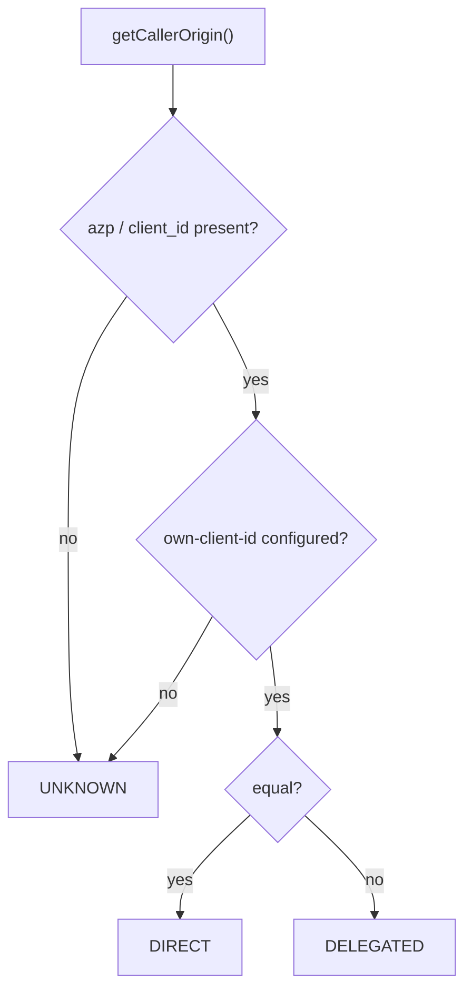

# Design: Token exchange (RFC 8693) for delegated service-to-service calls

## GitHub Issue

— (not yet created; a ready-to-paste draft is provided at the end of this document)

## Summary

Three applications share one OIDC issuer, so backend A can forward a user's token to backend B and B
cannot tell whether the user called it directly or A called on the user's behalf. This spec makes that
distinction explicit and standards-based: **inbound**, `spring-services-core` reads the calling
client's identity (`azp` / `client_id`, plus RFC 8693's `act` when the IdP supplies it) and answers
`DIRECT` / `DELEGATED` / `UNKNOWN`; **outbound**, a new optional module wires Spring Security's
existing RFC 8693 client support so A exchanges the user's token for one audienced to B, adding the
one request parameter Spring omits. Plus the IdP setup documentation for Authentik **and** Keycloak.

## Goals

- Backend B can answer *"is an intermediary system acting on a user's request, and which one?"*
- The same library code works on **Authentik and Keycloak**: the discriminator is the calling client,
  not the Authentik-only `act` claim (which is used when present, never required).
- Backend A performs the exchange without hand-rolling HTTP: Spring Security already ships the grant.
- No new dependency in `spring-services-core`.
- The IdP-side configuration — the part the library cannot do — is documented per IdP.

## Non-goals

- **No enforcement of audience validation.** It is a separate, `docs/TODO.md`-tracked change marked
  *important*, because it locks out every application until its IdP is configured. This spec must
  state the consequence plainly rather than hide it — see [Security](#security-considerations).
- **No PAT.** Spec 010 is parked; the analysis (`docs/ideas/pat-landschaftsanalyse.md`) records why.
  PAT remains the answer for the *offline* case; token exchange covers the *online* case only.
- **No audit-log schema change.** The acting party is *exposed* so an application can log it; adding
  a column to `audit_log` is its own spec (consumer-managed migrations).
- **No change to `AuthenticationType`** (spec 019 — a sibling spec, reviewed and merged separately;
  this spec neither depends on it nor blocks it). Delegation is orthogonal to the authentication
  mechanism — a JWT caller can be direct or delegated, and both are `JWT_ACCOUNT`.
- **No impersonation.** Keycloak keeps impersonation in its legacy token-exchange feature; this spec
  targets the delegation/audience-switch case both IdPs support.
- **No token-forwarding support.** Forwarding is the anti-pattern this spec replaces.
- **No `resource` parameter** (RFC 8707): Authentik rejects it with `invalid_target`.

## Background: verified facts

### What the claims can and cannot carry

| Claim | Availability | Use here |
|---|---|---|
| `client_id` | **Required** for JWT access tokens by RFC 9068 | Primary discriminator |
| `azp` | Emitted by Keycloak; OIDC-defined | Read first, `client_id` as fallback |
| `act` (`{"sub": …}`) | **Authentik only**, from 2026.8, when an `actor_token` is sent | Exposed when present; never required |
| `aud` | Standard, but **not validated today** (see Security) | The control that makes the above enforceable |

The library reads only `name`, `email`, `picture`, `preferred_username` and `roles` today, so every
claim above is new surface.

### What Spring Security already provides (verified in the 6.5.10 jars/sources)

| Building block | Status |
|---|---|
| `AuthorizationGrantType.TOKEN_EXCHANGE` | present |
| `TokenExchangeOAuth2AuthorizedClientProvider` | present; `subjectTokenResolver` defaults to `context.getPrincipal().getPrincipal() instanceof OAuth2Token` — i.e. **the incoming `Jwt` is picked up automatically**; `actorTokenResolver` defaults to `null`; 60 s clock skew |
| `TokenExchangeGrantRequest` / `…GrantRequestEntityConverter` | present |
| `RestClientTokenExchangeTokenResponseClient`, `DefaultTokenExchangeTokenResponseClient` | present; `set/addParametersConverter` on the abstract base |
| `OAuth2ClientHttpRequestInterceptor` | present (`…client.web.client`); built from an `OAuth2AuthorizedClientManager`, with `setClientRegistrationIdResolver`, `setPrincipalResolver`, `setAuthorizationFailureHandler` and its own `WWW-Authenticate` error parsing |
| `JwtBearer*` (RFC 7523) | present — relevant only for Keycloak 26.5 cross-domain chaining, out of scope |

**The gap that forces glue:** `TokenExchangeGrantRequest.defaultParameters(...)` sends `scope`,
`requested_token_type`, `subject_token`, `subject_token_type` and optionally `actor_token` /
`actor_token_type` — **it never sends `audience`**. Without it the IdP is not told which service the
new token is for: Keycloak's internal-internal exchange selects the target client by `audience`, and
Authentik uses it to target another provider. Adding that one parameter is the entire outbound
implementation.

### Dependency situation

`spring-services-core` has `spring-boot-starter-security`, `-oauth2-resource-server` (→
`spring-security-oauth2-resource-server`, `-oauth2-core`, `-oauth2-jose`) — but **not**
`spring-security-oauth2-client` (verified with `dependency:tree`). The inbound half needs no new
dependency; the outbound half does, and therefore becomes its own optional module, following the
spec-014/016 pattern.

### IdP capabilities

| | Authentik | Keycloak |
|---|---|---|
| Token exchange | `urn:ietf:params:oauth:grant-type:token-exchange`; impersonation (subject only) and delegation (subject + actor) | Standard Token Exchange since **26.2**, RFC-8693-compliant, limited to **internal-internal** (one client's token → another client of the same realm) |
| `act` claim | Yes, from **2026.8** | Not documented |
| Prerequisites | Provider with grant "Token exchange", bound to an application, issuer trusted via federated provider/source. Delegation additionally requires an authentik *Actor* whose parent user matches the subject token's user | *Audience* protocol mapper on the client or an assigned client scope (*Included Client Audience* + *Add to access token*), otherwise the access token does not name the resource server |
| Deferred | `resource` → `invalid_target` | External-IdP tokens and impersonation remain in the legacy feature |

## Technical approach

### 1. Inbound — `spring-services-core`, package `com.openelements.spring.base.security`

A new enum and three accessors on `AuthService`:

```java
public enum CallerOrigin { DIRECT, DELEGATED, UNKNOWN }
```

| Member | Contract |
|---|---|
| `Optional<String> findCallerClientId()` | The raw fact: `azp`, else `client_id`, else empty. Never throws |
| `CallerOrigin getCallerOrigin()` | `DIRECT` if the client id equals the configured own client; `DELEGATED` if it is present and different; `UNKNOWN` if the token carries no client id **or** the own-client id is not configured. Never throws, never `null` |
| `Optional<String> findActorSubject()` | `act.sub` when the IdP supplied it (Authentik delegation); empty otherwise. Never a requirement |

Configuration: `openelements.security.own-client-id` — the client id of this backend's own frontend.
Since every backend has exactly one direct frontend, this is a single value, not a list.



`UNKNOWN` deliberately covers *two* different absences — no client id in the token and no
configuration — because both mean the same for a caller: **the library cannot tell, and will not
guess**. As in spec 019, the Javadoc mandates allow-list comparisons (`== DIRECT`), never
`!= DELEGATED`, which would treat `UNKNOWN` as trustworthy.

### 2. Outbound — new module `spring-services-token-exchange`

Layout follows the spec-014 pattern: `com.openelements.spring.base.tokenexchange`
(`TokenExchangeAutoConfiguration`) plus `com.openelements.spring.base.services.tokenexchange` (the
implementation). Depends on `spring-services-core` and `spring-boot-starter-oauth2-client`.
Self-activating, `@ConditionalOnClass(TokenExchangeOAuth2AuthorizedClientProvider.class)` and
`@ConditionalOnProperty`.

Beans:

1. A `RestClientTokenExchangeTokenResponseClient` with `addParametersConverter(...)` that adds
   `audience` for the requested target — **the one thing Spring omits**.
2. A `TokenExchangeOAuth2AuthorizedClientProvider` using that response client, registered in an
   `OAuth2AuthorizedClientManager`. The default `subjectTokenResolver` already lifts the current
   request's `Jwt`; no custom resolver is needed for the common case.
3. A `RestClient` customizer per target, built on Spring Security's
   `OAuth2ClientHttpRequestInterceptor` (verified present in 6.5.10) with a fixed
   `ClientRegistrationIdResolver`. Application code builds one `RestClient` per target service and
   **never touches a token value**:

   ```java
   @Bean
   RestClient crmClient(TokenExchangeClients tokenExchange, RestClient.Builder builder) {
     return tokenExchange.forTarget("crm").apply(builder).baseUrl(crmBaseUrl).build();
   }
   ```

   No bespoke exception type: authorization failures surface as Spring's
   `ClientAuthorizationException` / `OAuth2AuthorizationException`, which already carry the OAuth2
   error code and never contain the token value. The module adds an
   `OAuth2AuthorizationFailureHandler` so a rejected exchange invalidates the stored client instead of
   being retried against a stale one.

Targets are named so an application can talk to several services:

```properties
spring.security.oauth2.client.registration.crm.authorization-grant-type=urn:ietf:params:oauth:grant-type:token-exchange
spring.security.oauth2.client.registration.crm.client-id=tasks-backend
spring.security.oauth2.client.registration.crm.client-secret=…
spring.security.oauth2.client.provider.authentik.token-uri=…
openelements.token-exchange.targets.crm.audience=crm-backend
```

Caching and expiry ride on `OAuth2AuthorizedClientManager` / `OAuth2AuthorizedClientService`; the
library adds no cache of its own (documented, not implemented).

**Why a customizer and not a `exchangeFor(String)` service:** a method returning a token value invites
application code to hold, log or forward it — the very habit this spec replaces. The interceptor keeps
the token inside the HTTP client, and the smallest possible misuse surface beats the smaller API
surface.

### 3. Documentation

- A README section: what delegation is, what `CallerOrigin` answers, and the **explicit warning** that
  the answer is a label until audience validation is switched on, with the property that does it.
- Per-IdP setup: Authentik (provider grant, application binding, trusted issuer, the Actor/parent-user
  constraint, version 2026.8 for `act`) and Keycloak (26.2+, audience mapper via client scope,
  internal-internal limitation).

## Security considerations

- **The load-bearing control is `aud`, not this spec.** Until
  `spring.security.oauth2.resourceserver.jwt.audiences` is set, B also accepts a token issued for A
  and merely forwarded; `getCallerOrigin()` would label it `DELEGATED` and let it pass. Token exchange
  is therefore **bypassable** in the current default, and the spec documents this at the point of use
  rather than in a footnote. The fix is tracked in `docs/TODO.md` (*important*).
- **Allow-list mandate** on `CallerOrigin`, mirroring spec 019: `UNKNOWN` must never be read as
  "direct and trusted".
- **Fail-closed**: all three accessors tolerate an absent security context; none throws.
- **No secrets in logs**: the exchange never logs token values; failures log the target id and the
  OAuth2 error code only.
- **Blast radius, stated for the record**: with a shared issuer and no audience validation, a
  compromised A can act as any of its logged-in users against B. Audience validation plus token
  exchange narrows this to what the IdP issues for B.

## Data protection (GDPR / DSGVO)

No new personal data is stored. `findActorSubject()` and `findCallerClientId()` expose identifiers
already present in the token; nothing is persisted by this spec. If an application decides to write
the acting party into its audit log, that is its own processing decision — and the reason the
audit-log column is deliberately not part of this spec.

## Verification plan (pre-merge, as in spec 015)

Doc-derived facts must be confirmed against real instances before merge; the two `docs/TODO.md`
measurements are folded in here:

1. Decode an Authentik access token: record `aud`, `azp`/`client_id`, and whether `act` appears after
   a delegation exchange. Confirm the `audience` parameter is honoured.
2. Decode a Keycloak token after configuring the audience mapper: record whether `aud` carries the
   **client id or the internal UUID** (a reported quirk), and confirm internal-internal exchange with
   `audience`.
3. Confirm the Authentik Actor/parent-user constraint either permits or rules out
   "service acts for arbitrary users".

## Testing strategy

- **Inbound unit tests** (`AuthServiceTest`): `azp` only, `client_id` only, both, neither; equal /
  different / unconfigured own-client-id; `act.sub` present and absent; empty security context.
- **Inbound chain test**: extend the spec-017 harness (`com.example.rolesapp`), which already has one
  endpoint per production chain, with a `CallerOrigin`-reporting endpoint.
- **Outbound tests**: WireMock (already a core test dependency) as the token endpoint, asserting the
  **exact form parameters** — `grant_type`, `subject_token`, `subject_token_type`,
  `requested_token_type`, `scope` and, critically, `audience`. This is the regression guard for the
  gap that motivated the glue.
- **Failure paths**: token endpoint returns `400 invalid_target` / `401` → Spring's
  `ClientAuthorizationException` carrying the error code, no token value in the message; the failure
  handler removes the stored authorized client.
- **Module test** in `spring-services-token-exchange`; the aggregate context test in
  `spring-services-all` picks up the new module.

## Dependencies

- Inbound: none.
- Outbound: `spring-boot-starter-oauth2-client` (new, isolated in the new module).
- Reactor, `spring-services-all` and `spring-services-bom` gain the module (spec 014/016 pattern).

## Open questions

- **Property naming.** `openelements.security.own-client-id` and `openelements.token-exchange.*`
  follow the majority prefix, but the reactor is inconsistent (`open-elements.email`,
  `open-elements.slack` versus `openelements.mcp`, `openelements.scim`, `openelements.db-backup`).
  Straightening this out is its own spec (`docs/TODO.md`); this spec picks the majority prefix and
  accepts being renamed by that spec.
- **Resolved during planning, kept here for the record:** the outbound API is a `RestClient`
  customizer, not a token-returning service (see *Technical approach*, §2); and `DELEGATED` does not
  distinguish "actor known" from "actor unknown" in step 1 — that distinction is a `docs/TODO.md`
  entry, since Keycloak never supplies an actor and `findActorSubject()` returning empty carries the
  same information.

## Appendix: GitHub issue draft

> **Title:** Token exchange (RFC 8693): recognise delegated callers and perform the exchange
>
> **Description**
>
> All applications share one OIDC issuer, so a backend can forward a user's token to another backend
> and the receiver cannot distinguish a direct user call from a delegated one. This adds:
>
> - `spring-services-core`: `CallerOrigin` (`DIRECT`/`DELEGATED`/`UNKNOWN`) plus
>   `AuthService.getCallerOrigin()`, `findCallerClientId()` and `findActorSubject()`. The
>   discriminator is `azp`/`client_id` so the feature works identically on Authentik and Keycloak;
>   RFC 8693's `act` claim is used when present (Authentik 2026.8+) and never required.
> - New optional module `spring-services-token-exchange`: wires Spring Security's existing
>   `TokenExchangeOAuth2AuthorizedClientProvider`, adds the `audience` request parameter (which
>   `TokenExchangeGrantRequest.defaultParameters(...)` does not send), and exposes a `RestClient`
>   customizer built on `OAuth2ClientHttpRequestInterceptor` so application code never handles a
>   token value.
> - Documentation of the IdP setup for both Authentik and Keycloak.
>
> **Acceptance criteria**
>
> - [ ] `getCallerOrigin()` returns `DIRECT`/`DELEGATED`/`UNKNOWN` per the documented rules, never
>       throws, and its Javadoc mandates allow-list comparisons.
> - [ ] `findActorSubject()` surfaces `act.sub` when present and is empty otherwise.
> - [ ] The outbound exchange sends `audience`, proven by a WireMock test on the exact form parameters.
> - [ ] A failed exchange surfaces as Spring's `ClientAuthorizationException` /
>       `OAuth2AuthorizationException` with the OAuth2 error code and no token value; the module
>       defines no exception type of its own.
> - [ ] The outbound API is a `RestClient` customizer per target; no method returns a token value.
> - [ ] `spring-services-core` gains no new dependency; `spring-security-oauth2-client` stays inside
>       the new module.
> - [ ] README documents the Authentik and Keycloak setup **and** that the distinction is a label
>       until `spring.security.oauth2.resourceserver.jwt.audiences` is configured.
> - [ ] Verified against real Authentik and Keycloak instances before merge.
>
> **Spec:** `docs/specs/020-token-exchange/`
