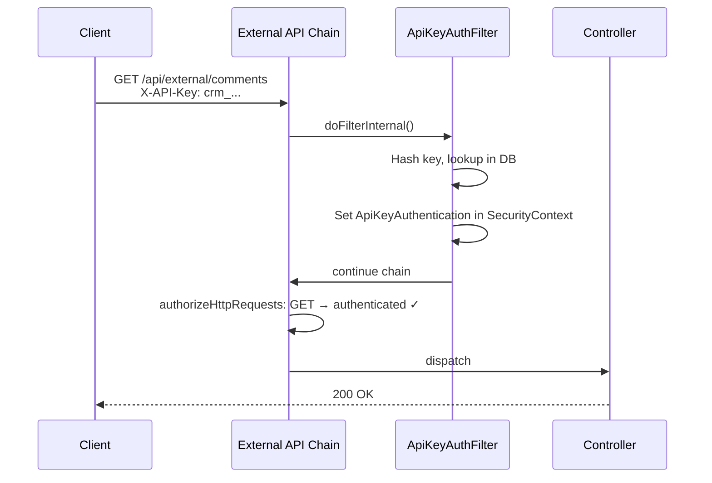
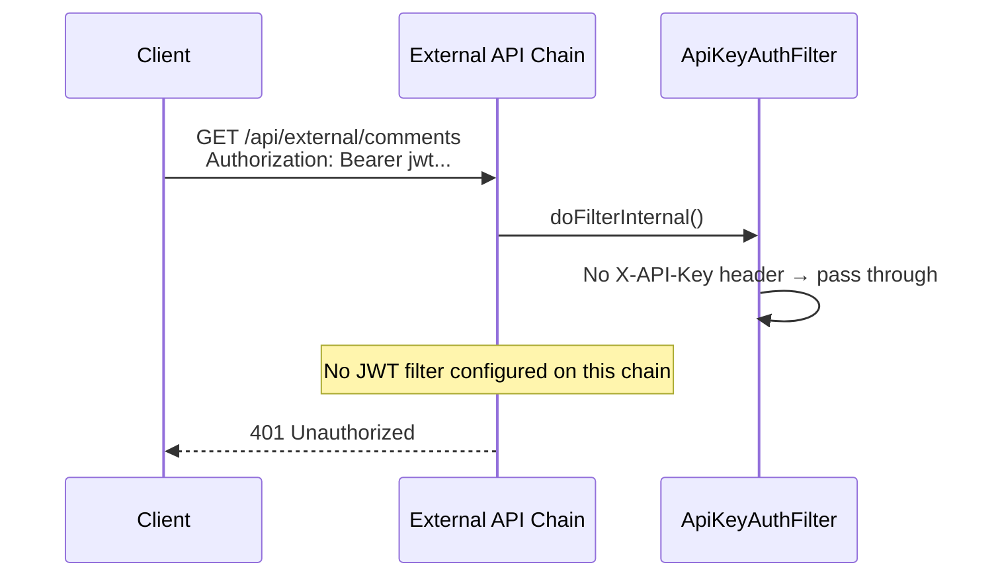
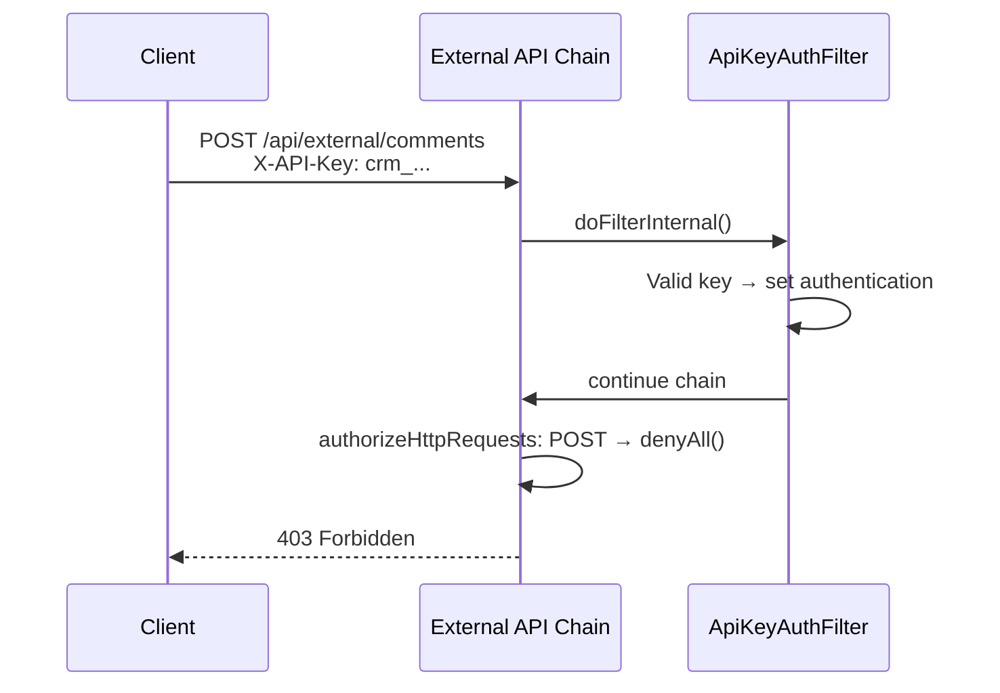
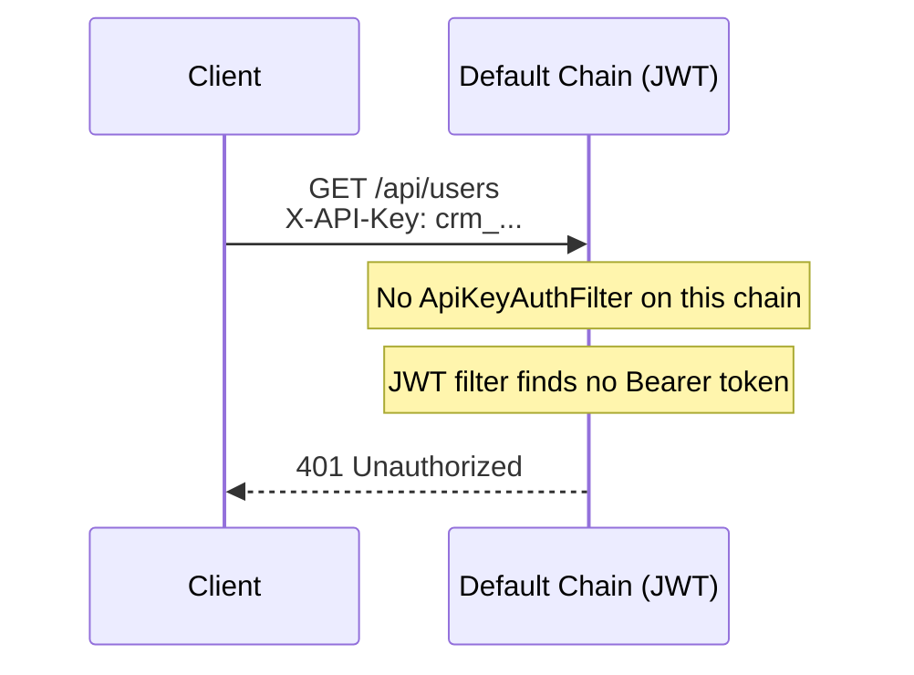
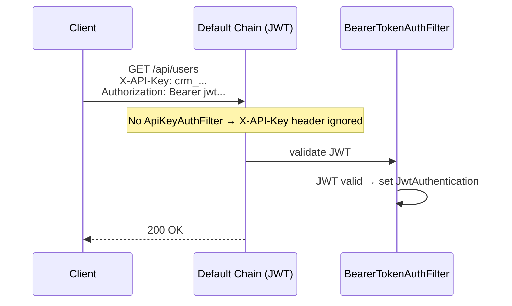

# Design: Split SecurityFilterChain into Two Isolated Chains

## GitHub Issue

—

## Summary

The library currently defines a single `SecurityFilterChain` that applies both API-key and JWT authentication to all endpoints. The `ApiKeyAuthenticationFilter` runs before the JWT filter on every request, and enforces read-only access (GET/HEAD/OPTIONS) internally when an API key is used. This mixes concerns: authentication mechanism selection and HTTP method authorization are entangled inside the filter rather than expressed declaratively in the Spring Security configuration.

This change splits the single chain into two strictly isolated `SecurityFilterChain` beans:

1. **External API chain** (`@Order(1)`, `/api/external/**`) — API-key authentication only, read-only access enforced at the chain level.
2. **Default chain** (`@Order(2)`, all other paths) — JWT/OAuth2 authentication only, full access.

The split makes the security model explicit in the configuration, enables independent policies per chain, and prepares the library to host its own read-only controllers under `/api/external/` for Tag, Comment, and Audit resources.

## Goals

- Separate API-key and JWT authentication into distinct, non-overlapping filter chains.
- Make read-only enforcement for API keys declarative (in `authorizeHttpRequests`) rather than imperative (in the filter).
- Ensure strict isolation: JWT is not accepted on `/api/external/**`, API keys are not accepted on other endpoints.
- Allow `AuthService.getUserInformation()` to work in API-key contexts by returning a static "UNKNOWN" user instead of throwing.
- Prepare the endpoint structure for future library-owned controllers under `/api/external/`.

## Non-goals

- Creating the actual `/api/external/` controllers for Tag, Comment, or Audit — that is a separate follow-up task.
- Making the `/api/external/` path prefix configurable — it is a fixed company-wide convention for all Open Elements products.
- Unifying error response formats between the two chains.
- Associating user identity with API keys (deferred — tracked as a TODO).

## Technical Approach

### Two `SecurityFilterChain` beans

Replace the single `filterChain` bean in `SecurityConfig` with two beans:

#### Chain 1: External API (`@Order(1)`)

```java
@Bean
@Order(1)
public SecurityFilterChain externalApiFilterChain(HttpSecurity http) throws Exception {
    http.securityMatcher("/api/external/**")
        .authorizeHttpRequests(auth -> auth
            .requestMatchers(HttpMethod.GET, "/api/external/**").authenticated()
            .requestMatchers(HttpMethod.HEAD, "/api/external/**").authenticated()
            .requestMatchers(HttpMethod.OPTIONS, "/api/external/**").authenticated()
            .anyRequest().denyAll()
        )
        .addFilterBefore(apiKeyAuthenticationFilter, BearerTokenAuthenticationFilter.class)
        .csrf(csrf -> csrf.disable());
    return http.build();
}
```

- `securityMatcher("/api/external/**")` scopes the chain.
- Only GET, HEAD, OPTIONS are allowed; all other HTTP methods are denied at the authorization level.
- No `.oauth2ResourceServer()` configured — JWT bearer tokens are not evaluated on this chain.
- `ApiKeyAuthenticationFilter` is the sole authentication mechanism.

#### Chain 2: Default (`@Order(2)`)

```java
@Bean
@Order(2)
public SecurityFilterChain defaultFilterChain(HttpSecurity http) throws Exception {
    http.authorizeHttpRequests(auth -> auth
            .requestMatchers("/api/health/**").permitAll()
            .requestMatchers("/swagger-ui.html", "/swagger-ui/**", "/v3/api-docs/**").permitAll()
            .anyRequest().authenticated()
        )
        .oauth2ResourceServer(oauth2 -> oauth2.jwt(
            jwt -> jwt.jwtAuthenticationConverter(jwtAuthenticationConverter())))
        .csrf(csrf -> csrf.disable());
    return http.build();
}
```

- No `securityMatcher` — matches everything not matched by chain 1.
- No `ApiKeyAuthenticationFilter` registered. An `X-API-Key` header is silently ignored by JWT auth.
- Health and Swagger endpoints remain public.

### Simplify `ApiKeyAuthenticationFilter`

Remove the HTTP method checking logic from `doFilterInternal`:

- Remove the `READ_ONLY_METHODS` constant and the block that returns 403 for non-read-only methods.
- The filter becomes a pure authentication component: (1) no header → pass through, (2) invalid key → 401, (3) valid key → set `ApiKeyAuthentication` in security context and continue.
- Read-only enforcement is now the responsibility of the chain's `authorizeHttpRequests` configuration.

### Remove `@Component` from `ApiKeyAuthenticationFilter`

**Critical pitfall:** The `@Component` annotation causes Spring Boot to auto-register the filter as a servlet filter on *all* requests, regardless of which `SecurityFilterChain` matched. This violates strict chain isolation — the filter would run on JWT-chain requests too.

**Fix:** Remove `@Component`. Instead, instantiate the filter as a `@Bean` in `SecurityConfig` (or construct it directly from the injected `ApiKeyDataService`). It is then only added to chain 1 via `addFilterBefore`.

### Modify `AuthService.getUserInformation()`

Change the method to handle non-JWT principals gracefully:

```java
@NonNull
public UserInformation getUserInformation() {
    final Object principal = getPrincipalObject();
    if (principal instanceof Jwt jwt) {
        final String sub = jwt.getSubject();
        if (sub == null || sub.isBlank()) {
            throw new IllegalStateException("No sub found");
        }
        final String picture = jwt.getClaimAsString("picture");
        final String avatarUrl = (picture == null || picture.isBlank()) ? null : picture;
        return new UserInformation(
                jwt.getSubject(), jwt.getClaimAsString("name"),
                jwt.getClaimAsString("email"), avatarUrl);
    }
    return new UserInformation("UNKNOWN", "UNKNOWN", null, null);
}
```

When the principal is not a JWT (e.g., `ApiKeyEntity`), return `UserInformation("UNKNOWN", "UNKNOWN", null, null)` instead of throwing.

### Update `TODO.md`

Add entry: "Associate user information with API keys to replace UNKNOWN user".

## Key Flows

### Flow 1: API-key request to `/api/external/comments` (GET)



### Flow 2: JWT request to `/api/external/comments` (rejected)



### Flow 3: API-key POST to `/api/external/comments` (denied)



### Flow 4: API-key-only request to JWT endpoint (rejected)



### Flow 5: JWT + API-key on JWT endpoint (API key ignored)



## Dependencies

- Spring Security's `SecurityFilterChain` ordering via `@Order` — standard Spring Security feature.
- No new external dependencies required.

## Security Considerations

- **Strict isolation prevents credential confusion:** An API key cannot authenticate a request on the JWT chain, and a JWT cannot authenticate on the external API chain. This eliminates ambiguity about which mechanism authenticated a request.
- **Read-only enforcement at the chain level** is more robust than filter-level checks — it cannot be bypassed by filter ordering changes.
- **Removing `@Component`** from `ApiKeyAuthenticationFilter` is essential. Without this change, Spring Boot auto-registers the filter as a servlet-level filter that runs on all requests, breaking chain isolation.
- **`BearerTokenAuthenticationFilter` anchor in chain 1:** Since chain 1 does not configure `.oauth2ResourceServer()`, the `BearerTokenAuthenticationFilter` class is not present in that chain. Spring Security's `addFilterBefore` uses a well-known ordering, so this should work, but must be verified in testing. An alternative anchor (e.g., `UsernamePasswordAuthenticationFilter.class`) can be used if needed.

## Behavioral Side Effects

- **`AuditLogEventListener.resolveUser()`** currently catches `IllegalStateException` from `getUserInformation()` in API-key contexts and falls back to `"System"`. After this change, `getUserInformation()` returns `UserInformation("UNKNOWN", "UNKNOWN", null, null)` instead of throwing, so `resolveUser()` will return `"UNKNOWN"` instead of `"System"`. This is intentional.
- **`UserService.getCurrentUser()`** calls `getUserInformation()` and does a DB lookup by the returned `id`. If called from an API-key context, it would look up or create a user with ID `"UNKNOWN"`. Currently this code path is not reachable from chain 1 (no controllers exist yet), but future controllers must be aware of this. Tracked as a TODO.

## Files Affected

| File | Change |
|------|--------|
| `SecurityConfig.java` | Split into two `@Bean` methods with `@Order` |
| `ApiKeyAuthenticationFilter.java` | Remove `@Component`, remove HTTP method checking |
| `AuthService.java` | Return UNKNOWN user for non-JWT principals |
| `ApiKeyAuthenticationFilterTest.java` | Remove 403 tests, add POST-passthrough test |
| `AuthServiceTest.java` | Add UNKNOWN user tests |
| `package-info.java` (security) | Update documentation for two-chain model |
| `package-info.java` (apikey) | Remove method-checking references |
| `TODO.md` | Add API key user info entry |

## Open Questions

None — all questions were resolved during the grill session.
