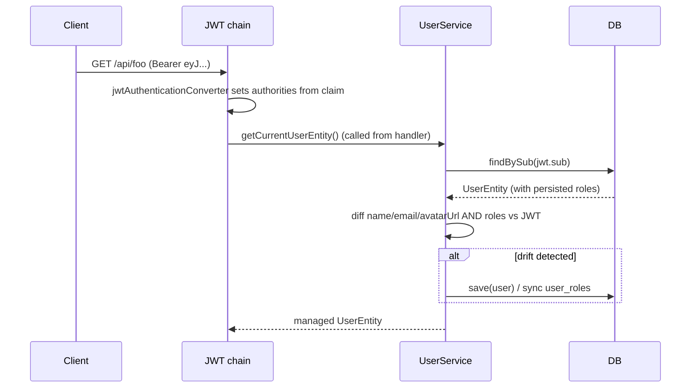
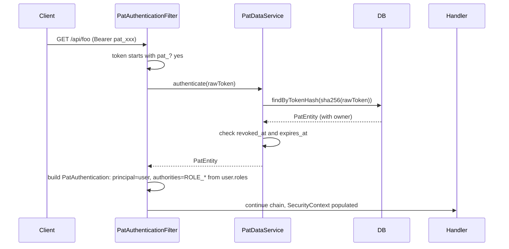

# Design: Personal Access Tokens

## GitHub Issue

—

## Summary

User-bound API tokens (Personal Access Tokens, PATs) that carry the permissions of their
owner. A user authenticates interactively via OIDC, generates one or more PATs in the app,
and uses them on subsequent requests via `Authorization: Bearer pat_xxx`. When a PAT is
presented, the server resolves the owner, applies the owner's currently-stored roles as
Spring Security authorities, and processes the request as if the owner had logged in.

To make this work without calling Authentik on every request, the user's `roles` claim
from the JWT is now **persisted on each authenticated request** (JIT-Sync of roles),
extending the existing per-request sync of `name` / `email` / `avatarUrl` in
`UserService.getCurrentUserEntity()`.

The existing `ApiKey` infrastructure on `/api/external/**` stays in place unchanged. It
remains the right tool for service-to-service / external-integration use cases where no
user identity is involved.

## Goals

- Persist a user's role assignments in the local database, kept in sync with the OIDC
  provider on every authenticated request.
- Let authenticated users mint, list, and revoke PATs through a service API exposed by
  the library (consuming apps wire REST controllers, mirroring the existing
  `ApiKeyDataService` pattern).
- Authenticate requests carrying a PAT with the owner's identity and persisted roles, so
  existing `@RequiresAppUser`, `@RequiresAppAdmin`, etc. annotations work without any
  change.
- Keep the PAT and existing `ApiKey` paths cleanly separated; do not change the read-only
  `/api/external/**` chain.

## Non-goals

- Fine-grained scopes — a PAT inherits all roles of its owner.
- REST controllers in the library — same convention as today (`ApiKeyDataService` has no
  controller in the library either).
- SCIM-based push sync from Authentik — separate, later step (tracked in `TODO.md`).
- Detecting users deactivated in Authentik — a PAT stays valid until explicitly revoked
  or expired. The owner's next interactive login is what removes their roles.
- Last-used tracking — can be added later as a non-breaking enhancement.
- Flyway migration scripts — schema continues to be DDL-generated via Hibernate (matches
  current project state).

## Technical Approach

The change has two coordinated parts.

### Part A — Persisted user roles, JIT-synced on every request

Extend `UserEntity` with a `Set<String> roles` mapped through `@ElementCollection` to a
join table `user_roles(user_id, role)`. Extend `UserInformation` with a `Set<String> roles`
field populated by `AuthService.getUserInformation()` from the JWT `roles` claim. Extend
`UserService.getCurrentUserEntity()` so that, in addition to the existing
`name` / `email` / `avatarUrl` drift detection, it diffs the persisted role set against
the JWT-asserted role set and synchronizes both directions (adds new roles, removes ones
no longer in the JWT). When the JWT has no `roles` claim, the set is treated as empty —
matching how Spring Security already handles it for authorities today.

Adding the `roles` field to the `UserInformation` record is a minor breaking change for
direct consumers of the record. The project is in `1.0.0-SNAPSHOT` and tolerates these
changes when they serve a clear purpose.

### Part B — Personal Access Token module

Add a new `services/pat` package with `PatEntity`, `PatRepository`, `PatDataService` —
mirroring the structure of `services/apikey`. Add a new `security/pat` package with
`PatAuthenticationFilter` and `PatAuthentication`. Wire the filter into the default JWT
chain as the first filter in the bearer-token path. Distinguish PAT bearer tokens from
JWT bearer tokens by their `pat_` prefix.

### Filter integration in the default chain

A custom `BearerTokenResolver` is configured on the `oauth2ResourceServer` so that
tokens starting with `pat_` are not handed to the JWT processor (the resolver returns
`null` for those, which makes Spring Security's `BearerTokenAuthenticationFilter`
behave as if no bearer token was present).

The new `PatAuthenticationFilter` is added with
`addFilterBefore(patFilter, BearerTokenAuthenticationFilter.class)`. It only acts when
the `Authorization` header is `Bearer pat_*`:

1. Extract the raw token from the header.
2. SHA-256 hash it.
3. Look up the `PatEntity` by `tokenHash`.
4. Reject if `revokedAt != null` or `expiresAt < now()`.
5. Resolve the owner's `UserEntity` and its persisted `roles`.
6. Build a `PatAuthentication` with `principal = UserEntity`, authorities =
   `ROLE_<role>` for every entry in `user.roles`.
7. Put the authentication into the `SecurityContext` and continue the chain.

If the token does not have a `pat_` prefix, the filter is a no-op and the existing JWT
flow runs unchanged.

The external API filter chain (`/api/external/**`) is not touched — PATs do not apply
there; that chain remains API-key only and read-only.

### Rationale for the key decisions

- **`Set<String>` on `UserEntity` over a dedicated `RoleEntity`.** Roles are
  JWT-asserted, untyped strings. The existing role model (`Roles.java`) already treats
  them as constants. A full entity would add no value at V1 and would have to be kept
  consistent with the IdP anyway.
- **Separate module from `ApiKey`.** Different semantics, different chain, different
  authorization model. Token prefixes (`crm_` vs. `pat_`) keep the two visually
  distinguishable in logs, support tickets, and config.
- **`Authorization: Bearer pat_xxx`.** Standard, integrates cleanly with HTTP clients
  and OAuth-aware tooling. Prefix-based dispatch keeps the routing logic trivial.
- **Optional `expiresAt`, no default.** Aligns with GitHub's classic-PAT policy. A
  default or maximum can be added later via a property without changing the schema or
  invalidating any token.
- **JIT-Sync of roles inside `UserService.getCurrentUserEntity()`.** Reuses the
  existing once-per-request sync path. No new filter, no extra DB call beyond the one
  that already runs today. Consistent with how `name` / `email` / `avatarUrl` are
  synchronized.
- **Same hash strategy as `ApiKey`** (SHA-256 hex, unsalted). High-entropy tokens (≈
  286 bits of randomness) do not need a key-stretching function — those are for
  protecting low-entropy user passwords.
- **Follow current `ApiKey` service style** rather than the
  `AbstractDbBackedDataService` style used by `UserService`. `TODO.md` already tracks
  migrating `ApiKeyDataService` to the new pattern. When that migration happens, PAT
  follows along — they should migrate together to stay consistent.

## Data Model

### Changes to `UserEntity`

```java
@ElementCollection(fetch = FetchType.EAGER)
@CollectionTable(name = "user_roles", joinColumns = @JoinColumn(name = "user_id"))
@Column(name = "role", nullable = false, length = 128)
private Set<String> roles = new HashSet<>();
```

Resulting table:

```
user_roles (
    user_id UUID    NOT NULL  REFERENCES users(id),
    role    VARCHAR(128) NOT NULL,
    PRIMARY KEY (user_id, role)
)
```

`FetchType.EAGER` is acceptable: typical use is "load current user, check authorities",
and the role set is short (single-digit entries per user).

### New `PatEntity`

| Column         | Type         | Notes                                                |
|----------------|--------------|------------------------------------------------------|
| `id`           | UUID, PK     | from `AbstractEntity`                                |
| `user_id`      | UUID, FK     | NOT NULL, references `users.id`, indexed            |
| `name`         | VARCHAR(255) | NOT NULL, user-supplied label                        |
| `token_hash`   | CHAR(64)     | NOT NULL, UNIQUE, SHA-256 hex of raw token           |
| `token_prefix` | VARCHAR(32)  | NOT NULL, e.g. `pat_AbC1...x9Yz`                     |
| `expires_at`   | TIMESTAMP    | nullable                                             |
| `revoked_at`   | TIMESTAMP    | nullable; soft revoke                                |
| `created_at`   | TIMESTAMP    | inherited from `AbstractEntity`                      |
| `updated_at`   | TIMESTAMP    | inherited from `AbstractEntity`                      |

Indexes:
- Unique on `token_hash` — primary authentication lookup path.
- Non-unique on `user_id` — listing the current user's tokens.

### Entity-relationship diagram

```mermaid
erDiagram
    USERS ||--o{ USER_ROLES : has
    USERS ||--o{ PATS : owns
    USERS {
        UUID id PK
        string sub UK
        string name
        string email
        string avatar_url
    }
    USER_ROLES {
        UUID user_id PK_FK
        string role PK
    }
    PATS {
        UUID id PK
        UUID user_id FK
        string name
        string token_hash UK
        string token_prefix
        timestamp expires_at
        timestamp revoked_at
    }
```

## API Design (service layer)

The library exposes `PatDataService`. REST controllers are added by consuming apps,
matching the existing `ApiKeyDataService` convention.

```java
public class PatDataService {

    PatCreatedDto create(PatCreateDto request);

    Page<PatDto> listForCurrentUser(Pageable pageable);

    void revoke(UUID patId);

    Optional<PatEntity> authenticate(String rawToken);
}
```

DTOs (Java records):

- `PatCreateDto(String name, Instant expiresAt)` — `expiresAt` is optional; `name` is
  required and non-blank.
- `PatCreatedDto(UUID id, String name, String tokenPrefix, String rawToken,
  Instant expiresAt, Instant createdAt)` — `rawToken` is the only DTO field that ever
  carries the secret, and it is returned only by `create()`.
- `PatDto(UUID id, String name, String tokenPrefix, Instant expiresAt,
  Instant revokedAt, Instant createdAt)` — used for listing; never contains a raw token.

`authenticate(rawToken)` returns the entity only when: a row matches the hashed token,
`revoked_at IS NULL`, and (`expires_at IS NULL OR expires_at > now()`).

`revoke()` enforces ownership at the service layer: a user can only revoke their own
PATs. Attempting to revoke another user's PAT returns "not found" (same status code as a
non-existent id, to avoid leaking the existence of other users' tokens).

## Key Flows

### Flow 1 — JIT-Sync of profile and roles on a JWT request



### Flow 2 — Authenticating with a PAT



For a JWT bearer token (no `pat_` prefix), `PatAuthenticationFilter` does nothing and
the existing JWT flow handles it. The `BearerTokenResolver` is configured to return
`null` for `pat_`-prefixed tokens, so `BearerTokenAuthenticationFilter` does not attempt
to validate them as JWTs.

### Flow 3 — Creating a PAT

A logged-in user calls `PatDataService.create(new PatCreateDto("ci-pipeline", null))`:

1. Resolve the current user via `UserService.getCurrentUserEntity()`.
2. Generate a raw token: `pat_` + 48 alphanumeric characters from `SecureRandom`.
3. SHA-256 hash the raw token → `tokenHash`.
4. Build the display prefix: first 4 chars after `pat_`, then `...`, then last 4 chars.
5. Persist a `PatEntity` with `userId` of the current user.
6. Return a `PatCreatedDto` containing the **raw token**. This is the only time the
   raw value is exposed by the system.

## Dependencies

No new external libraries. Uses Spring Security, Spring Data JPA, JPA's
`@ElementCollection`, and `MessageDigest("SHA-256")` (already in use by
`ApiKeyDataService`).

## Security Considerations

- **Raw token returned exactly once** — at `create()`. Same model as `ApiKey`. After
  that, only `tokenPrefix` is ever exposed in API responses.
- **SHA-256 unsalted is adequate** for high-entropy random tokens (48 chars from a
  62-symbol alphabet ≈ 286 bits of entropy). Argon2 / bcrypt are for low-entropy
  user-chosen secrets. This matches the current `ApiKey` design.
- **Revoked and expired tokens are filtered at the data layer** — `authenticate()`
  returns empty. Soft revoke (`revoked_at` timestamp) preserves audit history rather
  than hard-deleting the row.
- **Role drift between sessions.** A user logs in with roles `{A, B}`, creates a PAT,
  then never logs in again. If the IdP downgrades them to `{A}`, the PAT continues to
  grant `{A, B}` until the next interactive login. Accepted limitation for V1. SCIM
  push sync (separate roadmap item in `TODO.md`) closes this gap.
- **Tokens in URLs.** Bearer auth keeps tokens out of URLs. Document that the
  `Authorization` header is the only supported transport; query-parameter tokens are
  intentionally not implemented.
- **Logging discipline.** Filters and the service must never log the raw token or the
  full hash. The token prefix (`pat_xxxx...yyyy`) is safe to log and is the standard
  identifier for support / audit purposes.
- **GDPR.** No new personal data is introduced. Roles are derived from existing JWT
  claims (legal basis: contract / legitimate interest, same as today's profile sync).
  PAT `name` is user-supplied free text — it is treated as user-controlled content and
  is shown back only to the owner.
- **External chain isolation.** The PAT filter is registered on the default chain only.
  A PAT presented on `/api/external/**` is rejected, because that chain accepts only
  `X-API-Key` and only read-only methods.

## Open Questions

- **Max-lifetime policy.** Should the service cap `expiresAt` at a configurable
  maximum (e.g. 1 year)? V1 says no; can be added later as a property without changing
  the schema.
- **Opt-out via property.** A consuming app might not want PAT support at all.
  Suggested follow-up: gate filter and service registration on
  `openelements.security.pat.enabled` (default `true`). Out of scope for V1.
- **Last-used timestamp.** Useful for showing "this token has not been used in 90 days,
  consider revoking" but not required for correctness. Deferred.
